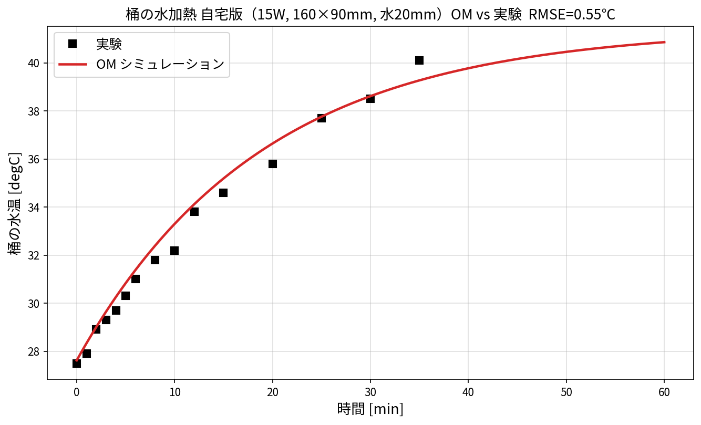
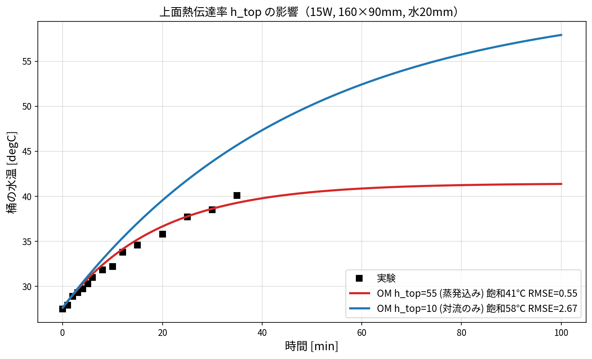
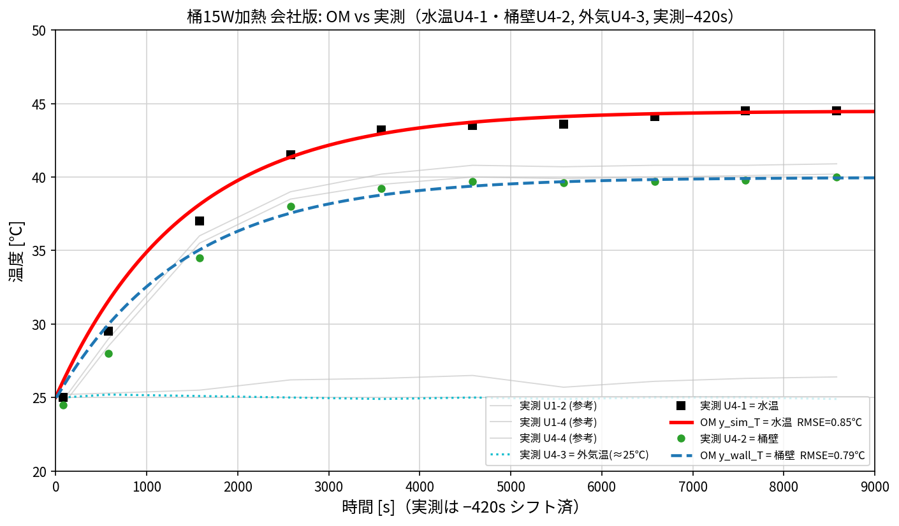

# 桶の水加熱 1DCAE（CupHotWater_15W）と実験比較

桶に水を **20 mm** 入れ、底面を **15 W** で加熱する OpenModelica モデルと実験の比較。
測定を **2回**（自宅・会社）行い、桶寸法・実測データが異なるため **`home/`（自宅）** と
**`company/`（会社）** に分けている（トップ `001_cup/README.md` に対応表）。

| | home（自宅） | company（会社） |
|---|---|---|
| モデル | `home/CupHotWater_15W_home.mo`（160×90mm, 壁0.5mm, Tamb27.6℃） | `company/CupHotWater_15W_company.mo`（135×96mm, 壁0.2mm, Tamb25℃） |
| 実測 | 単一センサ（〜2100s） | 6センサ U4-1..U1-4（〜9000s） |
| 実行 | `run_home.mos`→`compare_home.py` | `run_company.mos`→`compare_company.py` |

---

## 1. 実行手順

各フォルダ内で実行する（WSL 例。Windows は `"C:\Program Files\...\omc.exe"`）。

```bash
# --- 自宅版 (home/) ---
"/mnt/c/Program Files/OpenModelica1.26.3-64bit/bin/omc.exe" run_home.mos   # -> CupHotWater_15W_home_res.csv
python compare_home.py                                                     # -> CupHotWater_15W_home_compare.png
python htop_compare.py     # (任意) h_top=55/10 比較 -> CupHotWater_15W_home_htop_compare.png

# --- 会社版 (company/) ---
"/mnt/c/Program Files/OpenModelica1.26.3-64bit/bin/omc.exe" run_company.mos # -> CupHotWater_15W_company_res.csv
python compare_company.py                                                   # -> CupHotWater_15W_company_compare.png
```

必要 Python パッケージ: `numpy matplotlib`。画面表示なしなら `MPLBACKEND=Agg` を付ける。
`*_res.csv` と `_build/` は再実行で作り直せるため git 追跡外。

---

## 2. 元モデルのバグと修正

| # | バグ | 修正 |
|---|---|---|
| 1 | `combiTimeTable1` が式で参照されているのに**未宣言** → コンパイル不可 | 実験データ表を CombiTimeTable として追加 |
| 2 | 桶 `level_start = 0`（**水が無い**）→ 熱容量ゼロで温度発散 | `level_fill`（20 mm）に修正 |
| 3 | 寸法 190×100 mm | 実機の **160×90 mm** に修正 |
| 4 | `nPorts=0` と `portsData` 1個指定＋`use_portsData=true` の**不整合** | `use_portsData=false`、portsData 削除 |

---

## 3. OM と実験の比較（自宅版 home）

修正後、OM と実験は **RMSE 0.55 ℃** でよく一致する（27.6→約41℃で飽和）。



- 水量 288 mL（0.288 kg）、15 W 加熱。
- 放熱経路：上面（蒸発込み）＋ 側壁・底面（桶壁 SUS304 経由で外気へ）。

---

## 4. 熱伝達率の設定（h と h_top）

| 記号 | 値 | 対象 | 妥当性 |
|---|---|---|---|
| `h` | 10 W/m²K | 側面・底面 → 外気（自然対流） | 標準（静止空気 5〜25） |
| `h_top` | 55 W/m²K | 液面 → 外気（**蒸発込み実効値**） | 下記の理論で妥当 |
| `h_l` | 1000 W/m²K | 桶内 水↔壁（固液） | 大（良好接触） |

### 4.1 h_top を 10 にすると合わない

上面を普通の対流（10）にすると放熱不足で **58 ℃まで過熱**し、実験（~41 ℃）と乖離する。



| h_top | 飽和温度 | RMSE |
|---|---|---|
| **55（蒸発込み）** | 41 ℃ | **0.55 ℃** |
| 10（対流のみ） | 58 ℃ | 2.67 ℃ |

### 4.2 h_top の理論的根拠（蒸発）

水面放熱は「対流（顕熱）＋蒸発（潜熱）」。蒸発分は **Chilton–Colburn の熱・物質移動アナロジー**
から見積もれる。

- 対流：\(q_\text{conv} = h_c (T_w - T_\infty),\ h_c \approx 5\text{–}10\)
- 蒸発：\(q_\text{evap} = h_m L_\text{vap} (\rho_{v,s}(T_w) - \rho_{v,\infty})\)
- アナロジー：\(\displaystyle \frac{h_m}{h_c} = \frac{1}{\rho_\text{air} c_{p,\text{air}} Le^{2/3}}\)（\(Le\approx0.87\)）

**概算**（水面35℃・空気27.6℃・湿度50%）:
飽和蒸気密度差 Δρ≈0.026 kg/m³、\(h_c=5\) → \(h_m\approx0.0047\) m/s、
\(q_\text{evap}=h_m L \Delta\rho\approx 300\) W/m²、ΔT=7.4 K で割ると
**実効 \(h_\text{evap}\approx 40\)**。合計 \(h_\text{top}\approx 5+40 = 45\) W/m²K。
→ 使用値 **55 と同オーダー**（湿度・気流・水温で 30〜60 に変動）。

### 4.3 近似の限界

厳密には蒸発は **ΔT ではなく蒸気圧差**に比例する非線形現象（飽和蒸気圧は水温で指数増加）。
`h_top=一定` は線形化した実効値なので、水温が高いほど本来は蒸発が強まる。
より厳密には `h_top` 固定をやめ、**蒸気圧差ベースの蒸発モデル**（水温・湿度依存の \(q_\text{evap}\)）に
置き換えるのが望ましい。

---

## 5. 会社版（company）— 3温度（水・壁・外気）の同時比較

会社の測定は 6センサ。**実測↔モデルの対応**を付けて比較する：

| 実測センサ | 物理量 | OM 変数 |
|---|---|---|
| **U4-1** | 桶の水温 | `y_sim_T` = `cup.medium.T` |
| **U4-2** | 桶壁（SUS304）温度 | `y_wall_T` = `thermalConductor2.port_b.T` |
| **U4-3** | 外気温（≈25℃） | `Tamb`（＝初期水温） |

- 実測は加熱開始に合わせ **−420s（7分）シフト**、初期水温は加熱開始時の 25℃ に合わせる。
- 実測は **水（U4-1, 44.5℃）が 壁（U4-2, 40.0℃）より約4℃高い**。当初 `h_l=1000`（水↔壁密結合）では
  OM 水温≒壁温 になりこの差を再現できなかった。

**合わせ込み（水深20mm・発熱15W・外気25℃は固定）**

| 係数 | 値 | 意味 |
|---|---|---|
| `h`（SUS壁↔外気） | **9** W/m²K | 側面・底面の対流（実測提供値） |
| `h_top`（上面, 蒸発込み） | **45** W/m²K | Chilton–Colburn 概算 ~45 と一致 |
| `h_l`（水↔壁, 実効） | **58** W/m²K | 水↔壁に温度差(≈4℃)を持たせU4-1/U4-2を分離 |

→ **水 U4-1 RMSE 0.85℃ / 壁 U4-2 RMSE 0.80℃** で同時に一致。



> 集中定数の網目解析：水は 15W を受け、上面 `Gtop=h_top·A_top` と 水↔壁 `Gl=h_l·Sin`（直列で壁へ）
> から放熱、壁は `Gwall=h·(Sout+A_bot)` で外気へ。定常で水温 `Tw=Tamb+15/UA`、壁温は
> `Tc=Gl·Tw/(Gl+Gwall)`。`h=9` を固定して水44.5℃・壁40℃を満たすよう `h_top=45, h_l=58` を決めた。

---

## 6. まとめ

- **自宅版**：元モデルの 4 バグ（未宣言テーブル・水位0・寸法・ポート不整合）を修正し RMSE 0.55℃ で一致。
  側面・底面 `h=10`（自宅）、上面 `h_top=55` は蒸発込み実効値（Chilton–Colburn ~45 と整合）。
- **会社版**：水(U4-1)・壁(U4-2)・外気(U4-3) の3温度を対応づけ、`h=9, h_top=45, h_l=58` で
  水↔壁の4℃差まで含めて同時再現（水 0.85℃ / 壁 0.80℃）。
- 精密化するなら蒸発を蒸気圧差で陽にモデル化する。
