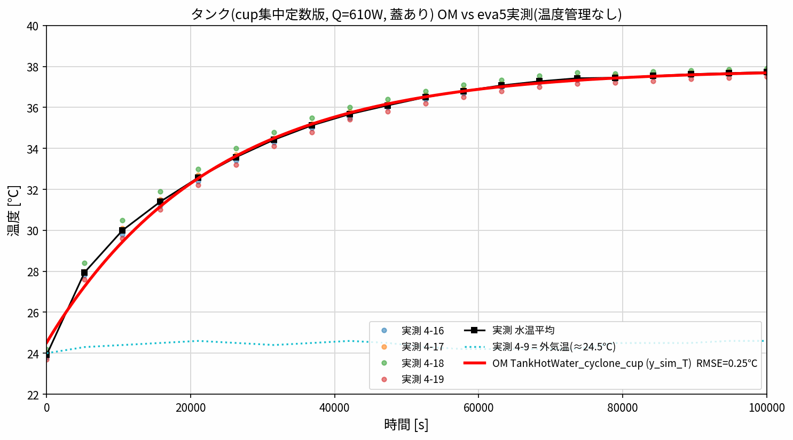
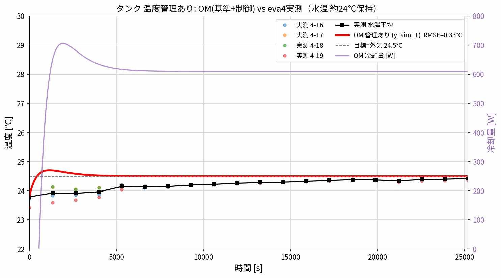
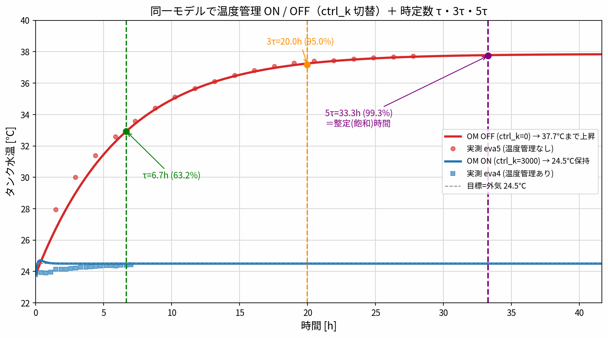
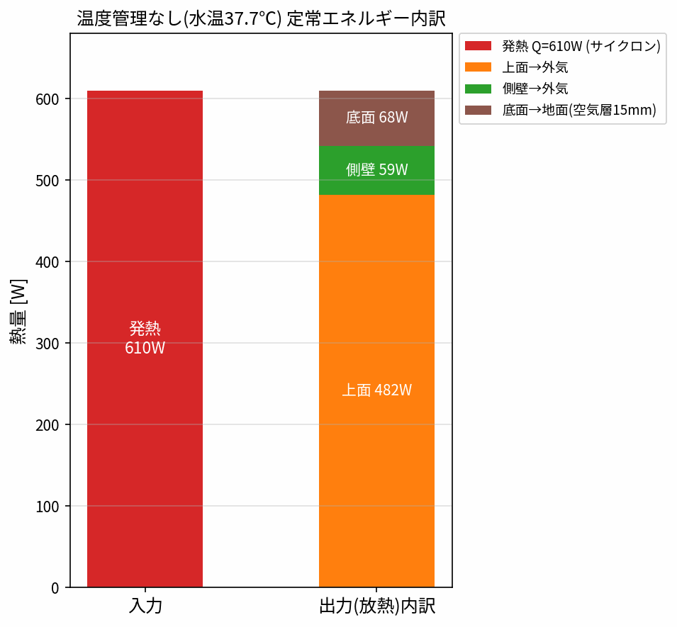
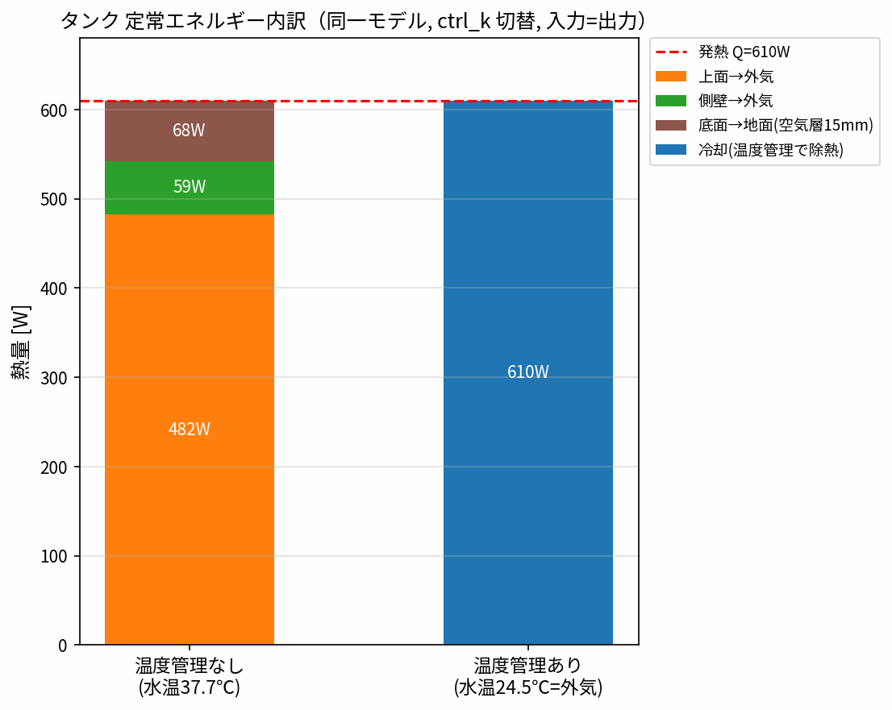

# 001_cup_tank — cup構造をタンクに適用した集中定数モデル

`001_cup/company` の桶（cup）モデルの**集中定数トポロジ**（水ノード＋鋼壁ノード＋外気、
上面／側面／底面の3放熱経路）を、**タンク3槽を等価な単一矩形（Lx=1764×Ly=1829mm）に簡略化**して適用したモデル。
**温度管理なし／あり**でフォルダを分ける：

| フォルダ | 内容 | 実測 |
|---|---|---|
| **`notemp/`** | 基準モデル（温度管理なし） | `eva5`（水温 24→37.7℃, 100000s） |
| **`tempctrl/`** | 基準モデル＋制御（温度管理あり） | `eva4`（水温 約24℃保持, 25200s） |

> **フェアな比較**：`tempctrl` は `notemp` の基準モデルを**一切変更せず**、
> 水温センサ＋目標(=外気24.5℃)＋PI＋冷却熱流の**レギュレータだけを追加**したもの。
> `ctrl_k=0` で基準モデルと完全一致、`ctrl_k>0` で水温を目標に保持する。

## 結果

**温度管理なし（notemp, eva5）** — RMSE 0.26℃、24→37.7℃：



**温度管理あり（tempctrl, eva4）** — RMSE 0.36℃、水温を約24℃に保持（冷却610W）：



- OM `y_sim_T`(=`tank.medium.T`) が実測 4-16/4-17/4-18/4-19 とその平均をよく追従。
- 幾何は**等価単一矩形 Lx=1764×Ly=1829mm** で定義（3槽を1矩形に簡略化, A_top≒3.23m², 周長≒7.19m）。
- 温度管理ありの初期水温は eva4 実測に合わせて `T_ini=23.8℃`。

## 温度管理 ON / OFF の切り替え方（両モデル共通, `ctrl_k`）

対象の Modelica モデル（`.mo`）は次の2つ：
- `notemp/TankHotWater_cyclone_cup.mo`（既定 `ctrl_k=0`）
- `tempctrl/TankHotWater_cyclone_cup_TempCtrl.mo`（既定 `ctrl_k=3000`）

**どちらも `ctrl_k`（温度管理ゲイン [W/K]）1つで切り替える**：

- `ctrl_k = 0` → **OFF**（PI出力=0で冷却なし＝温度管理なしと完全一致, 37.7℃まで上昇）
- `ctrl_k = 3000` → **ON**（水温を目標=外気24.5℃に保持）

切り替える3つの方法：

1. **`.mo` を編集**：`parameter Real ctrl_k = 0;` の値を 0（OFF）/ 3000（ON）に書き換える
2. **実行時に上書き（編集不要）**：`simulate(<model>, ..., simflags="-override ctrl_k=3000")`
   例）`tempctrl/run_onoff.mos` は同一モデルを `ctrl_k=0` と `=3000` で2回回している
3. **OMEdit**：Simulation Setup → 変数 `ctrl_k` に値を入力

```bash
cd tempctrl
omc.exe run_onoff.mos && python onoff_compare.py   # 1モデルでON/OFF両方 -> onoff_compare.png
```

しくみ：水温センサ →（目標=外気との差）→ PI → 冷却熱流(`PrescribedHeatFlow`) を `tank.heatPort` に戻す。
`ctrl_k=0` なら PI 出力が 0 なので基準モデル（温度管理なし）と数値まで一致する。



## エネルギー内訳（各フォルダ, 定常）

**温度管理なし**（`notemp/heat_breakdown.py`）：610W ＝ **上面482＋側壁59＋底面68W**。
**上面が最大・底面が最小**。底面はタンクが地面から15mm浮いて**空気層で断熱的**（h_bot≒1.7）なため放熱が小さい。
**温度管理あり／なし比較**（`tempctrl/heat_breakdown.py`）：ありは水温=外気で自然放熱≒0、610Wを全部**冷却で除熱**。




## cup版との違い（桶 → タンク）

| 項目 | cup（桶, 開放） | tank（本モデル） |
|---|---|---|
| 上面 `h_top` | 45（**蒸発込み**の実効値） | **11.2**（自然対流。蒸発なし） |
| 側面 `h` | 9 | 9（同じ物理値） |
| 底面 | 直接接触 | **15mm空気層で断熱**（h_bot≒1.7） |
| 発熱 | 15 W（底面ヒータ） | 610 W（サイクロン投入熱） |
| 上面積 | 0.013 m²（135×96mm） | 3.23 m²（等価単一矩形1764×1829mm） |
| 材料 | SUS304（7900/500） | 鋼（7000/450） |

**要点**：cup で効いた `h_top≈45`（蒸発）はタンクでは効かない（水面が広く蒸発させると放熱過大）。
放熱経路は **上面(自然対流 h_top)・側面(h=9)・底面(15mm空気層で断熱 h_bot≒1.7)**。
底面が断熱的なぶん、**上面が放熱の主役**になり、`h_top` を合わせて全体 **UA≒46 W/K**、
最終到達温度 37.7℃（$= T_\infty + Q/UA = 24.5 + 610/46$）が合う。

## 合わせ込み：どのパラメータを「何に」合わせたか

Q=610W・外気24.5℃・側面 h=9・底面 h_bot(空気層)・h_l=200 は**固定/物理値**。
残り2つを実測 eva5 の別々の特徴に合わせる：

| 合わせ込みノブ | 値 | **合わせる相手（実測の特徴）** | 効く物理量 |
|---|---|---|---|
| `h_top`（上面のみ） | **11.2** | eva5 の**最終到達温度 37.7℃**（頭打ちの高さ） | UA → `Tamb+Q/UA` |
| `level_fill`（有効水位） | **0.0755 m** | eva5 の**立ち上がりの速さ**（昇温カーブの傾き/時定数） | C → `τ=C/UA` |

> つまり **h_top＝到達する高さ**、**level_fill＝そこへ着く速さ**、を別々に合わせている。
> 到達高さ $= T_\infty + Q/UA$、速さ（時定数）$\tau = C/UA$（$C$ は水量 ∝ 水位）。
> level≈0.0755m は 002_tank_base の集中定数フィットとも整合。

## 使い方

```bash
# このフォルダ内で
"/mnt/c/Program Files/OpenModelica1.26.3-64bit/bin/omc.exe" run_tank.mos  # -> TankHotWater_cyclone_cup_res.csv
python compare_tank.py                                                    # -> TankHotWater_cyclone_cup_compare.png
```

- `data/eva5_tank_data.csv` … eva5 実測（`write_tank_csv.py` で `002_tank_base/OM/data/eva5.py` から生成）
- `*_res.csv` と `_build/` は再実行で作れるため git 追跡外。
