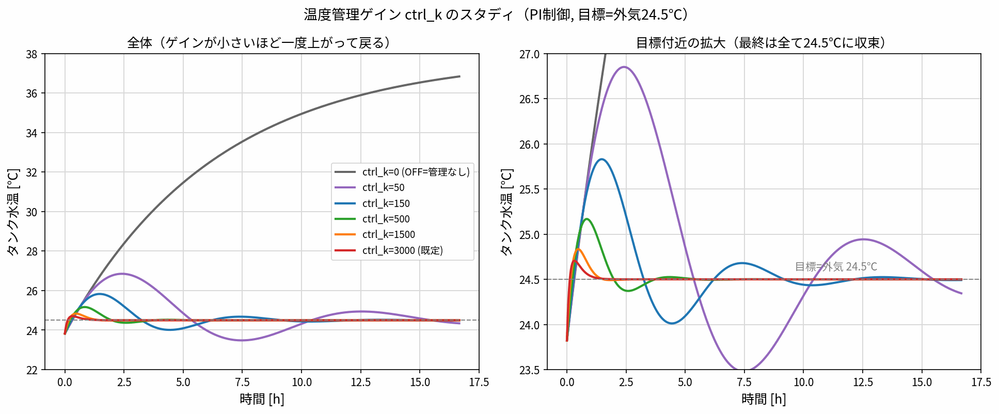

# 温度管理コントローラの設計・チューニング根拠（PI）

`tempctrl`（および `notemp`）の温度管理は **PI制御**で、パラメータは2つ：

| パラメータ | 記号 | 値 | 意味 |
|---|---|---|---|
| `ctrl_k` | $k$ | 0 / 3000 | 比例ゲイン [W/K]（0=OFF, 3000=ON既定） |
| `ctrl_Ti` | $T_i$ | 1500 | 積分時間 [s] |

出力（冷却熱流）：

$$u = k\left(e + \frac{1}{T_i}\int e\,dt\right),\qquad e = T_\mathrm{target} - T$$

- **比例項** $k\,e$ … 今の誤差に反応
- **積分項** $\dfrac{k}{T_i}\displaystyle\int e\,dt$ … 誤差を溜めて押し切り、**定常オフセットをゼロ**にする（水温がぴったり目標へ）

---

## 1. なぜ PI（D なし）か

PID の D（微分）は入れていない：

1. **D はノイズを増幅**：微分はセンサノイズで暴れる。実務でも温度ループは **PI 運用が主流**。
2. **この系は1次遅れで素直**（時定数 $\tau\approx 6.7$ h、むだ時間も小さい）。振動する高次要素が無く、D の「先読み減衰」の恩恵がほぼ無い。
3. **調整が楽・堅牢**：PI は $k,\,T_i$ の2つだけ。D を足すと3つ＋微分フィルタが増える。

→ 遅い1次遅れの水温制御では **PI が定石**。むだ時間や振れが大きい系でだけ D を足す。

---

## 2. `ctrl_Ti = 1500` の根拠（閉ループの減衰から）

タンク水（熱容量 $C$、コンダクタンス $UA$）に PI をかけた**閉ループは2次系**になる。
誤差 $\theta=T-T_\mathrm{target}$ について整理すると：

$$C\,\ddot\theta + (UA+k)\,\dot\theta + \frac{k}{T_i}\,\theta = 0$$

標準形 $\ddot\theta + 2\zeta\omega_n\dot\theta + \omega_n^2\theta = 0$ と比べて：

$$\omega_n = \sqrt{\frac{k}{T_i\,C}},\qquad \zeta = \frac{UA+k}{2\sqrt{k\,C/T_i}}$$

- $\omega_n$ … 速さ（固有角周波数）
- $\zeta$ … 減衰比。$\zeta<1$ 振動的、$\zeta=1$ 臨界（行き過ぎ無しで最速）、$\zeta>1$ 過減衰

**設計方針：既定ゲイン $k=3000$ で $\zeta\approx 1$（行き過ぎゼロ）になるよう $T_i$ を選ぶ。**

数値（$C\approx1.06\times10^6$ J/K, $UA\approx46$ W/K）：

$$\zeta=1 \;\Rightarrow\; T_i = \frac{k\,C}{\left(\frac{UA+k}{2}\right)^2} \approx 1365\ \mathrm{s}$$

→ 採用値 **$T_i=1500$ s** は $\zeta=1.05$（**わずかに過減衰＝行き過ぎゼロ側に余裕**）。
このとき $\omega_n=1.38\times10^{-3}$ rad/s（周期1.3h）、**整定 約1.2h**。

> つまり $T_i=1500$ は「既定ゲインで**オーバーシュートせず最速級**に整定する」値として決めた。
> $\tau\approx6.7$h（無制御の熱時定数）より十分速く、制御で応答をぐっと速めている。

---

## 3. ゲインと減衰の対応（`gain_study.png` の裏づけ）

$T_i=1500$ 固定でゲインを振ると、$\zeta$ が変わり挙動が一致する：

| $k$ (ctrl_k) | $\zeta$ | 周期 | 挙動（最高到達） |
|---|---|---|---|
| 50 | 0.26 | 9.8 h | 強く振動（26.9℃まで） |
| 150 | 0.30 | 5.7 h | 振動（25.8℃） |
| 500 | 0.46 | 3.1 h | やや振動（25.2℃） |
| 1500 | 0.75 | 1.8 h | ほぼ収まる（24.8℃） |
| **3000** | **1.05** | 1.3 h | **行き過ぎ最小（24.7℃）・最速** |

- **低ゲインほど $\zeta$ 小 → 振動的**（比例の減衰が弱い）。
- **既定 $k=3000$ で $\zeta\approx1$** となり、素直で速い。
- どのゲインでも積分があるので**最終水温は目標24.5℃に収束**する（前ページのスタディ）。

---

## 4. この値は常に同じでよいか？（対象しだい）

**いいえ。$T_i$ [s] は「このタンク専用」の値で、制御する対象（タンクや水の量）が変わると変わる。**
"ダイキンならこの数字" のような**万能の固定値は無い**。理由は $\omega_n,\zeta$ の式に $C$（熱容量）が入るから：

$$\omega_n=\sqrt{\frac{k}{T_iC}},\qquad \zeta=\frac{UA+k}{2\sqrt{kC/T_i}}$$

$C$（水量・タンクの大きさ）が変われば、同じ $\zeta\approx1$ を保つには $k,T_i$ を変える必要がある。

### 普遍なのは「値」ではなく「設計ルール」
$k\gg UA$ のとき式を整理すると、きれいな設計レシピになる：

$$\tau_\mathrm{cl}\approx\frac{2C}{k}\ \text{(閉ループ時定数)},\qquad T_i\approx 2\,\tau_\mathrm{cl},\qquad k=\frac{2C}{\tau_\mathrm{cl}}$$

- **手順**：①望む速さ $\tau_\mathrm{cl}$ を決める → ② $k=2C/\tau_\mathrm{cl}$ → ③ $T_i\approx2\tau_\mathrm{cl}$。
- 本タンク：$C\approx1.06\times10^6$, $k=3000$ → $\tau_\mathrm{cl}\approx700$ s, $T_i\approx1400$ s（採用1500）。**式どおり**。
- **転用できるのは $\zeta\approx1$ と「$T_i\approx2\tau_\mathrm{cl}$」という関係**であって、1500 という秒数ではない。

### 対象が変わると値も変わる（例）
| 制御する対象 | $C$ [J/K] | 同じ狙いでの目安 |
|---|---|---|
| このタンク（水243kg） | $1.06\times10^6$ | $T_i\approx1400$–1500 s |
| 桶 cup（水0.26kg, $C\approx1100$） | 約 1/1000 | $T_i$ も約 1/1000 のオーダー |
| もっと大きな水槽 | 大きい | $T_i$ も比例して大きく（遅く） |

### 実機ではどうするか
- **運転しながら自動で合わせる（自動調整）**：ダイキン等のインバータ機やPLCは、実際に動かして対象の特性を測り $k,T_i$ を**自動で計算**する（据付ごとに部屋・負荷が違うので固定値にしない）。
- **決まった計算式（整定則）**：内部モデル制御法(IMC)・ジーグラー＆ニコルス法など。**式はどの対象でも同じ**だが、出てくる**値は対象しだい**。
- したがって「常に同じ数字を入れる」より、**「行き過ぎゼロ（$\zeta\approx1$）になるよう $C,UA$ から計算する」**のが正しい運用。

---

## 5. まとめ

- **PI（D なし）**：遅い1次遅れの水温制御に適し、ノイズに強く堅牢。
- **`ctrl_Ti=1500`**：既定ゲイン $k=3000$ で **$\zeta\approx1$（行き過ぎゼロで最速）** になるよう選んだ値
  （$\zeta=1$ 厳密は $T_i\approx1365$、余裕をみて 1500）。
- **`ctrl_k=3000`**：$\zeta\approx1$ を与える十分大きいゲイン。$\zeta,\omega_n$ の式から $k,T_i$ は解析的に設計できる。

**根拠式の再掲**：$\displaystyle \omega_n=\sqrt{\frac{k}{T_iC}},\quad \zeta=\frac{UA+k}{2\sqrt{kC/T_i}}$ を $\zeta\approx1$ にする。

## 参照
- モデル：`tempctrl/TankHotWater_cyclone_cup_TempCtrl.mo`, `notemp/TankHotWater_cyclone_cup.mo`
- ゲインスタディ：`tempctrl/gain_study.py` → `gain_study.png`
- ON/OFF 切替：`001_cup_tank/README.md`（`ctrl_k` 0/3000）
