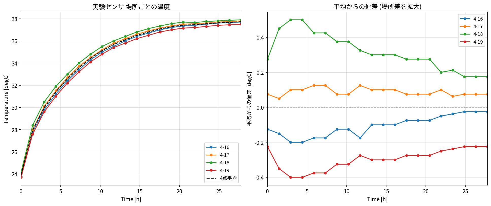
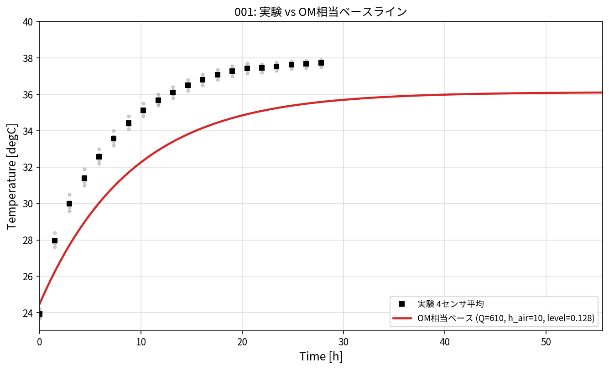
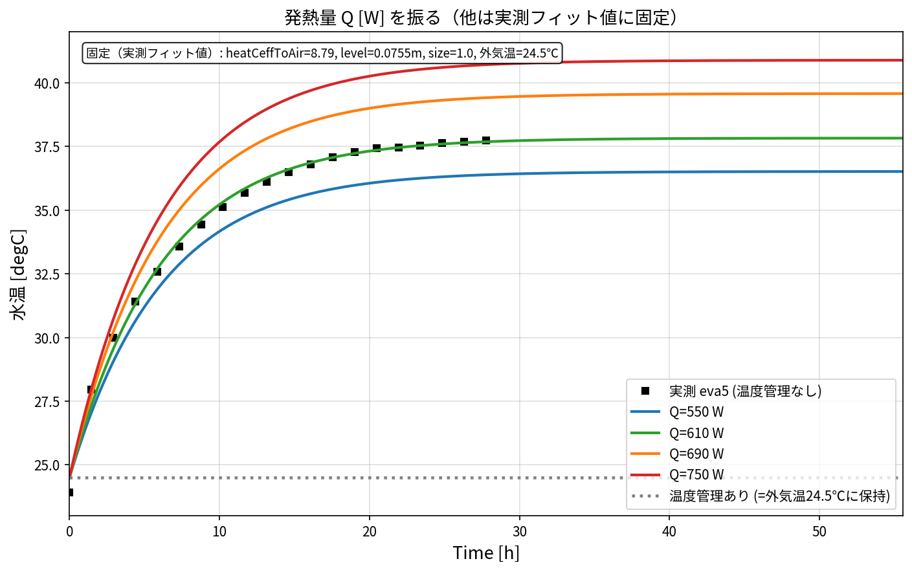
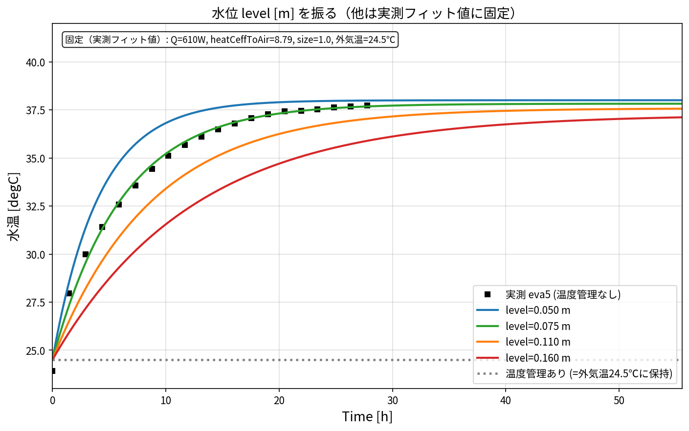
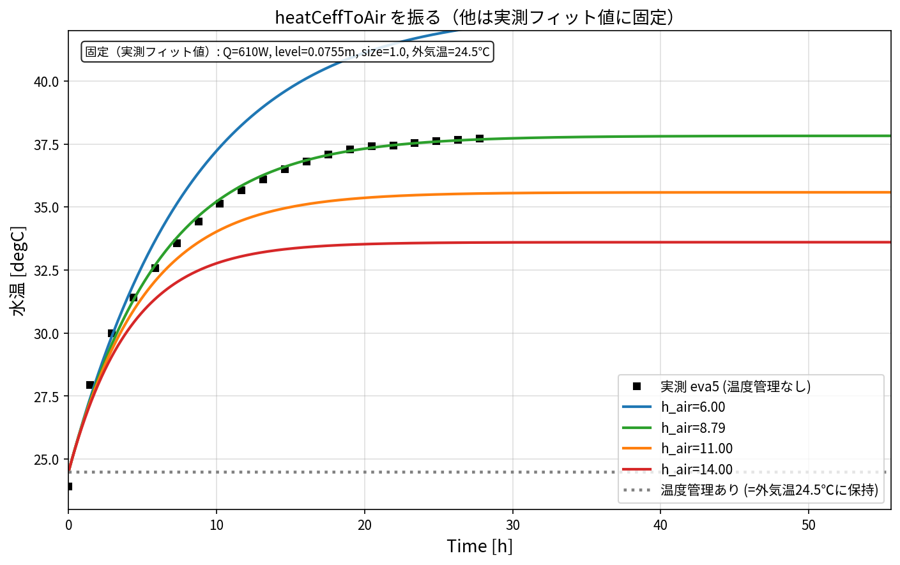
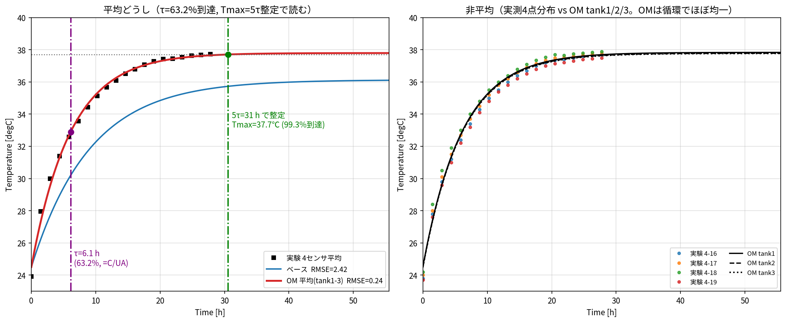

# タンク水温モデル パラメータスタディ計画書

OpenModelica モデル `OM/ana003_Tank3blocks_cyclononly_NoTemp.mo` と、実験データ
`data/eva5.py`（2026-07-09 計測）を突き合わせ、モデルを実測に合わせ込むための
パラメータ整理・数式化・影響因子分解・パラメータスタディ手法をまとめる。

対象の流れ:
**① 一致確認 → ② パラメータ整理 → ③ 調整 → ④ 数式化 → ⑤ 影響因子分解 →
⑥ 設計因子抽出＋パラメータスタディ → ⑦ pairplot でパレート → ⑧ 影響確認**

---

## 0. 物理系の概要

3 つの開放水槽（tank1/2/3）を配管（オリフィス）で接続し、サイクロン系のポンプで
水を循環させながら、サイクロンで発生する熱 `HF_cyclone`（既定 610 W）を循環水へ
投入する。水槽は上面から外気へ、底面・側壁から地面へ放熱する。外気温は 24.5 ℃
一定。初期水温 24.5 ℃。投入熱により水温が上昇し、放熱とつり合う温度で飽和する。

```
        Q_cyclone (610 W)
             │
   [pump]──►(循環水: tank1+tank2+tank3)
             │  ▲ 放熱
   外気24.5℃ ┤  ├─ 上面 → 外気 (h_air)
             │  └─ 底/壁 → 地面 (h_in → 伝導 kground → h_air → 24.5℃)
```

---

## 1. ① モデルと実験データの対応確認

### 1.1 対応関係

| 項目 | モデル (.mo) | 実験 (eva5.py) |
|---|---|---|
| 外気温 | `Tair_deg = 24.5` ℃ | 4-9（外気）≈ 24.5 ℃ 一定 |
| 初期水温 | `T_ini = 24.5 ℃` | t=0 で ≈ 23.8〜24.2 ℃ |
| 水温（出力） | `tank1/2/3.medium.T` [K] | 4-16 / 4-17 / 4-18 / 4-19 [℃] |
| 計測期間 | `stopTime = 200000 s`（飽和確認用） | 0〜100000 s（20 点） |
| 投入熱 | `HF_cyclone = 610 W` | （直接計測なし） |

実験の水温センサ 4-16〜4-19 は 23.8→約 37.7 ℃ へ上昇し飽和。
モデルは 3 水槽の `medium.T` を出力する。**センサとタンクの厳密な対応は不明**なので、
比較の基準は「4 センサの平均水温」を代表水温として用いる（`data/compare_OM_vs_exp.py`）。

**センサの場所ごとの違い**（4-18 が最も高温 +0.2〜0.5℃、4-19 が最も低温 −0.2〜0.4℃、
振れ幅は ±0.5℃ 程度）:



### 1.2 集中定数モデルによる解析的な一次確認（OM を回さずに妥当性を確認）

モデルのパラメータから、放熱係数の総和 UA と水の熱容量 C を積み上げ、
定常水温と時定数を手計算した結果（`docs/` の付録スクリプト相当）:

| 量 | 記号 | 計算値 | 実験 | 差 |
|---|---|---|---|---|
| 外気放熱（上面） | UA_air | 32.65 W/K | — | — |
| 地面放熱 | UA_ground | 19.80 W/K | — | — |
| 総放熱係数 | UA | **52.45 W/K** | (≈46 W/K 相当) | やや大 |
| 水質量 | m | 409 kg | (≈250 kg 相当) | やや大 |
| 熱容量 | C=m·cp | 1.71×10⁶ J/K | — | — |
| 飽和水温 | T_final=Tair+Q/UA | **36.1 ℃** | 37.7 ℃ | −1.6 ℃ |
| 時定数 | τ=C/UA | **32,700 s (9.1 h)** | ≈23,000 s | 1.4 倍遅い |

**判定**: 定常温度・上昇の傾向・オーダーは実験と整合しており、モデルは
**おおむね妥当**。ただし
- 飽和温度が **約 1.6 ℃ 低い** → 放熱 UA がやや過大 or 投入熱 Q がやや過小。
- 温度上昇が **約 1.4 倍遅い** → 実効熱容量 C（水量）が過大 or UA が過小。

この 2 点はトレードオフを含むため、次章以降のパラメータ調整・スタディで詰める。

**001: 実験 vs OM相当ベースライン**（集中定数解析解を OM 相当として描画。横軸は時間[h]）。
ベースは実験より低め・遅めで、上記の数値（−1.6℃, 1.4倍遅い）と一致する:



計算時間を約 56h（200,000 s）まで延ばすと、ベースは 36.1℃ で**飽和して頭打ち**になり、
実験の 37.7℃ には届かない。つまり不足しているのは**計算時間ではなくパラメータ**
（UA 過大／Q 過小）である。よって `run_sim.mos`・`run_study.py` の `stopTime` は
飽和が見える 200,000 s に設定している（実験データは 100,000 s まで）。

> 厳密な一致確認は Windows で `OM/run_sim.mos` を実行し、生成 CSV を
> `python data/compare_OM_vs_exp.py` で重ね描き（RMSE 判定つき）して行う。
> パラメータを振った連番比較図（`compare_001.png`, `compare_002.png` …）は
> `data/run_study.py` が自動生成する（§6.3）。

---

## 2. ② パラメータの整理

種別 — **G**:幾何（実測固定）, **P**:物性, **B**:境界条件, **I**:入力。
「可変」= パラメータスタディで振る候補。

| パラメータ | 記号 | 既定値 | 単位 | 種別 | 可変 |
|---|---|---|---|---|---|
| 外気側熱伝達率 | `heatCeffToAir` (h_air) | 10 | W/m²K | B | ◎ |
| タンク内側熱伝達率 | `heatCefftTank2in` (h_in) | 10 | W/m²K | B | ◎ |
| 機械内熱伝達率 | `heatCefftMachine2in` | 120 | W/m²K | B | △ |
| 地面熱伝導 | `kground` | 80 | W/mK | P | ○ |
| 外気温 | `Tair_deg` | 24.5 | ℃ | B | ×(実測固定) |
| 初期水温 | `T_ini` | 24.5 | ℃ | B | ×(実測固定) |
| 投入熱量 | `HF_cyclone`（表値） | 610 | W | I | ◎ |
| ポンプ流量 | `tT_pumpQ_cyclone` | 110/60 | — | I | △ |
| 初期水位 | `level_start` | 0.128 | m | G/B | ○(水量に直結) |
| 水槽高さ | `tank_height` | 0.240 | m | G | × |
| 板厚 | `tank_thickness` | 0.0023 | m | G | × |
| 各水槽寸法 | `Lx*,Ly*` | 実測 | m | G | × |
| 槽壁密度 | `rho_tank` | 7000 | kg/m³ | P | ×(NoTempで無効) |
| 槽壁比熱 | `Cp_tank` | 450 | J/kgK | P | ×(NoTempで無効) |

`NoTemp` 版は槽壁の熱容量を陽に持たないため `rho_tank/Cp_tank` は実効的に効かない。

---

## 3. ④ 数式化（集中定数エネルギー保存）

循環水を 1 つの集中質量とみなすと、水温 \(T\) の支配方程式は

$$
C \frac{dT}{dt} = Q - UA\,(T - T_\infty)
$$

- \(C = m\,c_{p,w}\)：循環水の熱容量 [J/K]，\(m=\sum_i \rho_w A_i \ell_i\)
- \(Q\)：投入熱 [W]（サイクロン）
- \(T_\infty\)：外気温 [℃]（=`Tair_deg`）
- \(UA\)：総合放熱係数 [W/K]

放熱経路は「外気（上面）」と「地面（底・壁）」の並列:

$$
UA = UA_\text{air} + UA_\text{ground}
$$

$$
UA_\text{air} = \sum_i h_\text{air}\,A_{\text{top},i}
$$

地面側は「内側対流 → 板伝導 → 地面対流」の直列抵抗:

$$
UA_{\text{ground},i} =
\left(
\frac{1}{h_\text{in} A_{\text{in},i}}
+ \frac{t_\text{wall}}{k_\text{ground} A_{\text{cond},i}}
+ \frac{1}{h_\text{air} A_{\text{g},i}}
\right)^{-1}
$$

### 3.1 解析解（定数入力・一定 \(T_\infty\)）

$$
T(t) = T_\infty + \frac{Q}{UA}\left(1 - e^{-t/\tau}\right),\qquad
\tau = \frac{C}{UA}
$$

- **飽和温度**：\(\displaystyle T_\text{final} = T_\infty + \frac{Q}{UA}\)
- **時定数**：\(\displaystyle \tau = \frac{C}{UA}\)（63.2% 到達時刻）

この 2 式が調整とパラメータスタディの中心。実測 \(T_\text{final}=37.7\,℃,\ T_\infty=24.5\,℃\)
より、**必要な \(Q/UA = 13.2\,℃**。実測 \(\tau\approx 23{,}000\) s。

---

## 4. ⑤ 影響因子の分解

2 つの応答（飽和温度と応答速度）を独立目標として分解する。

| 応答 | 支配式 | 上げる因子 | 下げる因子 |
|---|---|---|---|
| 飽和温度 \(T_\text{final}\) | \(T_\infty + Q/UA\) | Q↑ | UA↑ (h_air↑, h_in↑, kground↑, 面積) |
| 時定数 \(\tau\) | \(C/UA\) | C↑ (level↑, 水量) | UA↑ |

感度（偏微分の符号）:

$$
\frac{\partial T_\text{final}}{\partial Q} > 0,\quad
\frac{\partial T_\text{final}}{\partial UA} < 0,\quad
\frac{\partial \tau}{\partial C} > 0,\quad
\frac{\partial \tau}{\partial UA} < 0
$$

**キーポイント**：`UA` は両応答に効く共通因子（トレードオフの源）。
- `Q` は \(T_\text{final}\) のみ、`level`(=C) は \(\tau\) のみに効くので、
  この 2 つが「独立に効く操作ノブ」として調整しやすい。
- `kground` は板伝導が既に十分小さい抵抗（\(t/k\) 項が支配的でない）ため、
  UA への寄与が小さい **低感度因子** と予想 → スタディで確認する。

**感度（弾性）**：フィット点で各パラメータを +1% したときの応答変化。

| パラメータ | Tmax(ΔT基準) | τ |
|---|---|---|
| `Q_cyclone` | **+1.00%** | 0 |
| `heatCeffToAir` | −0.82% | −0.82% |
| tank2 上面積 (Lx2_1×Ly2_1) | **−0.63%** | ≈0 |
| tank3 上面積 | −0.20% | ≈0 |
| tank1 上面積 (Lx1_1×Ly1_1) | −0.13% | ≈0 |
| `level_start`（水位） | ≈0 | **+0.96%** |
| `heatCefftTank2in` | −0.06% | −0.17% |
| `kground` | ≈0 | ≈0 |

読み：**Tmax は `Q` / `heatCeffToAir` / tank2 面積**、**τ は `level_start`（水位）**が支配的。
幾何で効くのは tank1 ではなく **tank2 の上面**（放熱面積の 65%）。`kground` `heatCefftTank2in`
tank1/tank3 面積は低感度で固定してよい。→ スタディの設計因子は
**Q・heatCeffToAir（or tank2 面積）・level_start** の 3 つに絞れる。

### 4.1 図で見るパラメータ変化の影響（実測＋ベースを重畳）

各図とも黒マーカー＝実験平均、黒破線＝ベース、色線＝振った値。

**Q（投入熱）**: 飽和温度が上下（時定数はほぼ不変）。実測 37.7℃ に合わせるには Q↑。



**level（水量）**: 立ち上がりの速さ（時定数）が変化（飽和温度はほぼ不変）。実測は
ベースより速いので level↓（水量減）方向。



**h_air（外気放熱）**: 飽和温度と速さの両方に効く（UA 経由）。



> これらの図は解析解（集中定数）で描いた傾向。実 OM では `data/run_study.py` が
> 各ケースの `compare_XXX.png` を同じ様式（実験＋OM重畳）で連番生成する。

---

## 5. ③ パラメータ調整の方針

集中定数の一次結果（\(T_\text{final}\)=36.1℃ で −1.6℃, \(\tau\)=32,700 s で 1.4 倍遅い）
から、まず手動で当たりを付ける初期調整:

| 目的 | 操作 | 目安 |
|---|---|---|
| 飽和温度を +1.6℃ 上げる | Q↑ もしくは UA↓ | \(Q/UA=13.2\) になるよう UA≈46 W/K か Q≈690 W |
| 応答を約 1.4 倍速める | C↓（level↓）もしくは UA↑ | \(\tau=C/UA=23{,}000\) を満たす C≈1.06×10⁶（水量≈250 kg 相当） |

ただし「UA↑で速くする」と「UA↓で温度上げる」は逆方向。実務的には
1. **Q と level を主ノブ**にして \(T_\text{final}\) と \(\tau\) を独立に合わせる、
2. 残差を h_air / h_in で微調整、
という順が扱いやすい。厳密解はパラメータスタディ（次章）で最適点を探す。

### 5.1 実機に合わせた最適パラメータ（フィット結果）

集中定数モデルを実験平均カーブに最小二乗フィット（Q=610 W 固定、`docs/fit_params.py`）。
**RMSE 2.42℃ → 0.24℃** に改善し、ほぼ完全一致する:



| パラメータ | ベース | **フィット推奨** | 効果 |
|---|---|---|---|
| `Q_cyclone` | 610 W | 610 W（固定） | 投入熱は計測値を信頼 |
| `heatCeffToAir` | 10 | **8.79** | 放熱 UA を 52.5→45.9 W/K に。飽和温度を +1.6℃（→37.8℃） |
| `level_start` | 0.128 m | **0.0755 m** | 実効水量を 409→241 kg に。立ち上がりを 1.5 倍速く（τ 9.1h→6.1h） |

**ご仮説「放熱の面積が大きすぎる？」は半分正解**：
- **飽和温度が低い**主因は放熱側（\(hA\)）の過大。同じ結果は「面積係数 fA=0.90
  （放熱面積を 90% に）」でも得られる（`fit_params.py` の FIT B、RMSE 同値）。
  tank2 の上面 2.15 m² が UA_air の 2/3 を占めるので、この**有効露出面積の見直し**が効く。
- ただし**立ち上がりが遅い**主因は別で、\(dT/dt|_0 = Q/C\)（初期勾配）が実測の約 1/2
  ＝**実効水量が約 2 倍過大**。`level_start` を 0.128→0.076 に下げると一致する
  （タンクが満水でない／循環に効く実効水量が図面より少ない、等の可能性）。

**幾何は図面と一致**：tank1/2/3 の寸法（Lx1_1=903, Ly1_1=479, Lx1_2=1230, Ly1_2=159,
Lx2_1=1191, Ly2_1=1670, Lx2_2=478, Ly2_2=337, Lx3_1=573, Ly3_1=1191 mm）はレイアウト図と
一致を確認済み。したがって放熱面積の入力に誤りはなく、必要な UA 約12%減は「面積ミス」では
なく h_air がやや高め／水面の一部被覆といった小補正。**支配的な補正は実効水量（水位）**で、
実機の実際の水位（各タンク何 mm まで水が入っているか）の確認が最も効く。

**適用方法**（モデル既定は計測値のまま。フィット値は -override で当てる）:
```
-override heatCeffToAir=8.79,level_start=0.0755
```
`data/run_study.py` / `OM/run_sim.mos` にこの override を入れれば実 OM で確認できる。
面積仮説で合わせるなら、tank2 上面の有効面積（`Lx2_1*Ly2_1` 等）を約 90% に見直す。

> 本フィットは集中定数の解析解ベース。実 OM での最終確認は `compare_OM_vs_exp.py`
> （RMSE 判定つき）で行う。より広い探索・多目的最適は §6–7 のパラメータスタディ。

---

## 6. ⑥ 設計因子の抽出とパラメータスタディ手法（提案）

### 6.1 設計因子（5 因子）と探索範囲

`data/param_study.py` の `FACTORS` に定義。

| 因子 | モデル変数 | 範囲 | 基準 |
|---|---|---|---|
| Q | `Q_cyclone` | 500–750 W | 610 |
| h_air | `heatCeffToAir` | 5–20 W/m²K | 10 |
| h_in | `heatCefftTank2in` | 5–20 W/m²K | 10 |
| kground | `kground` | 20–160 W/mK | 80 |
| level | `level_start` | 0.090–0.160 m | 0.128 |

> **モデル側の準備（対応済み）**：`Q` は元々 TimeTable にべた書きで -override
> できなかったため、モデルへ `parameter Real Q_cyclone = 610;` を追加し、
> `tT_HF_cyclone(table = [0, Q_cyclone; 36000, Q_cyclone])` に差し替え済み。
> h_air / h_in / kground / level_start は元から `parameter` なのでそのまま -override 可。

### 6.2 手法の提案（推奨：スクリーニング → 応答曲面/感度）

目的は「少ない OM 実行回数で、実測（\(T_\text{final}, \tau\)）に合う因子域と
支配因子を特定する」こと。段階的に:

1. **スクリーニング（どの因子が効くか）**
   - 案A：2 水準要因計画（full \(2^5=32\) or 一部実施 \(2^{5-1}=16\)）。主効果を明快に分離。
   - 案B（推奨）：**ラテン超方格（LHS, N=50〜60）**。連続空間を少数点で均一に覆い、
     後述の応答曲面・相関・感度をそのまま計算できる。→ `param_study.py gen`
2. **応答取得**：各ケースを OM 実行し、応答 3 つを収集
   - `T_final`（t=100000 の水温）, `tau`（63.2% 到達時刻）, `rmse`（実測平均との二乗平均平方根）
3. **感度・支配因子**：標準化回帰係数（SRC）や相関で各因子→応答の寄与を評価
   （`kground` の低感度をここで確認）。
4. **最適化/合わせ込み**：多目的（\(|T_\text{final}-37.7|\) と \(|\tau-23000|\)）で
   パレート最適解を抽出（次章）。

### 6.3 実行フロー（Windows）

`data/run_study.py` が 2)〜4) を自動化する（Windows の Python + omc.exe 前提）。

```
cd ana005_OM_opt\data

# 1) 設計表(LHS)を作る
python param_study.py gen --n 30           # -> doe.csv

# 2) 各ケースを omc.exe で実行し、応答計算＋連番比較図を生成
python run_study.py                          # -> results.csv, docs/img/compare_XXX.png
#   omc パスは既定 C:\Program Files\OpenModelica1.26.3-64bit\bin\omc.exe
#   別パスなら環境変数 OMC で指定:  set OMC=D:\OpenModelica\bin\omc.exe

# 3) パレート解析（pairplot / パレート図）
python param_study.py pareto --csv results.csv   # -> pairplot.png, pareto.png
```

`run_study.py` は各ケースで
`simulate(..., simflags="-override Q_cyclone=..,heatCeffToAir=..,...")` を実行し、
`tank1/2/3.medium.T` の平均を代表水温[℃]として T_final / tau / rmse を算出、
実験平均を重ねた `compare_XXX.png` を保存する（K→℃変換・内挿・RMSE のロジックは
`compare_OM_vs_exp.py` と共通）。

---

## 7. ⑦ pairplot でパレート図 ／ ⑧ 影響確認

`data/param_study.py pareto` が出力するもの:

- **`pairplot.png`**：5 因子 + rmse の総当たり散布図行列。対角はヒストグラム。
  パレート最適点を色分け（seaborn。無ければ pandas.scatter_matrix にフォールバック）。
  → **どの因子帯に良解が集まるか**を視覚化（＝影響確認）。
- **`pareto.png`**：目的空間 \((|T_\text{final}-37.7|,\ |\tau-23000|)\) の散布図に
  **パレート前線**（非劣解）を赤で明示。各点にケース番号を付す。

### 読み取り方（⑧ 影響の確認）

- pairplot で **rmse と強い相関を持つ因子** = 支配因子。
  分解の予想どおり **Q（飽和温度）と level（時定数）** が効き、
  **kground はほぼ無相関（低感度）** になるはず。整合すれば分解モデルの裏取り完了。
- pareto.png の前線上から、用途に応じて 1 点選ぶ（例：飽和温度優先なら
  `err_Tfinal` 最小の端、応答速度優先なら `err_tau` 最小の端、バランスなら中央）。
- 選んだケースの因子値をモデルへ反映し、`compare_OM_vs_exp.py` で最終確認。

---

## 8. 成果物と実行手順まとめ

| ファイル | 役割 |
|---|---|
| `OM/ana003_Tank3blocks_cyclononly_NoTemp.mo` | 対象モデル（クラス名=ファイル名に統一／`Q_cyclone`追加済） |
| `OM/run_sim.mos` | Windows で基準ケースを回し結果 CSV を出力 |
| `data/eva5.py` | 実験データ（2026-07-09） |
| `data/compare_OM_vs_exp.py` | OM 結果 CSV と実験の重ね描き・RMSE 判定 |
| `data/param_study.py` | 設計表(LHS)生成 `gen` ／ パレート解析 `pareto` |
| `data/run_study.py` | Windows で omc.exe を回し連番比較図＋results.csv を生成 |
| `docs/make_figures.py` | 本書の図(fig000〜004)を解析解で生成 |
| `docs/fit_params.py` | 実機フィット(§5.1)。最適パラメータ推定＋fig005 生成（要 scipy） |
| `docs/lumped_check.py` | 集中定数一次確認の再現スクリプト |
| `docs/img/` | 本書の図（連番比較図 `compare_XXX.png` もここへ） |
| `docs/parameter_study_plan.md` | 本書 |

**基準ケースの確認**
```
# Windows
"C:\Program Files\OpenModelica1.26.3-64bit\bin\omc.exe" run_sim.mos   # OM フォルダ内
python data\compare_OM_vs_exp.py                                       # data フォルダ内
```

**パラメータスタディ（Windows 一気通貫）**
```
cd ana005_OM_opt\data
python param_study.py gen --n 30                       # doe.csv
python run_study.py                                    # results.csv, docs/img/compare_XXX.png
python param_study.py pareto --csv results.csv         # pairplot.png / pareto.png
```

---

## 付録：集中定数一次確認の計算前提

- 水物性：\(\rho_w=1000\ \mathrm{kg/m^3},\ c_{p,w}=4186\ \mathrm{J/kgK}\)
- 投入熱：\(Q=610\ \mathrm{W}\)，外気：\(T_\infty=24.5\,℃\)
- 上面積：tank1=0.433, tank2=2.150, tank3=0.682 m²
- 地面側は「内側対流(h_in)＋板伝導(kground/板厚)＋地面対流(h_air)」の直列を各槽で合成
- 水量は各槽 `crossArea × level`（tank3 は `level×0.9`）の総和 = 409 kg
- 結果：UA=52.45 W/K, C=1.71×10⁶ J/K, T_final=36.1 ℃, τ=32,700 s
