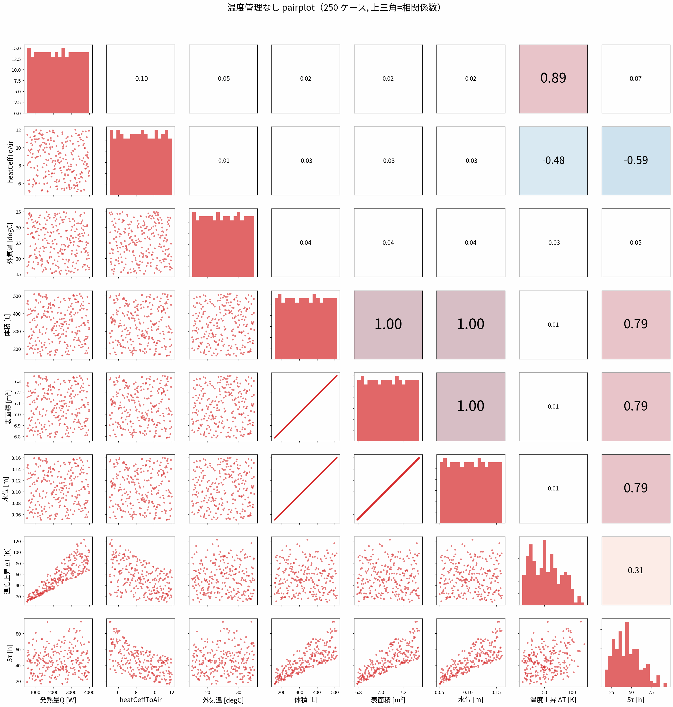
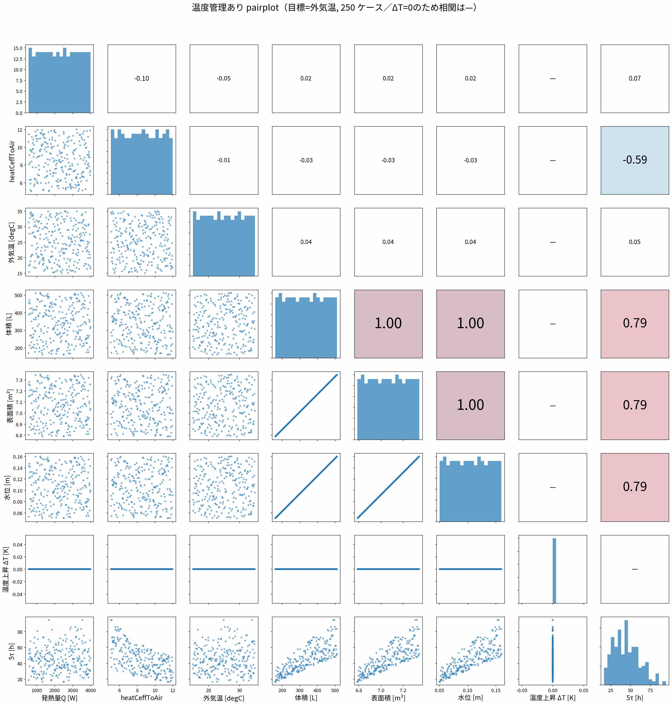
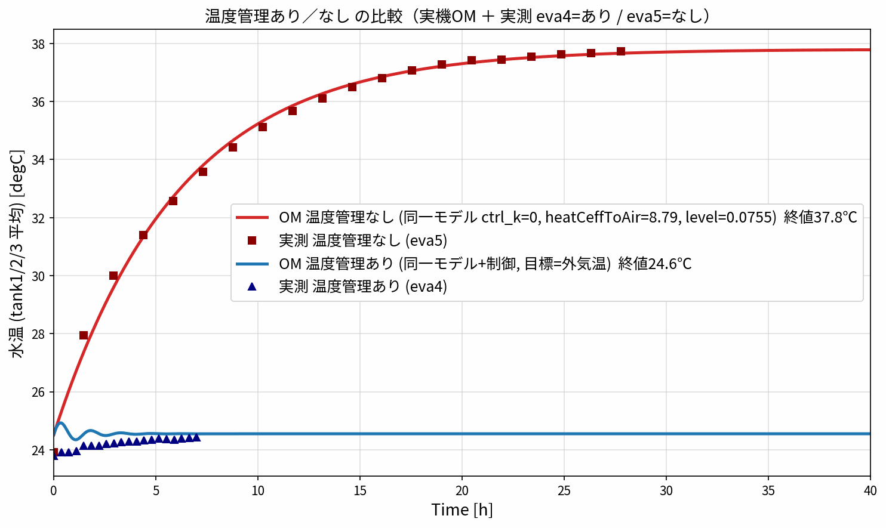

# 003_tank_para — タンク パラメータスタディ（温度管理あり/なし）

002 で実測に合わせ込んだ状態を起点に、因子を振ってタンク水温への影響を調べ、
さらに **温度管理あり／なし** を比較する。

---

## 1. 実行手順

```bash
cd 003_tank_para

# (A) フィット状態から各因子を振る（集中定数・数秒）
python vary_factors.py        # -> docs/img/vary_Q.png, vary_level.png, vary_h_air.png, vary_size.png

# (B) 因子の影響グリッド・目的空間（集中定数）
python study_pareto_demo.py   # -> docs/img/influence.png, objective_map.png, pairplot.png ほか

# (C) 温度管理あり/なし の pairplot（集中定数, 500ケース）
python pairplot_control.py --n 250   # -> docs/img/pairplot_control.png

# (D) 実機OMで あり/なし 2モデルを比較
#     OM/ の2モデルを omc で回して _cmp_*.csv を作り:
python compare_models.py      # -> docs/img/compare_models.png

# (E) 実機OMのパラメータスタディ（LHS -> omc -> pareto）
python param_study.py gen --n 30
python run_study.py
python param_study.py pareto --csv results.csv
```
集中定数の図は数秒、実機OMは1ケース約25〜50秒（`docs/003_openmodelica_paramstudy_howto.md` 参照）。

---

## 2. 計算ケース数

| スタディ | ケース数 | 手法 |
|---|---|---|
| 因子の影響（vary_*） | 4因子 × 各120点の掃引 | 集中定数（1因子ずつ、他はフィット値固定） |
| 影響グリッド / 目的空間 | LHS 300 点 | 集中定数 |
| **温度管理あり/なし pairplot** | **設計点 250 × 2条件 = 500 ケース相当** | 集中定数（LHS: Q, heatCeffToAir, 水位, 外気温） |
| 実機OM あり/なし 比較 | 2 モデル（各 stopTime=40h） | OpenModelica |
| 実機OM パラスタ（run_study） | LHS 30 点（既定） | OpenModelica |

---

## 3. 温度管理あり/なし pairplot（結果）

設計因子（**発熱量Q・heatCeffToAir・水位・外気温**）を LHS で振り、各設計点について
2 条件を評価。**温度管理は「目標＝外気温」**（例：外気15℃なら水温15℃に保持）とした。
**温度管理あり／なし で画像を分割**（各 250 ケース、上三角＝相関係数）。

温度管理なし（赤）:


温度管理あり（青, 目標=外気温）:


**読み取り・考察**
- **温度上昇 ΔT**：温度管理**なし**は ΔT = Q/UA ＝ **9〜24 K**（発熱・放熱条件で分布）。
  温度管理**あり**は目標＝外気温なので **ΔT ≒ 0**（水温＝外気温に張り付く）。
  → pairplot の ΔT 行で、赤（なし）は上方に散らばり、青（あり）は 0 に一列に並ぶ。
- **heatCeffToAir ↔ ΔT**（なし）：負の相関（放熱を増やすと温度上昇が下がる）。
- **水位 ↔ 5τ**：正の相関（水量が多いほど整定が遅い）。管理の有無に依らず熱時定数は同じ。
- **外気温**：なし側は ΔT に影響しない（上昇量は外気温に依らず Q/UA）が、絶対水温は外気温ぶん平行移動。
  あり側は水温＝外気温そのもの。
- **含意**：温度管理は「到達温度を外気温に固定」する効果が支配的で、Q や放熱条件のばらつきを
  吸収して水温を一定に保つ。管理なしでは同じばらつきがそのまま ΔT（=最大 24K）の差になって現れる。

---

## 4. 実機OMでの あり/なし（フェアな比較, `compare_models.png`）

**フェアな比較**：`OM/ana003_Tank3blocks_cyclononly_TempCtrl.mo` は、**温度管理なしモデル
（サイクロンのみ）に温度管理レギュレータを追加した同一モデル**で、`ctrl_k`（温度管理ゲイン）
だけを切り替える：
- `ctrl_k=0`（なし）→ 37.8℃（実測 eva5=37.7℃ と一致）
- `ctrl_k=300`（あり, 目標=外気温）→ 24.6℃（実測 eva4≈24℃ と一致）



> 以前の比較は「あり」に別モデル（flood/cover/cyclone 3熱源のフルモデル）を使っており
> フェアではなかった。上記は**同一モデル＋制御の有無のみ**の公平な比較。
> 検証: omc で `-override ctrl_k=0` と `-override ctrl_k=300`（他は fit 値）で確認済み。

---

## 5. 補足
- 集中定数（Python）と実機OMは基準36.1℃・フィット37.8℃・タンク差0.06℃で一致を確認済み（002/003）。
- 温度管理あり模型 `OM/ana003_Tank3blocks_cyclononly.mo` は PID レギュレータ。目標を外気温に
  合わせれば「外気15℃→15℃」の挙動になる。
