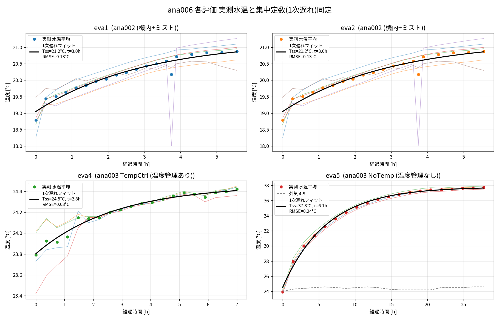

# 004_tank_eva（元 ana006）— タンク水温モデルの評価別（eva）検証

3槽循環タンクの水温モデルを、複数の実測評価条件（eva1/eva2/eva4/eva5）に対して照合・検証する。
評価ごとに使用するベースモデルが異なる。

| eva | 実測 | 使用モデル | 加熱 | 概要 |
|---|---|---|---|---|
| **eva1** | 2/19, センサ2-x | `ana002` 機内+ミスト | 機内循環＋各ヒータ | 18.8→20.9℃ を約5.5h（緩い昇温） |
| **eva2** | 2/19, センサ2-x | `ana002` 機内+ミスト | 同上 | eva1 とほぼ同一データ |
| **eva4** | 7/8, センサ4-x | `ana003` **TempCtrl 温度管理あり** | サイクロン610W＋**PID除熱** | 23.8→24.4℃（設定24.5℃で保持＝低温側） |
| **eva5** | 7/9, センサ4-x | `ana003` NoTemp 温度管理なし | サイクロン610W | 23.9→37.7℃ を約28h（自由昇温・合わせこみ済） |

> **eva4 と eva5 は同じ7月リグの対**：eva5＝温度管理なし（37.8℃まで自由昇温）、
> **eva4＝温度管理あり**（同じ610W投入でも設定温度24.5℃で保持されるため低温・横ばい）。

- **ana002**（機内モデル）：水が機械内（machine_liquid/machine_gas）を通り、flood/cover/cyclone/HD1OP
  の各ヒータ・ミスト除去を含む。外気19.5℃・初期18.5℃で eva1/eva2（2月）に対応。
- **ana003**（サイクロンのみ）：サイクロン投入熱610Wで3槽を昇温。外気24.5℃で eva4/eva5（7月）に対応。
  - eva5＝`NoTemp`（温度管理なし・自由昇温）、eva4＝`TempCtrl`（温度管理あり・PIDで設定温度に除熱保持）。

## フォルダ構成
```
004_tank_eva/
  eva1/  data/(eva1.py, csv, png)  model/(ana002...mo)  run_sim.mos  compare.py  fit_lumped.png
  eva2/  data/                     model/(ana002...mo)  run_sim.mos  compare.py  fit_lumped.png
  eva4/  data/                     model/(ana003...mo)  run_sim.mos  compare.py  fit_lumped.png
  eva5/  data/                     model/(ana003...mo)  run_sim.mos  compare.py  fit_lumped.png
  docs/  README.md  eva_summary.csv  img/eva_all_fits.png   ← 解説(md)と画像のみ
  scripts/ fit_all.py  draw_model.py  eva5_concept_diagram.py ← 作図・解析プログラムはここに集約
```
各 eva は自己完結（実測データ・モデル・実行スクリプト）。作図/解析のプログラムは
読みやすさのため `scripts/` にまとめ、`docs/` には解説と図だけを置く。

## 集中定数（1次遅れ）同定の結果

各 eva の水温センサ平均を `C dT/dt = Q − UA(T−Tamb)`（解は1次遅れ）で同定した結果。
実測は1次遅れで非常によく表される（RMSE 0.03〜0.24℃）。これが各 OM モデルの合わせこみ目標になる。



| eva | 外気Tamb [℃] | 飽和Tss [℃] | 上昇dT [℃] | 時定数τ [h] | fit RMSE [℃] | 同定UA [W/K] | 同定Q [W] |
|---|---:|---:|---:|---:|---:|---:|---:|
| eva1 | 19.5 | 21.2 | 1.7 | 3.0 | 0.13 | 95 | 162 |
| eva2 | 19.5 | 21.2 | 1.7 | 3.0 | 0.13 | 95 | 162 |
| eva4 | 24.5 | 24.5 | 0.0 | 2.8 | 0.03 | 103 | ≈0 |
| eva5 | 24.4 | 37.8 | 13.4 | 6.1 | 0.24 | 46 | **621** |

> UA・Q は熱容量 C（有効水位0.0755m×3槽断面×水物性）を仮定した逆算値。
> **eva5 の同定Q≈621W が実機の投入熱610W とほぼ一致**しており、集中定数同定と有効水質量の妥当性を裏付ける。
> eva4 は同定Q≈0＝**正味加熱ゼロ**。これは加熱が無いのではなく、サイクロン610Wを**温度管理のPID除熱が相殺**し
> 設定温度24.5℃に保持されるため（＝低温・横ばい）。eva1/eva2 は機内モデル（別熱容量）のため
> UA・Q はeva5基準Cでの相対値（目標は Tss=21.2℃, τ=3.0h）。

## モデルに反映済みの条件
- **eva5**：既知の合わせこみを反映（`level_start` 0.128→**0.0755**、`heatCeffToAir` 10→**8.79**、Q=610）。
  実測と **RMSE 0.24℃**（002_tank_base の結果を踏襲）。
- **eva4**：`ana003` **TempCtrl（温度管理あり）**を採用。サイクロン`Q_cyclone`=610W投入＋**PID除熱**
  （`ctrl_k`=200 で有効化、目標`Ttarget_deg`=外気24.5℃）、`T_ini`=**23.8℃**。設定温度で保持＝低温・横ばいを再現。
- **eva1/eva2**：`ana002` 既定（外気19.5℃・初期18.5℃）。**機内各ヒータの正味投入熱は要調整**
  （実測は dT≈1.7℃・τ≈3.0h と小さい昇温＝既定ヒータ合計より小さい正味熱）。次段階で OM 実行して合わせ込む。

## 実行手順（Windows OpenModelica 想定）
各 eva フォルダで：
```bat
cd eva5
"C:\Program Files\OpenModelica1.26.3-64bit\bin\omc.exe" run_sim.mos   :: -> *_res.csv
python compare.py                                                     :: 実測と重ねて RMSE 判定 -> compare_OM_vs_exp.png
```
- `run_sim.mos`：`model/` のモデルを読み、`stopTime`（eva毎: eva1/2=20000, eva4=25200, eva5=100000s）で
  CSV 出力（tank1/2/3 の水温[K]）。
- `compare.py`：OM結果（tank平均を℃換算）と実測水温平均を重ね、RMSE を算出。OM結果が無ければ実測のみ描画。

## 即時確認（Python のみ・OM不要）
```bash
# ana006 直下で実行（プログラムは scripts/ に集約）
python scripts/fit_all.py                    # 各evaの1次遅れ同定 → 各eva/fit_lumped.png, docs/img/eva_all_fits.png, eva_summary.csv
python scripts/eva5_concept_diagram.py       # eva5 熱の流れ概念図 → eva5/docs/img/eva5_concept.png
python scripts/draw_model.py <model.mo> <out.png> ["タイトル"]   # .mo構成図（例: eva5モデル→eva5/docs/img）
```

## 注記
- `docs/img/eva_all_fits.png` と各 `fit_lumped.png` は**実測データの1次遅れ同定**（データ駆動）。
  OM 実機の物理モデル結果は `run_sim.mos`→`compare.py` で得られる（本環境に omc 不在のため未実行）。
- **eva1 と eva2 は現状データが同一**。別条件であれば eva2 の実測（`eva2/data/eva2.py`）を差し替え要。
- eva3 は実測が空のため未作成（必要なら ana002 ベースで枠追加可能）。
