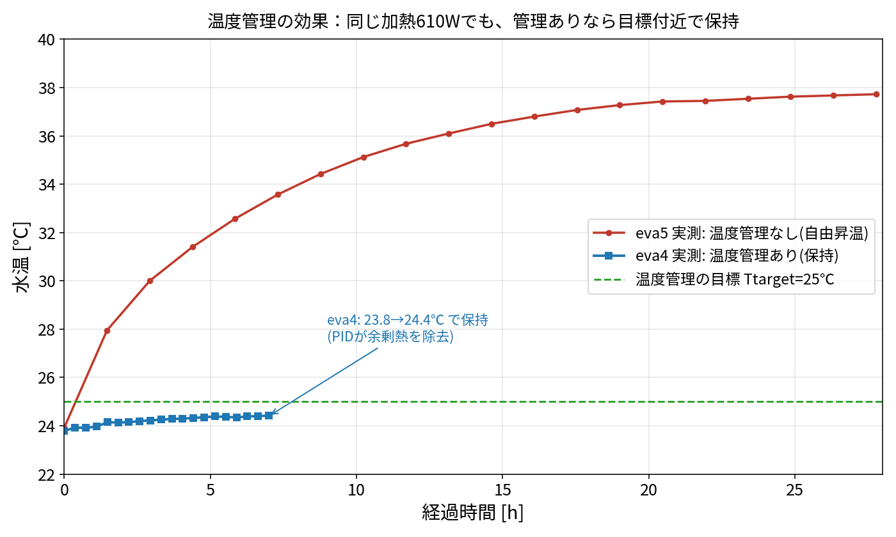
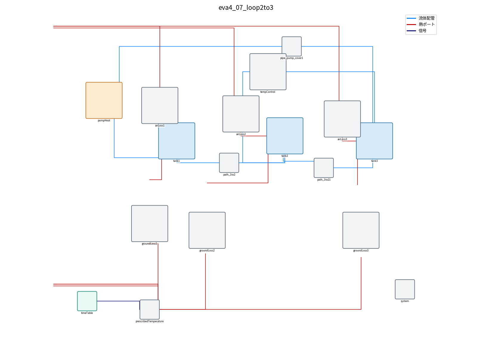
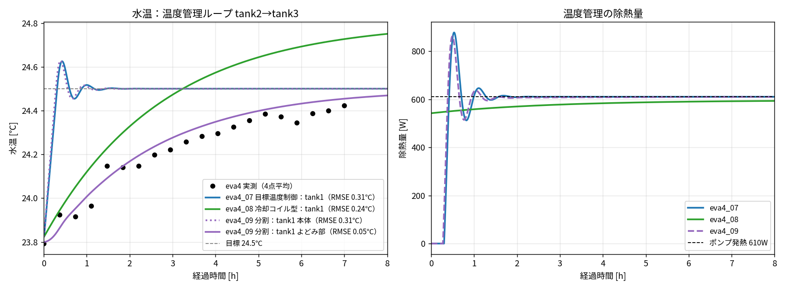

# eva4（温度管理あり）概要とモデル一覧

eva4 は eva5 と同じ7月リグ（4-x センサ）での実測で、違いは温度管理があること。
- eva5（温度管理なし）：サイクロン 610W で 23.9 → 37.7℃ まで上がる。
- eva4（温度管理あり）：同じ加熱でも 23.8 → 24.4℃ で保たれる（余った熱を冷却で取る）。

## 1. 今の標準の構成

温度管理ループは **tank2 から水を引いて、冷やして tank3 に返す**（流量 25 L/min）。
詳しくは [009_loop_tank2_to_tank3.md](009_loop_tank2_to_tank3.md)。

## 2. 実測との比較（最新）

- 実測に一番合うのは **eva4_09 の tank1 よどみ部**（誤差 0.05℃）。
- タンク内の混ざりにくい部分を入れると、目標温度制御のままでも実測のゆっくりした上がり方が説明できる。

## 3. モデル一覧

| モデル | 温度管理のループ | 温度管理の方式 | 実測との誤差 | 解説 |
|---|---|---|---|---|
| `ana001_Tank_004.mo` | ― | ユーザ作（Temperature regulator 内蔵） | ― | [002](002_daikin_and_models.md) |
| eva4_01_regLib | tank1 → tank3 | 目標温度制御（能力上限なし） | 0.31℃ | [002](002_daikin_and_models.md)、[003](003_comparison.md) |
| eva4_02_catalog | tank1 → tank3 | 目標温度制御（能力上限 3.5kW） | 0.31℃ | [002](002_daikin_and_models.md)、[003](003_comparison.md) |
| eva4_03_coilCtrl | tank1 → tank3 | 冷却コイル型 | 0.11℃ | [004](004_models_detail.md)、[005](005_option_c_setpoint.md) |
| eva4_04_immersion | ループなし（tank1 に浸漬） | 浸漬形オイルコン | ― | [006](006_immersion_cooler.md) |
| eva4_05_localSensor | ループなし（tank1） | センサ＝冷却機側の水 | 0.59℃ | [008](008_sensor_location_test.md) |
| eva4_06_pumpOutSensor | ループなし（tank1） | センサ＝ポンプ出口 | 0.25℃ | [008](008_sensor_location_test.md) |
| **eva4_07_loop2to3** | **tank2 → tank3** | 目標温度制御（センサ＝引いた水） | 0.31℃ | [009](009_loop_tank2_to_tank3.md) |
| **eva4_08_loop2to3_coil** | **tank2 → tank3** | 冷却コイル型 | 0.24℃ | [009](009_loop_tank2_to_tank3.md) |
| **eva4_09_loop2to3_split** | **tank2 → tank3** | 目標温度制御 ＋ tank1 を2つに分割 | **0.05℃**（よどみ部） | [009](009_loop_tank2_to_tank3.md) |

- 誤差は tank1 の水温（eva4_09 はよどみ部）と実測4点平均との比較。
- eva4_01〜03 の誤差は以前の計算（初期水温・計算方法が 07〜09 と違う）の値。

## 4. ドキュメント一覧

| 番号 | 内容 |
|---|---|
| [001](001_overview.md) | この概要・モデル一覧 |
| [002](002_daikin_and_models.md) | Daikin オイルコンのカタログと eva4_01/02 |
| [003](003_comparison.md) | eva4_01/02 と実測の比較 |
| [004](004_models_detail.md) | パラメータの根拠、冷却コイル型の合わせ方 |
| [005](005_option_c_setpoint.md) | 冷却コイル型（eva4_03） |
| [006](006_immersion_cooler.md) | 浸漬形オイルコン（eva4_04） |
| [007](007_missing_modeling_points.md) | 大きいタンクの温度がすぐ変わらない理由、モデルに足りない点 |
| [008](008_sensor_location_test.md) | センサ位置を変えた試し（eva4_05/06） |
| [009](009_loop_tank2_to_tank3.md) | ループ tank2 → tank3、tank1 の分割（eva4_07/08/09） |
| [010](010_eva4_09_explained.md) | eva4_09 で何をしたかの解説 |

## 5. eva4 実測の1次遅れ近似

eva4 の実測は、1次遅れで表せる（`../../docs/eva_summary.csv`）：
- 落ち着く温度 約 24.5℃、時定数 約 2.8 時間、当てはまりの誤差 0.03℃。
