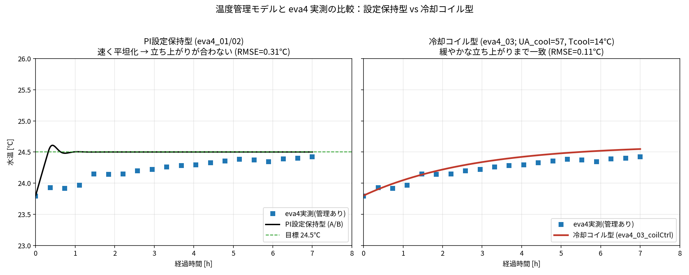
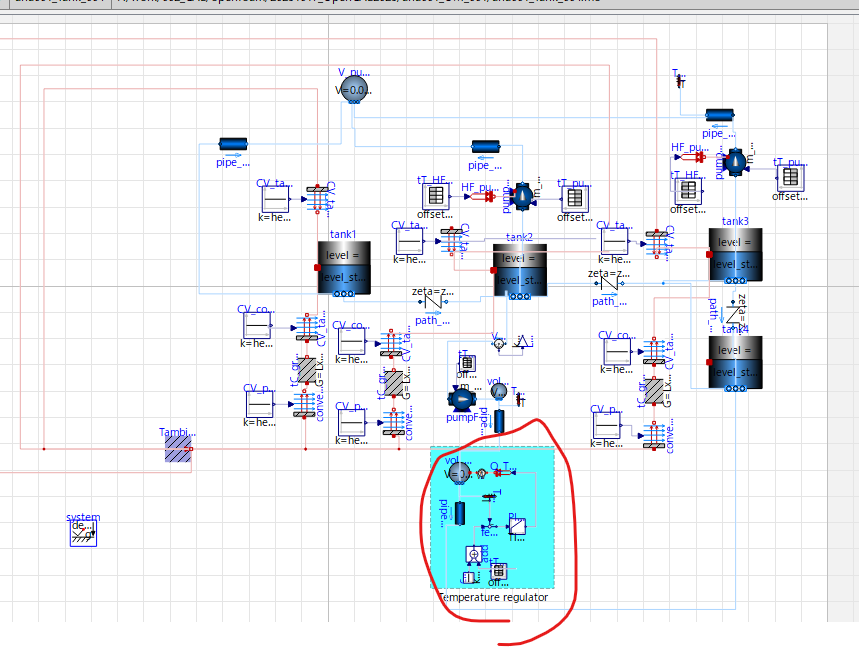
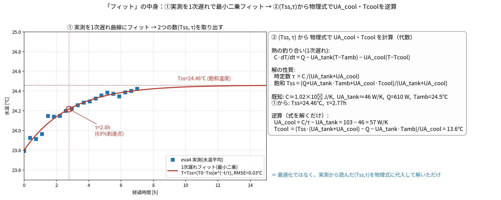
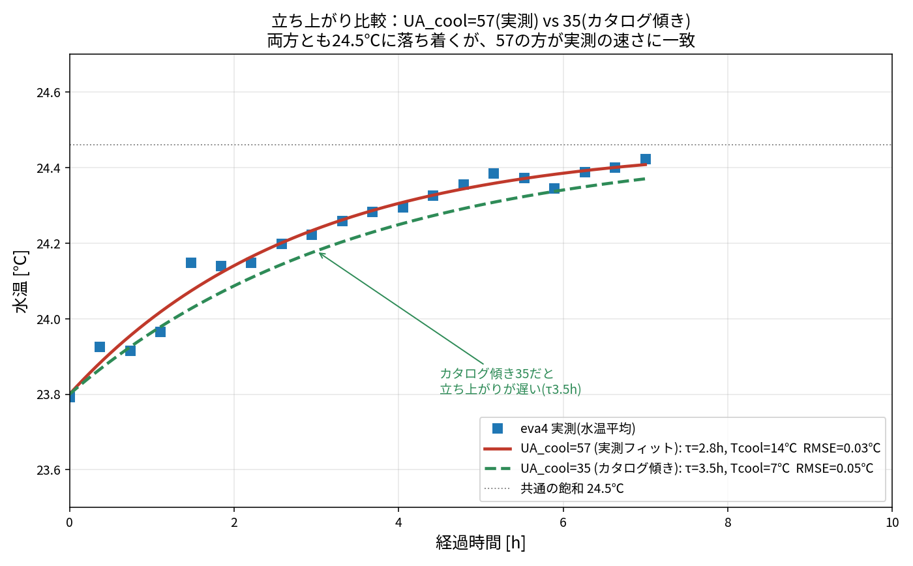
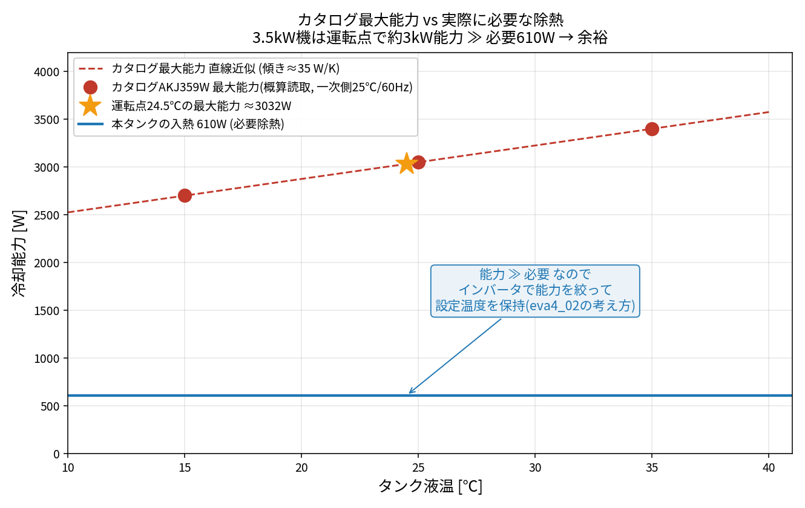

# eva4 温度管理モデル 各モデルの詳細解説

eva4（温度管理あり）を表す 4 つのモデルを、仕組み・パラメータ・長所短所・eva4 との適合で解説する。
`eva4_01/02/03` は**共通で eva5_04（全部品化）を土台**にし、タンク・加熱610W・放熱の設定は eva5 と同一。
違いは **温度管理（冷却）の作り方だけ**。

| モデル | 温度管理の作り方 | eva4適合(RMSE) | 一言 |
|---|---|---|---|
| `ana001_Tank_004.mo` | Temperature regulator 群（PID直接除熱）※ユーザ作・別リグ | ― | 発想の原型 |
| `eva4_01_regLib.mo` | `TempControl`（PI設定保持・能力上限なし） | 0.31℃ | 保持は◎だが立上り速すぎ |
| `eva4_02_catalog.mo` | `TempControl`（PI・冷却能力3.5kW上限） | 0.31℃ | 01と同等（能力に余裕） |
| **`eva4_03_coilCtrl.mo`** | **`CoolingCoilCtrl`（冷却コイル型）** | **0.11℃** | **★立上りまで一致・推奨** |

---

## 1. `ana001_Tank_004.mo`（ユーザ作・発想の原型）

- **構成**：4タンク＋「Temperature regulator」群（図で四角く囲った部分）。
  `vol_Treg`（小容量）を `pumpF` で循環させ、`T_Treg_out` で水温測定 → `feedback2` で目標との差 →
  `PID_Treg`(k=100, Ti=0.1) → `Q_Treg`(PrescribedHeatFlow) が `vol_Treg` を**直接除熱**して目標温度に保持。
- **目標温度**：`tT_Ttgt_Treg` = 25℃。
- **位置づけ**：温度管理の**発想の原型**。ただしタンク寸法(Lx=500mm等)・外気(25℃)が ana006 の7月リグと異なるため、
  eva4 データと数値を直接比べる用ではなく「温度管理の実装例」。

## 2. `eva4_01_regLib.mo`（温度管理をライブラリ化：PI設定保持・上限なし）

- **構成**：eva5_04 ＋ 部品 **`TempControl`**（tank1→ポンプ→水温センサ→PID→除熱→tank3）。
- **仕組み**：`LimPID`(PI) が「目標温度 `Ttarget` と水温の差」から除熱量を決め、`cooler` で除熱。
  積分(Ti)により定常で誤差ゼロ＝**設定温度にきつく保持**。冷却のみ（yMax=0）。
- **主パラメータ**：`Ttarget`=24.5℃, `ctrl_k`=2000 W/K, `cooling_capacity`=**1e9（実質上限なし）**, `m_flow`。
- **eva4適合**：保持温度は 24.5℃ で合うが、**設定へ速く到達**するため実測の緩やかな立上り(τ2.8h)と合わない（RMSE 0.31℃）。
- **用途**：理想的な高精度制御（能力無限）を仮定したいとき。ana001 の regulator を部品化した位置づけ。

## 3. `eva4_02_catalog.mo`（Daikinカタログ準拠：冷却能力に上限）

- **構成**：2 と同じ `TempControl`。違いは **`cooling_capacity`=3500W（Daikin 3.5kW）** を除熱の**上限**に設定
  （`LimPID` の `yMin=-cooling_capacity`）。
- **意味**：実機オイルコンは除熱能力に上限がある。入熱がこれを超えると保持できず温度上昇。
- **eva4適合**：本ケースは入熱**610W ≪ 3.5kW**で能力に余裕 → **eva4_01 とほぼ同一挙動**（RMSE 0.31℃）。
  能力上限の差が現れるのは高入熱時のみ。
- **用途**：カタログ能力での成立性チェック（この負荷なら3.5kWで十分、等）。

## 4. `eva4_03_coilCtrl.mo`（冷却コイル型オイルコン）

- **構成**：eva5_04 ＋ 部品 **`CoolingCoilCtrl`**（tank1→ポンプ→**冷却コイル**→tank3）。
  コイルは `ThermalConductor`(G=`UA_cool`) で **冷媒温度 `Tcool`** の固定温度源につながる。
- **仕組み**：除熱量 = **`UA_cool × (水温 − Tcool)`**。水温が高いほど除熱が増える＝**能力が水温依存**。
  これは実機の冷凍サイクル（冷却コイル=蒸発器）の外部挙動そのもの（→ カタログの能力特性図と整合）。
- **平衡温度**：`T = (Q_in + UA_tank·Tamb + UA_cool·Tcool)/(UA_tank + UA_cool)`。
  UA_cool=57, Tcool=14℃, Q=610, UA_tank=46, Tamb=24.5 → **T≈24.5℃**。
- **立ち上がり**：`τ = C/(UA_tank + UA_cool) ≈ 2.8h`（水の熱容量が大きいため）。
- **eva4適合**：**緩やかな立ち上がりまで一致（RMSE 0.11℃）**。eva4 の1次遅れ同定(Tss24.5, τ2.8h)と物理的に一致。
- **主パラメータ**：`Tcool`（冷媒温度＝落ち着き先を下げる）, `UA_cool`（大きいほど平衡が低く・速く）, `m_flow`。
- **用途**：**eva4 の実測（立上り含む）を再現する本命モデル**。実機の「能力が水温で変わる」特性も自然に表現。

### なぜコイル型が合うのか（PI型との違い）
- **PI設定保持型**：目標温度に“即座に”合わせ込む理想制御 → 速く平坦化。
- **冷却コイル型**：冷媒温度との温度差で除熱するため、水温が上がるにつれ除熱が増え、**平衡へゆっくり近づく**。
  実機（有限の熱伝達＋大きな水熱容量）はこちらに近い。

---

## 合わせこみノブ早見表
| 合わせたい | eva4_01/02 (PI型) | eva4_03 (コイル型) |
|---|---|---|
| 保持温度(定常) | `Ttarget` | `Tcool` と `UA_cool`（平衡式で決まる） |
| 立ち上がりの速さ(τ) | `ctrl_k`（弱いと遅い） | `UA_cool`（大きいと速い）／水量 |
| 能力の頭打ち | `cooling_capacity` | UA_cool で自動的に水温依存 |

---

## 5. 冷却パラメータの根拠：実測フィット vs カタログ由来

冷却コイル型の `UA_cool=57 W/K`・`Tcool=14℃` が**どこから来たか**の区別（重要）：

| 数値 | 意味 | 出所 |
|---|---|---|
| 「水温が高いほど能力↑」という**形** | 除熱=UA×(水温−Tcool) の形 | **カタログ特性図**（AKJ359W）と一致 |
| **傾き ≈ 35 W/K** | 最大能力の 液温依存の傾き | **カタログ**（図の読取: 液温15/25/35→能力2700/3050/3400W） |
| **`UA_cool` ≈ 57 W/K** | 立ち上がりを決める実効コンダクタンス | **eva4実測フィット**（τ2.8h → C/τ−UA_tank=103−46） |
| **`Tcool` = 14℃** | 落ち着く温度を決める冷媒温度 | **eva4実測フィット**（Tss24.5℃から逆算） |
| 冷却能力3.5kWで足りる | 最大能力≫必要 | **カタログ**（最大能力3.5kW ≫ 必要610W） |

> ⚠ **35 と 57 は別物**：35＝カタログの「最大能力の傾き」、57＝実測フィットの「UA_cool」。
> 両者が同オーダー(35〜57)なのは**物理的妥当性の確認**にはなるが、イコールではない。カタログ由来と言えるのは **35** と **形** と **能力上限3.5kW** のみ。

### 「実測フィット」の中身（具体的に何をしたか）

`UA_cool`・`Tcool` は次の**2段階**で決めた（ブラックボックス最適化ではない）：
1. **① 曲線フィット（最小二乗）**：eva4 の水温データ（20点）に1次遅れ `T=Tss+(T0−Tss)e^(−t/τ)` を当てはめ、
   **`Tss=24.46℃`（飽和温度）** と **`τ=2.77h`（時定数）** を取り出す（RMSE 0.03℃）。
2. **② 代数の逆算**：1次遅れ熱バランスの解の性質に ① の値と既知量（C, UA_tank, Q, Tamb）を代入：
   - `UA_cool = C/τ − UA_tank = 103 − 46 = **57 W/K**`
   - `Tcool = (Tss·(UA_tank+UA_cool) − Q − UA_tank·Tamb)/UA_cool = **13.6 ≈ 14℃**`

→ ②は**式を解いただけ**。「フィット」は正確には **①最小二乗フィット ＋ ②代数逆算** の合わせ技。

### もし UA_cool をカタログの傾き35にしたら（57 との比較）

両方とも飽和24.5℃に合わせた（Tcoolで調整）うえで立ち上がりを比較：
- **UA_cool=57（実測フィット）**：τ=2.8h、eva4に一致（RMSE 0.03℃）。
- **UA_cool=35（カタログ傾き）**：τ=3.5h と**やや遅く**、実測からわずかにズレる（RMSE 0.05℃）。Tcoolは7℃と低めになる。
- → eva4 の実際の立ち上がりは、カタログ最大能力の傾き(35)より**強い除熱(57)**で説明される
  （実機はフル出力の一部＋制御・熱遅れが効くため）。差は小さいので、カタログ由来で概算するなら35でも実用範囲。

### カタログ由来の見方（最大能力＋インバータで絞る）

- AKJ359W 特性図を概算読み取り（一次側25℃/60Hz）：**タンク液温が高いほど能力↑、傾き≈35 W/K**。
- **運転点24.5℃での最大能力 ≈ 3.0 kW**（定格3.5kW機）。一方**必要な除熱は入熱と同じ610W**だけ。
- つまり **能力 ≫ 必要（3000W ≫ 610W）** なので、実機はインバータで能力を**610W相当まで絞って**設定温度を保つ。
  これは「**設定保持＋能力上限**」型（`eva4_02_catalog`, `cooling_capacity=3500`）の考え方＝**完全にカタログ由来**の設定。
- ただしカタログの「最大能力」は**エネルギーの上限（天井）**で、実運転の除熱量(600W)や立ち上がりτは決めない。
  → **立ち上がりまで合わせる**なら実測フィットのコイル型（`eva4_03`, UA_cool/Tcoolは実測由来）を使う。

**まとめ**：`eva4_02`＝上限のみカタログ（保持は速い）、`eva4_03`＝形はカタログ準拠・値は実測フィット（立上りまで一致）。

## 6. GUIでの操作：温度管理 ON/OFF と 循環流量

温度管理部品（`TempControl`, `CoolingCoilCtrl`）に**GUIで触れるパラメータ**を用意：

| パラメータ | 意味 | 操作 |
|---|---|---|
| **`enabled`** | 温度管理 **ON/OFF** | OMEdit のパラメータ画面で**チェックボックス**。`true`=管理あり(eva4), `false`=管理なし(eva5相当) |
| **`flow_Lmin`** | 循環くみ上げ流量 [L/min] | 既定 **25 L/min**（=0.417 kg/s に自動換算） |

- **ON/OFF の仕組み（lib側で完結）**：
  - コイル型：`enabled=false` で `coil.G=0` → 除熱ゼロ → 自由昇温（eva5と同じ）。
  - 設定保持型：`enabled=false` で `LimPID.yMin=0`（yMax=0と合わせ出力0）→ 除熱ゼロ。
- **使い方**：同じモデルのまま、`coilCtrl`(または`tempControl`)の `enabled` を切り替えるだけで
  **温度管理あり(eva4) ↔ なし(eva5)** を比較できる。モデルを別々に作る必要なし。
- 流量を変えるなら `flow_Lmin` を書き換え（例 40 L/min）。質量流量は `flow_Lmin/60` [kg/s] に自動換算（水: 1L≈1kg）。

関連：実機の定格能力・冷凍サイクルは [`002_daikin_and_models.md`](002_daikin_and_models.md)、比較は [`003_comparison.md`](003_comparison.md)。
