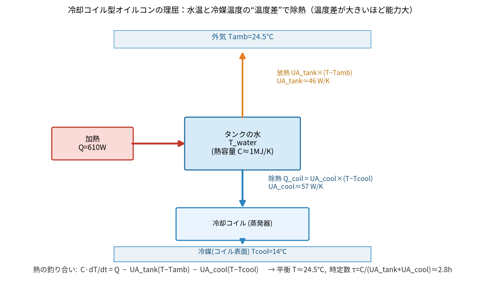

# option (c)：基準温度に追従する温度管理 — どこが設定温度か

## 疑問
「温度管理＝基準温度に追従」なのに、コイル型 `eva4_03` には一見“設定温度”が無い。おかしいのでは？

## 結論（先に）
**基準温度（設定ノブ）は「冷却側の温度 `Tcool`」です。** オイルコンは自分の**冷却側（オイル/冷媒）を `Tcool` に保持**し、
タンク水温はその冷却と加熱の釣り合いで決まる**平衡温度へ 1次遅れで追従**します。
`eva4_03`（`Tcool=14℃`）は、まさにこの option (c) の実体で、eva4 実測に **RMSE 0.11℃** で一致します。

---

## option (c) の考え方：ループ制御＋タンク遅れ

実機のイメージ：
```
  ┌─ 冷却側(オイル/冷媒) を Tcool に保持 ─┐   ← ここが「基準温度(設定)」
  │        ↑ コイルで除熱 UA_cool         │
  タンク水(大きな熱容量C) ← 加熱Q, 外気放熱UA_tank
```
- **冷却側（ループ）**：オイルコンが `Tcool` に保持（応答が速い）。
- **タンク水**：大きな熱容量 `C` を持ち、コイル（`UA_cool`）を介して冷却側とつながる → **遅れて追従**。

### なぜ「タンクを24.5℃に設定」ではないのか
タンクには加熱 `Q=610W` が入り続ける。**熱を捨てるにはタンクが冷却側より高くないといけない**。
だからタンクは冷却側(`Tcool=14℃`)より高い平衡温度(24.5℃)に落ち着く。
→ 「タンクを24.5℃に直接ホールド」ではなく、**冷却側を14℃に保つ結果として**タンクが24.5℃になる。

### 数式（1次遅れ）
```
C·dT_tank/dt = Q − UA_tank(T_tank − Tamb) − UA_cool(T_tank − Tcool)
  平衡:   T_tank = (Q + UA_tank·Tamb + UA_cool·Tcool) / (UA_tank + UA_cool)
  時定数: τ      = C / (UA_tank + UA_cool)
```
- 基準温度 `Tcool` を下げると平衡タンク温度も下がる（＝管理温度が下がる）。**Tcool が設定ノブ**。
- 立ち上がりが緩やか（τ≈2.8h）なのは、コイル `UA_cool` が有限で、水の熱容量 `C` が大きいから。

> ⚠ 前に試した「PIでタンクを設定温度にきつく保持する型」は、設定に**速く張り付く**ため
> eva4 の緩やかな立ち上がりと合わなかった（RMSE 0.42〜0.74）。→ option (c)=受動コイル型が正解。

---

## タンクを狙った温度にしたいとき（Tcool の決め方）
タンクを `T_want` に管理したいなら、上の平衡式を `Tcool` について解く：
```
Tcool = ( T_want·(UA_tank + UA_cool) − Q − UA_tank·Tamb ) / UA_cool
```
例）`T_want=24.5℃, Q=610W, UA_tank=46, UA_cool=57, Tamb=24.5℃` → **Tcool ≈ 14℃**（eva4に一致）。
`T_want` を下げたい → `Tcool` を下げる。加熱 `Q` が増えた → 同じ `Tcool` ならタンク平衡が上がるので、
保ちたいなら `Tcool` を下げる（＝より能力の高い運転）。

## 実装（`CoolingCoilCtrl` 部品）
- `coil`（ThermalConductor, `G=UA_cool`）で タンク水 ↔ 冷却側 を接続。
- `coolant`（FixedTemperature, `T=Tcool`）＝冷却側を基準温度に保持。
- `enabled=false` で `G=0` → 除熱ゼロ＝**温度管理OFF（eva5相当・自由昇温）**。
- GUIノブ：`Tcool`（基準温度）, `UA_cool`（能力）, `flow_Lmin`（流量）, `enabled`（ON/OFF）。



## まとめ
| 問い | 答え |
|---|---|
| 基準温度(設定)はどこ？ | **冷却側 `Tcool`**（オイルコンが保持する温度） |
| タンク温度は？ | 平衡として決まる（`Tcool` を上げ下げして管理） |
| 立ち上がりが緩やかな理由 | コイル能力 `UA_cool` が有限＋水の熱容量が大きい（τ≈2.8h） |
| eva4 一致 | `eva4_03`（Tcool=14℃）で **RMSE 0.11℃** |

より厳密に「オイル温度センサで冷却側をフィードバック制御」まで作るなら、`coolant` を
PI制御の可変温度源にする拡張も可能（ただしタンク水温の再現には上記で十分）。
