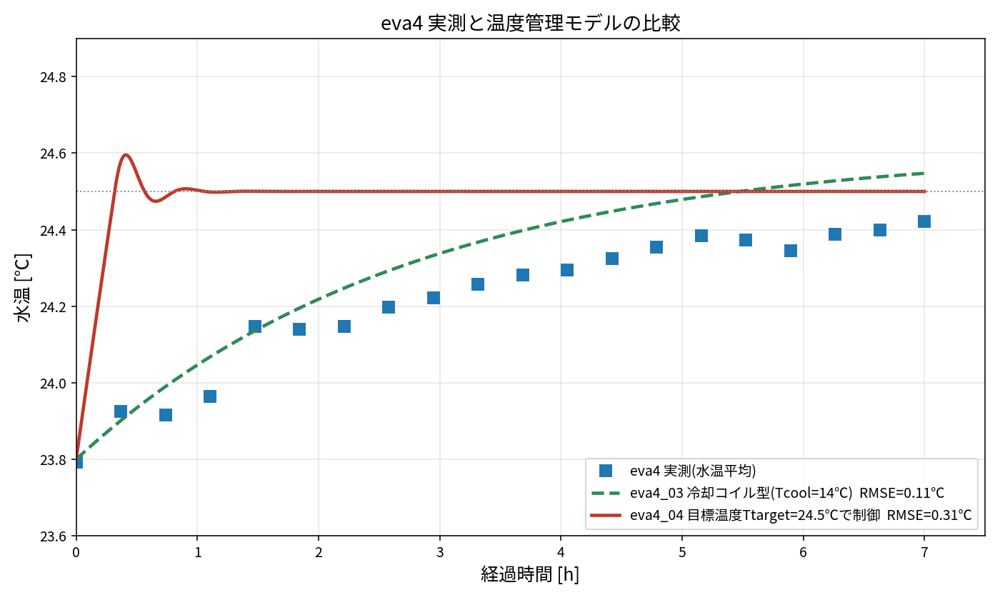
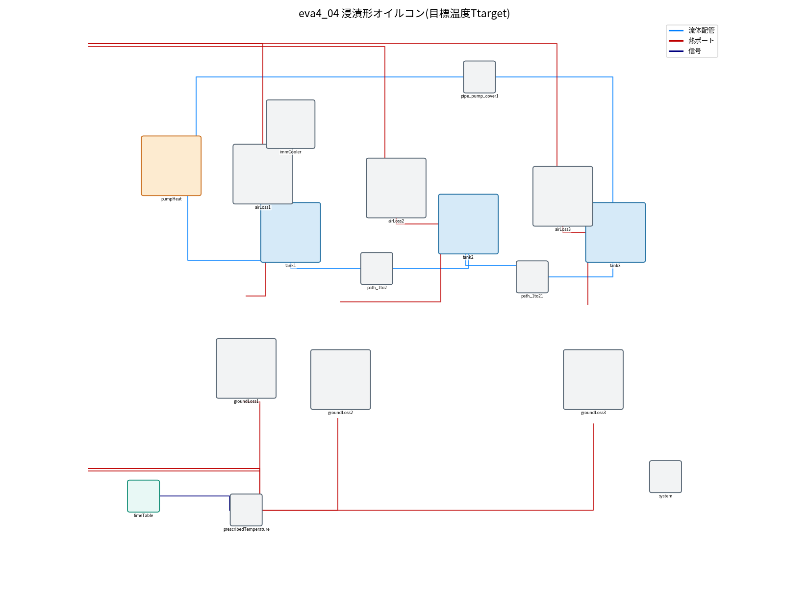

# eva4_04：浸漬形オイルコンのモデル（ImmersionCooler）

対象ファイル：`eva4/model/eva4_04_immersion.mo`（部品 `ImmersionCooler`）

## 1. 実測との温度比較



| モデル | 設定 | 実測との誤差(RMSE) | 24.4℃に達する時間 |
|---|---|---|---|
| eva4 実測 | ― | ― | 約7時間 |
| eva4_03（冷却コイル型） | Tcool = 14℃ | 0.11℃ | 約7時間 |
| eva4_04（目標温度で制御） | Ttarget = 24.5℃ | 0.31℃ | 約16分 |

- eva4_04 は目標温度 24.5℃ に**約16分で到達**し、その後一定になる。実測は**約7時間かけてゆっくり上がる**ので、立ち上がりが合わない。
- 最終的な温度（24.4〜24.5℃）はどちらも合っている。
- 立ち上がりまで合わせたい場合は eva4_03（冷却コイル型）を使う。

※この比較は集中定数（タンク全体を1つの温度とみなす）での計算。OMEdit で実行した結果とは細部が異なる場合がある。

## 2. 目標温度（Ttarget）の設定場所

OMEdit で `eva4_04_immersion` を開き、**`immCooler` をダブルクリック** → パラメータ画面の **`Ttarget`** に目標温度[℃]を入力する。

| パラメータ | 意味 | 既定値 |
|---|---|---|
| `Ttarget` | 目標温度。タンクをこの温度に保つよう除熱する | 24.5 ℃ |
| `capacity` | 冷却能力（除熱の上限）。3.5kW機なら 3500、5.0kW機なら 5000 | 3500 W |
| `enabled` | 温度管理のON/OFF（チェックを外すと除熱0＝管理なし） | ON |
| `ctrl_k` | 制御ゲイン（大きいほど強く目標に合わせる） | 3000 W/K |

モデルファイル上では次の行（テキストで直接書き換えても可）：
```modelica
ImmersionCooler immCooler(Ttarget = 24.5, capacity = 3500, enabled = true)
```

## 3. モデルの構成



- `immCooler` は tank1 の真上に配置し、赤い線で `tank1.heatPort` に直接つないでいる（熱の接続）。
- 中身：水温センサ(`Tsens`)でタンク水温を測り、PI制御(`pid`)で目標温度との差から除熱量を決め、`cooler` でタンクから熱を取る。
- 除熱は冷却のみ（タンクを温めることはしない）。上限は `capacity`。

## 4. 実機（Daikin 浸漬形 AKJ9）との対応

（画像はメーカーのカタログからの切り出しのため公開版では省略。Daikin カタログ HK289B の冷凍サイクルの図（浸漬形）を参照）

- 実機は冷却コイル(D)をタンクに直接沈め、撹拌モーターでタンク内をかき混ぜる。
- 冷凍サイクル（A 圧縮機 → B 凝縮器 → C 膨張弁 → D 冷却コイル → E ホットガスバイパス）は、
  このモデルでは「目標温度に保つ・能力の上限がある」という形にまとめている。
- 浸漬形なので、別の配管ループに水を回して冷やす構造はない（コイルがタンクの中にある）。

## 5. なぜ目標温度制御だと立ち上がりが速くなるか

- 開始時の水温(23.8℃)は目標(24.5℃)より低い。目標より低いうちは冷却しないので、ポンプの発熱 610W がそのまま水を温め、約16分で目標に届く。
- 実測は約7時間かかっている。これは実機が「目標に着くまで冷却を止める」のではなく、**冷却がずっと少しずつ効いていた**ことを示す。
- 冷却コイル型（除熱 = UA_cool ×(水温 − Tcool)）は、水温に応じて常に冷却が効くので、実測のようにゆっくり近づく。

## 6. 温度管理モデルの一覧（eva4）

| モデル | 方式 | 設定するもの | 実測との誤差 |
|---|---|---|---|
| eva4_01_regLib | 目標温度で制御（能力上限なし） | Ttarget | 0.31℃ |
| eva4_02_catalog | 目標温度で制御（能力上限3.5kW） | Ttarget, cooling_capacity | 0.31℃ |
| eva4_03_coilCtrl | 冷却コイル型 | Tcool, UA_cool | 0.11℃ |
| eva4_04_immersion | 浸漬形・目標温度で制御 | Ttarget, capacity | 0.31℃ |

## 7. 実行方法
```bat
cd eva4
"C:\Program Files\OpenModelica1.26.3-64bit\bin\omc.exe" run_sim_04_immersion.mos
```
