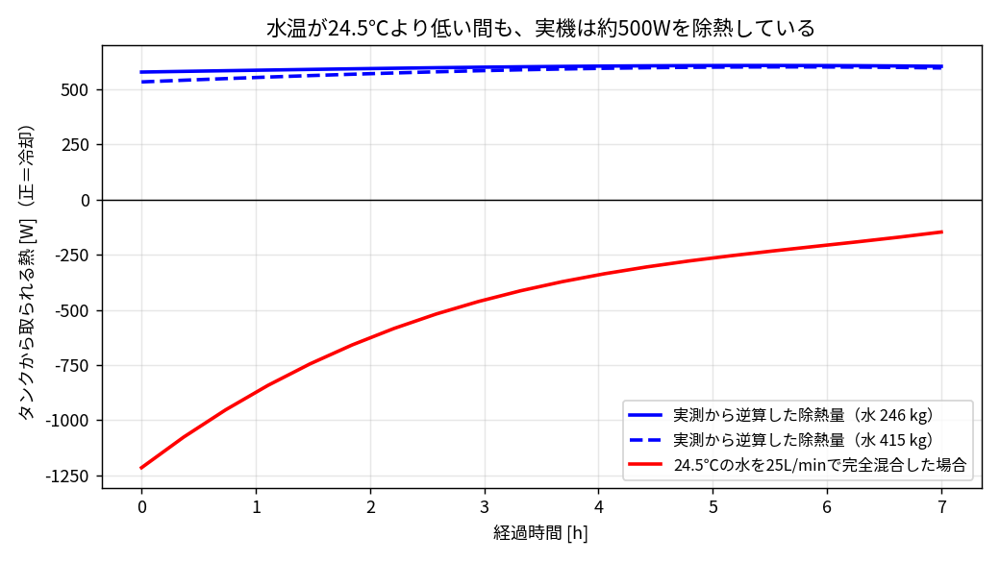
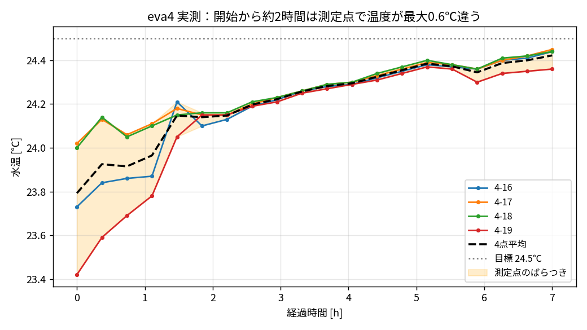

# eva4：大きいタンクの温度がすぐ変わらない理由と、モデルに足りない点

疑問：「23.5℃の大きいタンクに 24.5℃ の水を 25 L/min 入れても、タンクの温度がすぐ変わるとは思えない」

結論：今のモデルでは次の3点が足りていない（影響の大きい順）。

1. **冷却機がどの温度を見て制御しているか**（実機は水温が24.5℃より低くても約500W冷やしている）
2. **タンクの中が完全には混ざっていない**（今のモデルはタンク全体を1つの温度として扱っている）
3. **水の量が物理値より少ない**（合わせこみで 246 kg。図面の水位なら約 415 kg）

タンクの鉄板の熱容量は小さく、影響はほとんどない（下の4章）。

---

## 1. 今のモデルで「すぐ変わる」理由

今のモデル（OpenTank）は、タンクの水が**常に完全に混ざっている**と仮定している。
この仮定だと、入ってきた 24.5℃ の水は一瞬でタンク全体に混ざる。

| 項目 | 値 |
|---|---|
| 25 L/min の水が 1℃ 差で運ぶ熱 | 0.417 kg/s × 4186 × 1℃ ≈ **1740 W** |
| タンクの水（モデル） | 246 kg → 25 L/min で約 **10分** で全量入れ替わる |
| 温度が近づく時間の目安 | 246 × 4186 ÷ 1740 ≈ **10分**（水 415 kg でも約 17分） |

つまり「完全混合＋24.5℃ の水を 25 L/min」だと、**10〜20分でタンクは 24.5℃ になる**。
ポンプの発熱 610 W よりも、この 1740 W/℃ の方がずっと大きいため。
実測は約7時間かかっているので、この組み合わせでは合わない。

## 2. 実測から逆算した除熱量（いちばん大事な点）

実測の温度の上がり方から、タンクから取られている熱を逆算した。

除熱量 ＝ ポンプ発熱 610W ＋ 外気・地面から入る熱 − 水の熱容量 × 温度の上がる速さ



- 青線（実測から逆算）：開始直後から **約 530〜580 W を除熱**している。水温は 23.8℃ で目標 24.5℃ より低いのに冷やしている。
- 赤線（24.5℃ の水を完全混合）：水温が 24.5℃ より低い間は、逆に **タンクを温める**（開始時 −1200 W）。

**青と赤は符号が逆**。したがって「24.5℃ の水を 25 L/min 返す」というモデル自体が実機と違う。
実機の冷却機が実際にしていることは次のどれか（または組み合わせ）と考えられる。

※この逆算は「タンク全体の水が測定点と同じ温度」という仮定で計算している。タンク内が混ざりきっていない場合はこの仮定が成り立たない（[009](009_loop_tank2_to_tank3.md) の2章）。

| 考えられること | 内容 |
|---|---|
| (a) 冷却機が見ている温度が、測定点と違う | 冷却機のセンサはポンプ出口やコイル付近など、測定点より温かい場所にあるかもしれない。そこが 24.5℃ を超えていれば冷却は動き続ける |
| (b) 冷却機が返す水は 24.5℃ ではなく、もっと冷たい | 24.5℃ は「タンクをこの温度にする」設定で、コイルや吐出の水温は 24.5℃ より低い（コイル型 eva4_03 の Tcool=14℃ はこれを表している） |
| (c) 冷却機がほぼ一定の能力で運転している | 除熱量がほぼ一定（約600W）で、ポンプ発熱とほぼ釣り合っている。釣り合いのわずかな差で、ゆっくり温度が上がる |

eva4_03（冷却コイル型）が実測に合うのは、(b)(c) の形になっているから。
目標温度で制御する型（eva4_01/02/04）は、水温が目標より低いと冷却を止めるので、実測と合わない。

## 3. タンクの中が完全には混ざっていない



- 開始時、4つの測定点の温度は **23.42〜24.02℃ で最大 0.6℃ 違う**。
- 約2時間後にそろう。完全に混ざるまでに **時間単位** かかっている。
- 25 L/min の返り水は、タンク全体ではなく、吹き出し口の近くと吸い込み口の間を通りやすい（ショートカット）。そのため、遠い場所の水は入れ替わりにくい。

今のモデル（1タンク＝1温度）では、この「混ざるのに時間がかかる」ことが表せない。

## 4. 各項目の大きさの見積もり

| 項目 | 今のモデル | 実際の見積もり | 立ち上がりへの影響 |
|---|---|---|---|
| 冷却機の除熱のしかた | 目標より低いと冷やさない | 常に約500〜600W除熱 | **大**（これが主因） |
| タンク内の混ざり方 | 完全混合（1温度） | 混ざるのに約2時間 | **中** |
| 水の量 | 246 kg（水位 75.5mm、合わせこみ） | 約 415 kg（水位 128mm） | **中**（時間が約1.7倍） |
| 床（コンクリート）の熱容量 | なし（地面は一定温度） | 7時間で熱が届く深さ約16cm → 約1 MJ/K 相当 | 小〜中（底面の伝熱が小さいので効き方は限られる） |
| タンクの鉄板の熱容量 | なし（`rho_tank`,`Cp_tank` は宣言のみ） | 約 6 m² × 2.3mm × 7000 × 450 ≈ 45 kJ/K（水の約4%） | 小（ほぼ影響なし） |
| 配管・機械側の水 | なし | 不明（ポンプ・サイクロン・配管内の水） | 小〜中 |
| 外気温の変化 | 24.5℃ 一定 | 10時〜17時で変わっている可能性（未測定） | 小（UA 46 W/K × 数℃ ＝ 百数十W） |

補足：水の量を物理値 415 kg に戻すと、同じ時定数を出すための除熱の強さ（UA_cool）も約1.7倍になる。
今は「水量を少なくする」ことで、他の足りない熱容量を一緒に表している状態。

## 5. モデルに入れる方法（案）

| 番号 | 追加するもの | 方法 | 変わること |
|---|---|---|---|
| 1 | 冷却機の見ている温度 | 冷却機のセンサを「ポンプ出口」や「冷却機側の小さな水の塊」に付ける。目標温度制御はその温度で行う | 目標温度で設定しても、実測のようにゆっくり上がる |
| 2 | 混ざり方 | tank1 を「吹き出し口付近の小さい領域」と「残りの大きい領域」に分け、間を混合流量（例：5 L/min）でつなぐ | 返り水の影響が一部にしか届かず、全体はゆっくり変わる |
| 3 | 水の量 | `level_start` を物理値 128mm に戻し、UA_cool などを合わせ直す | パラメータが実物に近くなる |
| 4 | 床の熱容量 | 底面と地面の間に HeatCapacitor（コンクリート層）を入れる | 長時間のゆっくりした変化が表せる |

進め方の提案：まず **1（冷却機の見ている温度）と 2（混ざり方）** を eva4_05 として追加する。
eva4_04 以前のファイルは変更しない。

→ 案1を試した結果は [008_sensor_location_test.md](008_sensor_location_test.md)。センサ位置を変えても立ち上がりは速いままだった。

→ 案2を試した結果は [009_loop_tank2_to_tank3.md](009_loop_tank2_to_tank3.md)。tank1 の混ざりにくい部分（よどみ部）の水温が実測とよく合った（誤差 0.05℃）。

## 6. 図の作り方

```
python3 scripts/eva4_missing_points.py
```
