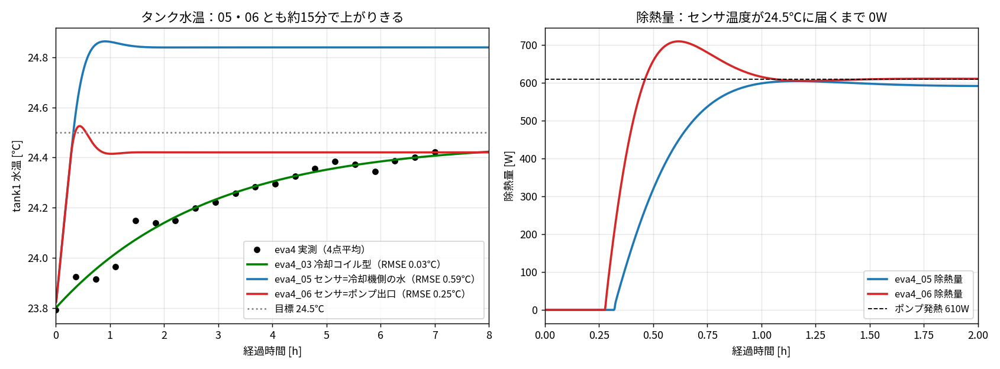
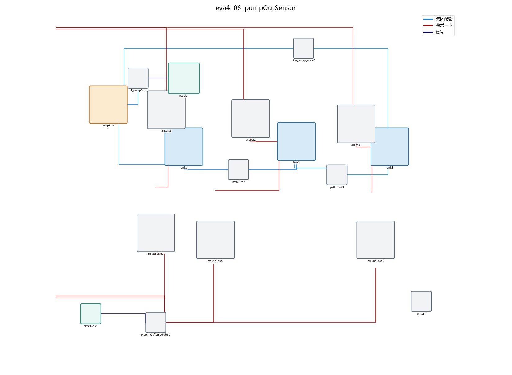

# eva4_05 / eva4_06：冷却機のセンサ位置を変えて試した結果

[007](007_missing_modeling_points.md) の案1「冷却機の見ている温度」を試した。

| モデル | ファイル | センサの位置 |
|---|---|---|
| eva4_05 | `eva4/model/eva4_05_localSensor.mo` | 冷却機側の小さな水の塊（10 kg） |
| eva4_06 | `eva4/model/eva4_06_pumpOutSensor.mo` | ポンプ出口（`pumpHeat.port_b`） |

どちらも version 1.0.0（2026-09-26）。eva4_04 以前のファイルは変更していない。

## 1. 結果：実測との温度比較



| モデル | 実測との誤差(RMSE) | 24.3℃に達する時間 | 7時間後の tank1 水温 |
|---|---|---|---|
| eva4 実測 | ― | 約4時間 | 24.4℃ |
| eva4_03（冷却コイル型） | 0.03℃ | 約4時間 | 24.4℃ |
| eva4_05（センサ＝冷却機側の水） | 0.59℃ | 約14分 | 24.8℃ |
| eva4_06（センサ＝ポンプ出口） | 0.25℃ | 約14分 | 24.4℃ |

- **センサの位置を変えても、立ち上がりは速いまま（約14分）**。実測のゆっくりした上がり方は再現できなかった。
- eva4_05 は、冷却機側の水を 24.5℃ にするため、タンク本体はそれより 0.35℃ 高い 24.8℃ で落ち着く。
- eva4_06 は、ポンプ出口がタンクより 0.08℃ 高い（ポンプ発熱 610W ÷ 110 L/min）ため、タンクは 24.4℃ で落ち着く。最終温度は実測と合う。
- eva4_05・06 は OpenModelica（omc）で計算した。eva4_03 は集中定数（タンク全体を1つの温度とみなす）で計算した。
- 初期水温は実測の開始時に合わせて 23.8℃（`-override=T_ini=296.95`）にした。

## 2. なぜ速いままなのか

右のグラフ（除熱量）のとおり、**センサの温度が 24.5℃ に届くまで、冷却機は 0W**。
その間はポンプ発熱 610W がそのままタンクを温めるので、約1℃/30分で上がる。

- センサをどこに付けても、センサの温度は「タンクの温度 ± 0.1〜0.4℃」くらいしか違わない。
- 開始時のタンクは 23.8℃ で、目標 24.5℃ より 0.7℃ 低い。センサが 24.5℃ 以上を示すには、センサの場所がタンクより 0.7℃ 以上温かい必要がある。
- ポンプ出口はタンクより 0.08℃ しか高くない。冷却機側の水は冷やされる側なので、タンクより低い。

つまり、**「目標より低い間は冷やさない」制御である限り、センサ位置を変えても立ち上がりは速い**。

## 3. わかったこと

実測（[007](007_missing_modeling_points.md) の2章）では、水温が 24.5℃ より低い間も約 500〜580W を除熱していた。
センサ位置では説明できないので、残る可能性は次のとおり。

| 考えられること | モデルで確かめる方法 |
|---|---|
| 実機は開始前から運転していて、冷却が止まらずに続いていた（能力をゆっくり下げる制御） | 除熱量の変化をゆっくりにする（eva4_04 の方式） |
| 冷却コイルの温度が低く、水温に関係なく熱を取り続ける | 冷却コイル型（eva4_03） |
| 冷却機が目標温度とは別の温度（例：冷媒側・オイル側）を見ている | 実機の設定・マニュアルの確認が必要 |

この時点では、実測に一番合うのは eva4_03（冷却コイル型）だった。
その後、タンク内の混ざりにくい部分を入れた eva4_09 が実測によく合った（[009](009_loop_tank2_to_tank3.md)）。

## 4. モデルの構成



- `sCooler`（部品 `SensorCooler`）を tank1 の上に置き、赤い線で `tank1.heatPort` につないでいる。
- eva4_06 では、`T_pumpOut`（ポンプ出口の温度センサ）を `pumpHeat.port_b` につなぎ、その温度を青紫の信号線で `sCooler` に渡している。
- `SensorCooler` の中身：
  - `localWater`：冷却機側の水（10 kg）
  - `exchange`：タンクとの水の入れ替わり（25 L/min × 比熱 ≈ 1740 W/K）
  - `cooler`：`localWater` から熱を取る（冷却のみ、上限 3500W）
  - `pid`：センサ温度が `Ttarget` になるよう除熱量を決める

## 5. 設定の場所

OMEdit でモデルを開き、**`sCooler` をダブルクリック**する。

| パラメータ | 意味 | 既定値 |
|---|---|---|
| `Ttarget` | 目標温度 | 24.5 ℃ |
| `sensorAtPumpOut` | センサ位置（チェックなし＝冷却機側の水、チェックあり＝ポンプ出口） | 05：なし／06：あり |
| `capacity` | 冷却能力（除熱の上限） | 3500 W |
| `m_local` | 冷却機側の水の量 | 10 kg |
| `flow_Lmin` | タンクと冷却機側の水の入れ替わり流量 | 25 L/min |
| `enabled` | 温度管理の ON/OFF | ON |

※ `sensorAtPumpOut` にチェックを入れる場合は、eva4_06 のように `T_pumpOut` センサをつなぐ必要がある。

## 6. 実行方法

```bat
cd eva4
"C:\Program Files\OpenModelica1.26.3-64bit\bin\omc.exe" run_sim_05_localSensor.mos
"C:\Program Files\OpenModelica1.26.3-64bit\bin\omc.exe" run_sim_06_pumpOutSensor.mos
```

結果の csv は `eva4/` に出力される（今回の結果は `eva4/results/` に移した）。グラフは `python3 scripts/eva4_sensor_compare.py` で作る。
