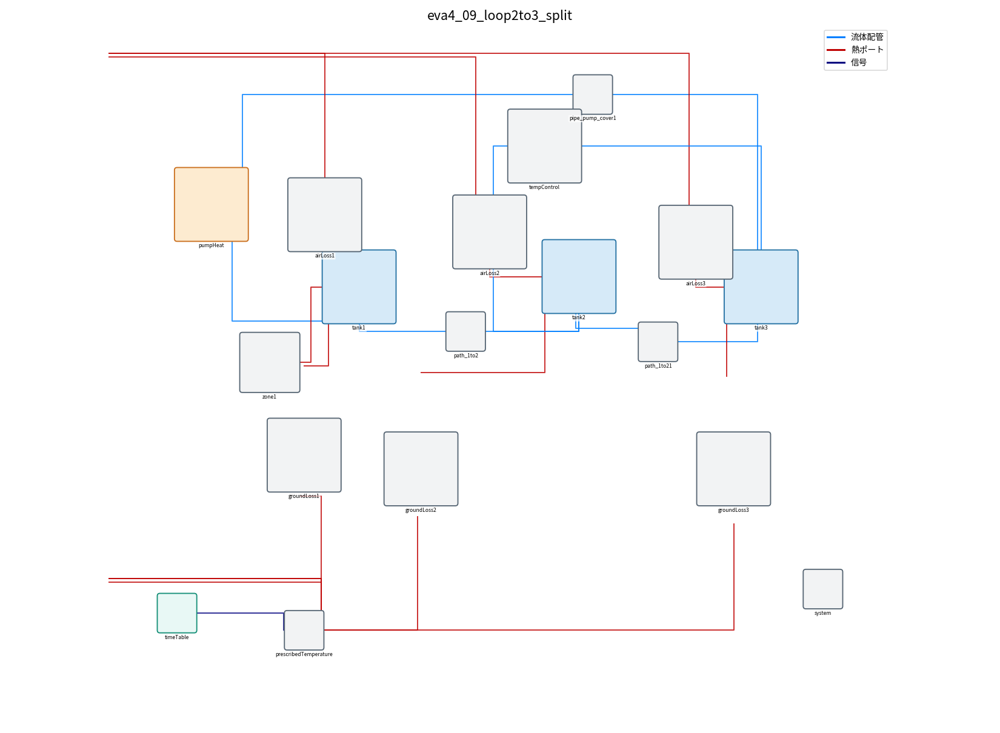

# eva4_07〜09：温度管理ループを tank2 → tank3 に変更し、tank1 を2つに分けて試した結果

温度管理ループを「tank2 から水を引いて、冷やして tank3 に返す」形に作り替えた。
あわせて [007](007_missing_modeling_points.md) の案2「タンクの中の混ざり方」（tank1 を2つに分ける）も試した。

| モデル | ファイル | 温度管理 | tank1 |
|---|---|---|---|
| eva4_07 | `eva4/model/eva4_07_loop2to3.mo` | 目標温度制御（24.5℃、冷却能力 3500W） | 1つ（完全混合） |
| eva4_08 | `eva4/model/eva4_08_loop2to3_coil.mo` | 冷却コイル型（UA_cool=57 W/K、Tcool=14℃） | 1つ（完全混合） |
| eva4_09 | `eva4/model/eva4_09_loop2to3_split.mo` | eva4_07 と同じ | 本体 30% ＋ 混ざりにくい部分（よどみ部）70% |

- 3つとも ループは `tank2.ports[3]` → 温度管理 → `tank3.ports[1]`、流量 25 L/min。
- 初期水温は実測の開始時に合わせて 23.8℃（モデル内の `T_ini`）。
- どれも version 1.0.0（2026-09-26）。eva4_01〜06 のファイルは変更していない。

## 1. 実測との温度比較


| モデル | 比べた温度 | 実測との誤差(RMSE) | 24.3℃に達する時間 | 7時間後 |
|---|---|---|---|---|
| eva4 実測（4点平均） | ― | ― | 約4時間 | 24.42℃ |
| eva4_07 目標温度制御 | tank1 | 0.31℃ | 約13分 | 24.50℃ |
| eva4_08 冷却コイル型 | tank1 | 0.24℃ | 約1.8時間 | 24.73℃ |
| eva4_09 分割 | tank1 本体 | 0.31℃ | 約12分 | 24.50℃ |
| eva4_09 分割 | **tank1 よどみ部** | **0.05℃** | **約3.3時間** | **24.45℃** |

- **eva4_09 のよどみ部の水温が、実測に一番よく合った**（誤差 0.05℃）。
- よく混ざる部分（tank1 本体・tank2・tank3）は、どのモデルでも約15分で上がりきる。
- eva4_08（冷却コイル型）は、ゆっくり上がるが、24.73℃ まで上がり実測より 0.3℃ 高い。
  Tcool=14℃ は集中定数で決めた値で、このモデルでは合わせ直していない（Tcool を約 13.4℃ にすると 24.4℃ 付近になる見込み）。
- 3つとも計算は OpenModelica（omc）。

## 2. tank1 を2つに分けると何が変わるか

- tank1 の 70% を「よどみ部」（`zone1`、水 約 23 kg）として分けた。
- よどみ部は、吹き出し口・吸い込み口から遠く、本体とは少ない混合流量（`mix_Lmin` = 0.15 L/min）でだけ水が入れ替わる。
- 本体は約15分で 24.5℃ になるが、よどみ部は本体の温度に **約2.5時間の遅れ**（23 kg ÷ 0.15 L/min）でゆっくり近づく。
- 実測の測定点がこのような混ざりにくい場所にあったと考えると、実測のゆっくりした上がり方が説明できる。

注意：
- `mix_Lmin` = 0.15 L/min は、実測の上がり方（時定数 約2.8時間）に合わせて決めた値。実機で測った値ではない。
- よどみ部からの外気・地面への放熱は入れていない（tank1 の放熱はすべて本体側に付いている）。
- 実測の開始時、測定点の温度は最大 0.6℃ 違っていた（[007](007_missing_modeling_points.md) の3章）。タンク内が混ざりきっていないことは実測からも確認できる。

### 007 の「除熱量の逆算」との関係

[007](007_missing_modeling_points.md) の2章では「タンク全体の水が測定点と同じ温度」と仮定して、
開始直後から約 500W 除熱していると計算した。
eva4_09 のように、よく混ざる部分がすでに 24.5℃ 近くになっていて、測定点だけが遅れているなら、
この仮定は成り立たない。つまり「24.5℃ より低い間も冷やしている」と考えなくても、実測は説明できる。

## 3. センサの位置（温度管理が見ている温度）

最初は、温度管理のセンサが「冷やした後の水」の温度を測る部品（`TempControl`、eva4_01/02 と同じ）で計算した。
その場合、冷やした後の水を 24.5℃ にするため、タンクは 24.84℃（約 0.34℃ 高い）で落ち着いた。
（除熱 約 594W ÷ 25 L/min の熱の運び 約 1740 W/K ≈ 0.34℃）

「tank2 から引いた水の温度で制御する」方が実機に近いと考え、eva4_07・09 ではセンサを吸込口に付けた部品 `TempControlIn` を使った。
これでタンクは目標の 24.5℃ で落ち着く。

| 部品 | センサの位置 | 使っているモデル |
|---|---|---|
| `TempControl` | 冷やした後の水（ポンプ部） | eva4_01、eva4_02 |
| `TempControlIn` | 吸込口（タンクから引いた水） | eva4_07、eva4_09 |

## 4. モデルの構成

### eva4_07（ループ tank2 → tank3）


- `tempControl` の左の端子（吸込）を `tank2.ports[3]` に、右の端子（吐出）を `tank3.ports[1]` に青い線でつないでいる。
- `tempControl` の中：ポンプ（25 L/min）、吸込の温度センサ `Tsens`、PI 制御 `pid`、除熱 `cooler`。

### eva4_09（eva4_07 ＋ tank1 の分割）



- `zone1`（部品 `StagnantZone`）を tank1 の左下に置き、赤い線で `tank1.heatPort` につないでいる。
- `zone1` の中：よどみ部の水 `zone`（熱容量）と、本体との混合 `mixing`（混合流量 × 比熱 ＝ 約 10 W/K）。
- tank1 本体の断面積は `(1 - f_zone)` 倍（30%）に減らしている。

## 5. 設定の場所

OMEdit でモデルを開き、部品をダブルクリックする。

| 部品 | パラメータ | 意味 | 既定値 |
|---|---|---|---|
| `tempControl` | `Ttarget` | 目標温度 | 24.5 ℃（モデル先頭の `Ttarget`） |
| `tempControl` | `cooling_capacity` | 冷却能力（除熱の上限） | 3500 W |
| `tempControl` | `flow_Lmin` | ループの流量 | 25 L/min |
| `tempControl` | `enabled` | 温度管理の ON/OFF | ON |
| `coilCtrl`（08） | `Tcool`、`UA_cool` | 冷却側の温度、冷却コイルの熱コンダクタンス | 14 ℃、57 W/K |
| `zone1`（09） | `mix_Lmin` | 本体との混合流量（小さいほどゆっくり） | 0.15 L/min |
| モデル先頭（09） | `f_zone` | tank1 のうちよどみ部の割合 | 0.7 |
| モデル先頭 | `T_ini` | 初期水温 | 23.8 ℃ |

## 6. 実行方法

```bat
cd eva4
"C:\Program Files\OpenModelica1.26.3-64bit\bin\omc.exe" run_sim_07_loop2to3.mos
"C:\Program Files\OpenModelica1.26.3-64bit\bin\omc.exe" run_sim_08_loop2to3_coil.mos
"C:\Program Files\OpenModelica1.26.3-64bit\bin\omc.exe" run_sim_09_loop2to3_split.mos
```

結果の csv は `eva4/` に出力される（今回の結果は `eva4/results/` に移した）。
グラフは `python3 scripts/eva4_loop2to3_compare.py` で作る。
