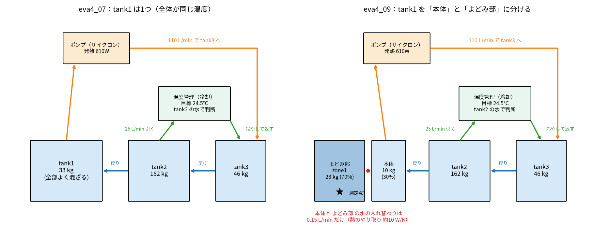
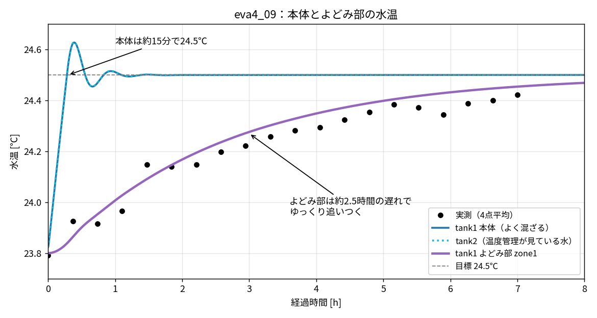

# eva4_09 で何をしたか（tank1 を2つに分けたモデルの解説）

対象ファイル：`eva4/model/eva4_09_loop2to3_split.mo`

eva4_07（温度管理ループ tank2 → tank3）に、**tank1 の中の「混ざりにくい部分」** を足したモデル。
やったことは次の3つだけ。

1. tank1 を「よく混ざる本体（30%）」と「混ざりにくい部分＝よどみ部（70%）」に分けた
2. 本体とよどみ部の間は、ごく少ない水の入れ替わり（0.15 L/min）でだけ熱が伝わるようにした
3. よどみ部の水温を実測と比べた

## 1. 分ける前と後



**分ける前（eva4_07）**
- tank1 の水 33 kg は全部よく混ざっていて、どこでも同じ温度。
- ポンプが tank1 から 110 L/min で引いて tank3 に送り、tank3 → tank2 → tank1 と戻ってくる。
- 温度管理は tank2 から 25 L/min 引いて、冷やして tank3 に返す。
- この流れが速いので、3つのタンクは約15分でほぼ同じ温度（24.5℃）になる。

**分けた後（eva4_09）**
- tank1 のうち 30%（10 kg）だけが上の流れに入る「本体」。
- 残り 70%（23 kg）は「よどみ部」。吹き出し口・吸い込み口から遠く、流れがほとんど届かない場所を表す。
- よどみ部は、本体とだけ、0.15 L/min 相当の水の入れ替わりで熱をやり取りする。

## 2. モデルファイルで変えたところ

eva4_07 と比べて、変えたのは次の4か所。

### (1) 部品 `StagnantZone`（よどみ部）を追加

ファイル先頭の部品定義に `model StagnantZone` を追加した。中身は2つだけ。

| 中の部品 | 何を表すか | 値 |
|---|---|---|
| `zone`（HeatCapacitor） | よどみ部の水の熱容量 | `m_zone` × 4186 J/(kg·K) |
| `mixing`（ThermalConductor） | 本体との水の入れ替わりで運ばれる熱 | `mix_Lmin`/60 × 4186 ≈ **10 W/K** |

- よどみ部の水は流れには入れず、「熱をためる箱」として表した。
- 本体とつながるのは赤い熱の線1本だけ。

### (2) tank1 本体の大きさを 30% に減らした

```modelica
Modelica.Fluid.Vessels.OpenTank tank1(..., crossArea = Lx1_1*Ly1_1*(1 - f_zone), ...)
```

- 元は `crossArea = Lx1_1*Ly1_1`（0.433 m²）。
- `(1 - f_zone)` を掛けて 30% にした。水位は同じなので、水の量も 30%（約 10 kg）になる。

### (3) よどみ部を置いた

```modelica
parameter Real f_zone = 0.7 "tank1 のうち、混ざりにくい部分(よどみ部)の割合";
StagnantZone zone1(m_zone = f_zone*Lx1_1*Ly1_1*level_start*995, mix_Lmin = 0.15, T_init = T_ini - 273.15);
```

- よどみ部の水の量 = 0.7 × 0.433 m² × 水位 0.0755 m × 995 kg/m³ ≈ **23 kg**
- 本体（10 kg）と合わせると、元の tank1 の 33 kg と同じ。**水の総量は変えていない**。

### (4) よどみ部を tank1 本体につないだ

```modelica
connect(zone1.port, tank1.heatPort);
```

- 赤い熱の線で tank1 の熱の端子につないでいる（外気・地面への放熱もこの端子につながっている）。

## 3. OpenModelica での見た目


- tank1 の左下にあるのが `zone1`（よどみ部）。
- 上の `tempControl` が温度管理。左の端子を tank2 に、右の端子を tank3 に青い線でつないでいる。

## 4. 計算結果



- **本体（青）**：流れの中にあるので、約15分で 24.5℃ になる。tank2（温度管理が見ている水）も同じ。
- **よどみ部（紫）**：本体との熱のやり取りが約 10 W/K と小さいので、ゆっくり追いつく。
  - 遅れの目安 = よどみ部の熱容量 ÷ やり取りの大きさ = 23 kg × 4186 ÷ 10.5 W/K ≈ 9,100 秒 ≈ **2.5時間**
- よどみ部の水温は実測（黒点）とよく合う（誤差 0.05℃）。

## 5. この結果の読み方

- 実測の測定点が、流れの届きにくい場所にあったなら、実測のゆっくりした上がり方（約7時間）は説明できる。
- その場合、タンクの大部分はもっと早く 24.5℃ になっていて、測定点だけが遅れていたことになる。
- 実測の開始時、4つの測定点で温度が最大 0.6℃ 違っていた。タンクの中が混ざりきっていなかったことは実測からも確認できる（[007](007_missing_modeling_points.md) の3章）。

## 6. 注意（決め打ちしている値）

| 値 | 決め方 | 実機で確かめること |
|---|---|---|
| `f_zone` = 0.7 | よどみ部の割合として仮に決めた | 測定点の位置、吹き出し口・吸い込み口の位置 |
| `mix_Lmin` = 0.15 L/min | 実測の遅れ（時定数 約2.8時間）に合わせて決めた | 測定点付近の流れの強さ |
| よどみ部の放熱 | 入れていない（tank1 の放熱は全部本体側） | ― |

- `mix_Lmin` を大きくすると早く上がり、小さくするとゆっくり上がる。
- 変えるときは OMEdit で `zone1` をダブルクリック → `mix_Lmin`。割合 `f_zone` はモデルの先頭のパラメータ。

## 7. 実行方法

```bat
cd eva4
"C:\Program Files\OpenModelica1.26.3-64bit\bin\omc.exe" run_sim_09_loop2to3_split.mos
```

図は `python3 scripts/eva4_09_explain.py` で作る。
