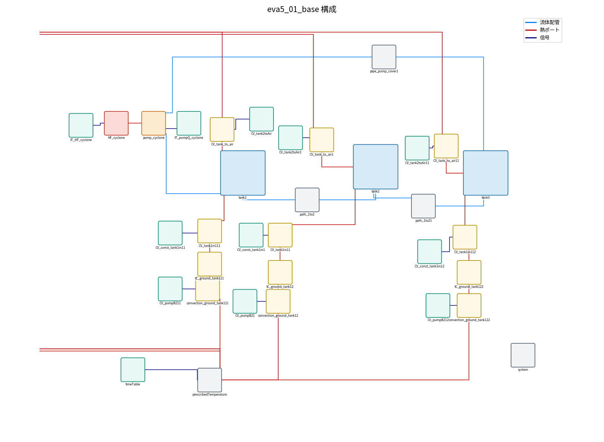
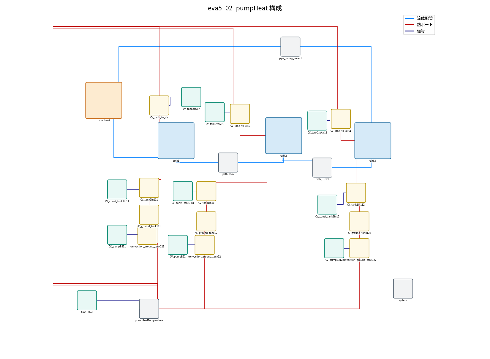
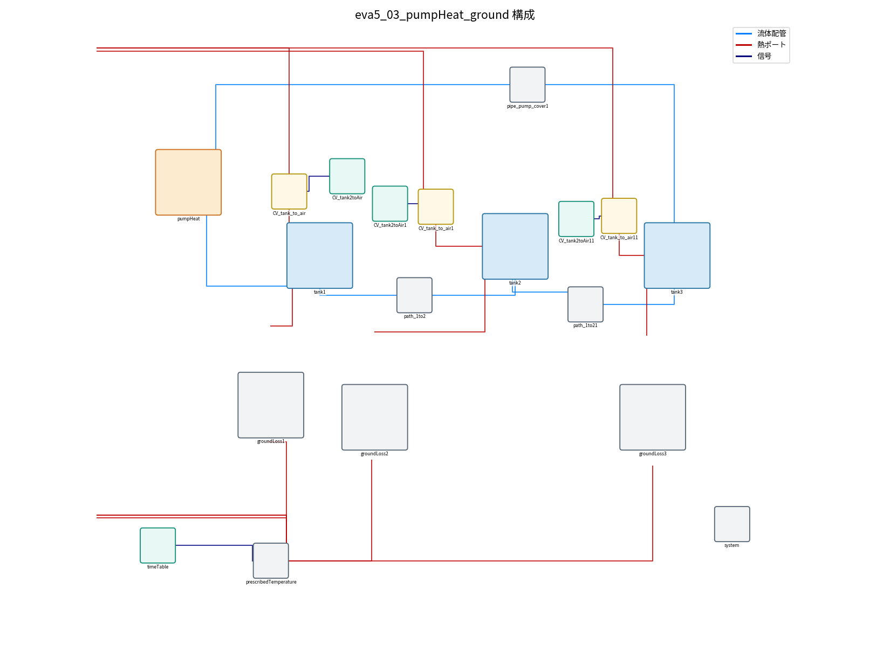
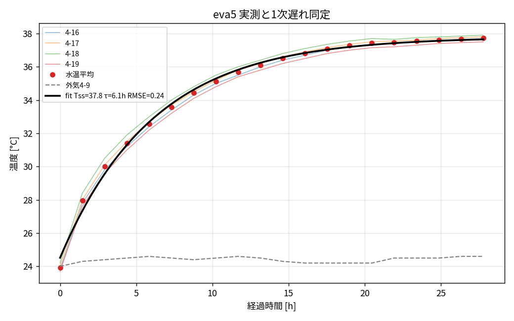

# eva5 モデル バージョン管理・連番モデル一覧

eva5（3槽・サイクロン加熱・温度管理なし）の OpenModelica モデルを、**段階的にパッケージ化**した
連番モデルとして管理する。**4モデルはすべて物理・結果が等価**（実測 RMSE 0.24℃）で、
違いは「どこまで部品(パッケージ)にまとめたか」だけ。

> 原本 `ana003_Tank3blocks_cyclononly_NoTemp.mo` は変更せず保持（`eva5_01_base` と同一物理）。

## 連番モデル一覧（上から順に部品化が進む）

| ファイル | version | 内容 | 図の要素数 |
|---|---|---|---|
| `eva5_01_base.mo` | 1.0.0 | ベース（部品化なし・素の構成） | 34 |
| `eva5_02_pumpHeat.mo` | 1.1.0 | 投入熱＋ポンプ → **`pumpHeat`** 部品に集約 | 31 |
| `eva5_03_pumpHeat_ground.mo` | 1.2.0 | ＋ 地面放熱 → **`groundLoss`×3** に集約 | 19 |
| `eva5_04_pumpHeat_ground_air.mo` | 1.3.0 | ＋ 外気放熱 → **`airLoss`×3** に集約（全放熱を部品化） | 16 |

すべて**自己完結**（部品クラスをモデル内に同梱）。各 `.mo` を1つ開くだけで動く（外部ライブラリ読込は不要）。
単独再利用したい場合の部品は `../lib/PumpHeat.mo`, `GroundLoss.mo`, `AirLoss.mo` にも置いてある。

## 構成図（部品化が進むほど要素が減る）

| 01 ベース (34) | 04 全部品化 (16) |
|---|---|
|  |  |

- 02: 
- 03: 

（青＝流体配管, 赤＝熱ポート, 緑＝信号。`.mo` の配置注釈から再構成。正確な作図は OMEdit が基準）

## 実測との比較（全モデル共通・等価）



実測（センサ 4-16〜4-19 の平均, 2026-07-09）に対し **RMSE 0.24℃**、時定数 τ≈6.2h。

## 実行（Windows OpenModelica）
各モデルに対応した実行スクリプトがある（自己完結・1ファイル）:
```bat
cd eva5
"C:\Program Files\OpenModelica1.26.3-64bit\bin\omc.exe" run_sim_04.mos   :: 01/02/03/04 それぞれ
```
OMEdit では `model/eva5_0N_*.mo` を開くだけ。

## バージョン方針
- モデル注釈 `version` とファイル先頭コメントに版を記載。変更したらこの表に追記。
- **メジャー(x.0.0)**＝構成変更／**マイナー(1.x.0)**＝パラメータ合わせこみ／**パッチ(1.0.x)**＝軽微。
- 本連番は「同一物理のまま部品化を進めた」ため、マイナーで 1.0→1.1→1.2→1.3 と付与。

## 関連ドキュメント
- パラメータ・熱伝達率一覧: [`002_parameters_heat_transfer.md`](002_parameters_heat_transfer.md)
- パッケージ化した部品の解説（OMEdit画像つき）: [`003_packages.md`](003_packages.md)
- **パッケージ(再利用部品)の作り方**（parameter・interfaceの置き方）: [`004_how_to_make_package.md`](004_how_to_make_package.md)
- 全eva横断まとめ: `../../docs/README.md`
