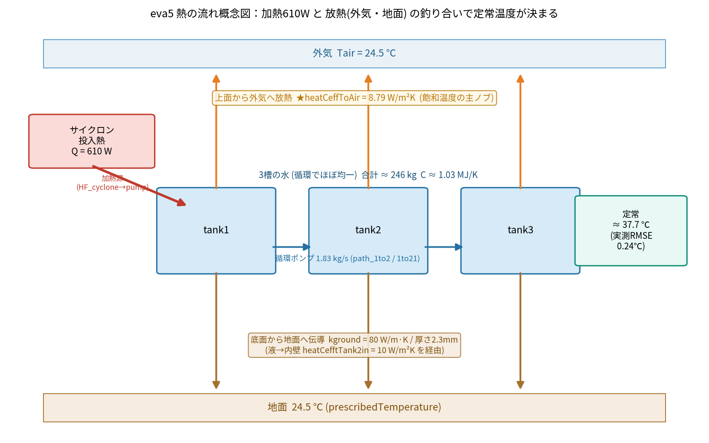

# eva5 モデル パラメータ・熱伝達率 一覧

対象: `eva5/model/eva5_01_base.mo`（＝原本 `ana003_Tank3blocks_cyclononly_NoTemp.mo` と同一物理。
パッケージ版 `eva5_02_pumpHeat` / `eva5_03_pumpHeat_ground` も**等価**で、下記の値・熱伝達率は共通）。
3槽（tank1→tank2→tank3、サイクロンで循環加熱）・温度管理なしの水温モデル。

## 熱の流れ（概念図）

加熱 610W と、外気・地面への放熱の釣り合いで**定常温度（≈37.7℃）**が決まる。
下表の各熱伝達率が、図のどの矢印に効くかを対応させて読むと分かりやすい。

- **上向き橙矢印**＝上面から外気へ放熱（`heatCeffToAir`）… 飽和温度を下げる主因
- **下向き茶矢印**＝底面から地面へ伝導（`kground`、`heatCefftTank2in` 経由）
- **左の赤矢印**＝サイクロン投入熱（`Q_cyclone`=610W）… 加熱源
- **中央の青矢印**＝循環ポンプ（3槽をほぼ均一化）

---

## 熱伝達率・熱伝導

| 変数 | 値 | 単位 | 意味 | 使用箇所 | 備考 |
|---|---|---|---|---|---|
| **`heatCeffToAir`** | **8.79** | W/(m²·K) | タンク**外面 → 外気**（自然対流での放熱） | `CV_tank2toAir`(tank1上面), `CV_tank2toAir1`(tank2上面), `CV_tank2toAir11`(tank3上面), `CV_pumpB21/211/212`(地面側) | **eva5合わせこみ値**（既定10）。**飽和温度を決める主ノブ**。大きいほど低く飽和 |
| **`heatCefftTank2in`** | **10** | W/(m²·K) | **液 → タンク内壁**（内側対流） | `CV_const_tank1in1`(tank2), `CV_const_tank1in11`(tank1), `CV_const_tank1in12`(tank3) | 内側は大きめで、放熱の律速にはならない |
| **`kground`** | **80** | W/(m·K) | **地面接触の熱伝導率**（底面から地面へ） | `tC_ground_tank12/121/122`：`G = 面積 × kground / tank_thickness` | 底面伝導。地面側は `heatCeffToAir` の対流と直列 |

> 放熱の総合 UA は「上面対流＋側面/底面(内側対流→壁伝導→地面/外気)」の合成。
> eva5 実測からの同定では **総合 UA ≈ 46 W/K、時定数 τ ≈ 6.2 h**（`../../docs/eva_summary.csv`）。
> 各 `Gc = 係数 × 面積` の面積は下記タンク寸法・水位から構成される。

## 加熱・循環

| 変数 | 値 | 単位 | 意味 | 使用箇所 |
|---|---|---|---|---|
| **`Q_cyclone`** | **610** | W | サイクロン投入熱（加熱源） | `tT_HF_cyclone`→`HF_cyclone`→`pump_cyclone.heatPort` |
| ポンプ流量 | 110/60 ≈ **1.833** | kg/s | 循環ポンプの設定流量 | `tT_pumpQ_cyclone`→`pump_cyclone.m_flow_set` |
| `m_flow_nominal` | 41/60 ≈ 0.683 | kg/s | ポンプ定格流量 | `pump_cyclone` |

## 温度条件

| 変数 | 値 | 意味 |
|---|---|---|
| `Tair_deg` | 24.5 ℃ | 外気温（`prescribedTemperature` の地面/外気境界） |
| `T_ini` | 24.5 + 273.15 K | 初期水温（全タンク） |

## 幾何（タンク寸法・水量）

| 変数 | 値 [mm] | | 断面積 [m²] |
|---|---|---|---|
| `tank_height` | 240 | タンク高さ | |
| `tank_thickness` | 2.3 | 壁厚（地面伝導に使用） | |
| **`level_start`** | **75.5** | 初期水位（**eva5合わせこみ**；物理値128） | |
| tank1 `Lx1_1×Ly1_1` | 903×479 | | 0.433 |
| tank2 `Lx2_1×Ly2_1 + Lx2_2×Ly2_2` | 1191×1670 + 478×337 | | 2.150 |
| tank3 `Lx3_1×Ly3_1` | 573×1191 | (水位 ×0.9) | 0.682 |
| 合計断面積 | | | **3.265** |

- 総水量 ≈ 3.265 m² × 0.0755 m ≈ **0.247 m³ ≈ 246 kg**（有効水位ベース）
  → 熱容量 C ≈ 246 × 4186 ≈ **1.03×10⁶ J/K**。τ=C/UA ≈ 6.2 h と整合。
- 他寸法: `Lx1_2`=1230, `Ly1_2`=159, `Ly2_1`=1670, （tank形状の補助寸法）。

## ダミー配管（タンク間接続）

| 変数 | 値 | 意味 |
|---|---|---|
| `diamDmyPipe` | 0.1 m | タンク間オリフィス/配管の径 |
| `zetaDmyPipe` | 0.1 | 圧損係数 |

## 本モデルでは未使用（宣言のみ・予約／他バリアント用）

| 変数 | 値 | 用途 |
|---|---|---|
| `rho_tank` / `Cp_tank` | 7000 / 450 | タンク材料の密度・比熱（本NoTempでは壁熱容量を陽に入れていないため未使用） |
| `heatCefftMachine2in` | 120 | 機械内熱伝達（`ana002` 機内モデル用） |
| `Ttarget` / `T3puls` | 24.5 / 1.5 | 温度管理の目標・幅（`TempCtrl` 版で使用。eva4参照） |
| `T_machine_in`, `Lx_machine`, `Ly_machine`, `machine_height` | 24.5, 2.0, 1.0, 1.5 | 機械領域（機内モデル用） |

---

## 合わせこみの指針（再掲）
- **飽和温度がズレる** → `heatCeffToAir`（外気放熱）。高いほど低く飽和。
- **立ち上がり（時定数）がズレる** → `level_start`（有効水量＝熱容量）。小さいほど速い。
- **加熱量** `Q_cyclone` は実機値610Wで固定（同定Q≈621Wと一致）。
