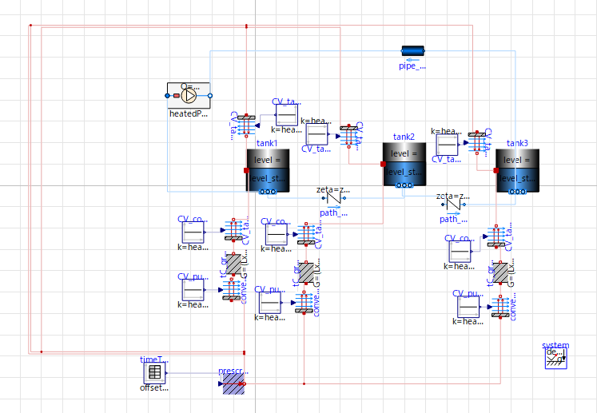
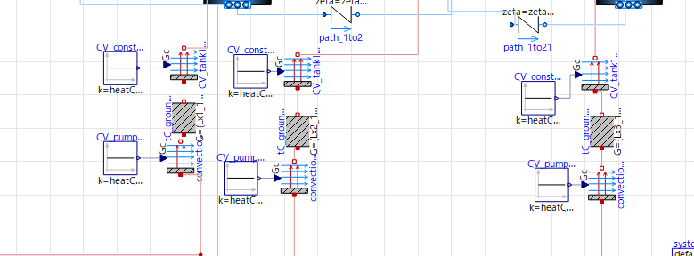
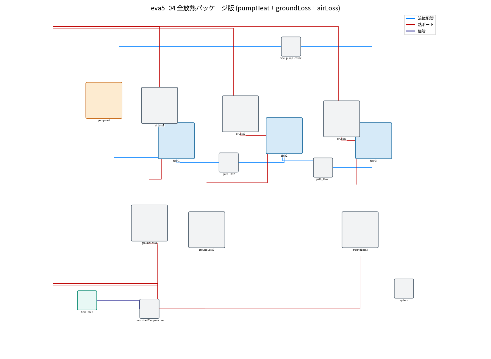

# eva5 パッケージ部品の解説（pumpHeat / groundLoss / airLoss）

繰り返し現れる「加熱」「放熱」のまとまりを**再利用部品（パッケージ）**にして、
モデルの見通しを良くした。物理・結果は素の `eva5_01_base` と等価。

| 部品 | まとめた対象 | 元の部品数 | 個数 |
|---|---|---|---|
| **`pumpHeat`**（クラス `PumpHeat`） | 投入熱＋循環ポンプ（サイクロン） | 4 | 1 |
| **`groundLoss`**（クラス `GroundLoss`） | タンク→地面の放熱（液→内壁→壁伝導→地面） | 5×3 | 3 |
| **`airLoss`**（クラス `AirLoss`） | タンク上面→外気の放熱（自然対流） | 2×3 | 3 |

結果、構成要素は **34 → 16** に減少（`eva5_01`→`eva5_04`）。

---

## 1. pumpHeat（投入熱＋ポンプ）

`eva5_01` では左の4部品（`tT_HF_cyclone`＋`HF_cyclone`＋`pump_cyclone`＋`tT_pumpQ_cyclone`）だったものが、
`pumpHeat` アイコン1個になる。



**中身**（`pumpHeat` をダブルクリック）：


| 部品 | 役割 |
|---|---|
| `port_a`（左・青丸） / `port_b`（右・白丸） | 吸込 / 吐出（流体コネクタ） |
| `pump`（ControlledPump） | 循環ポンプ。`m_flow_set` で流量指令 |
| `qSet`(k=Q) → `HF` | 投入熱 Q[W] を熱として pump に与える |
| `mSet`(k=m_flow) | ポンプ流量指令 |

**アイコン**（`lib/PumpHeat.mo` の Icon ビュー）。`%name`・`Q=%Q W` はクラス表示なのでそのまま文字。
インスタンス化すると名前と値に置き換わる：


→ 外から与えるのは **`Q`（投入熱）と `m_flow`（流量）だけ**。サイクロン/フラッド/カバー等を同じ部品で表せる。

## 2. groundLoss（地面への放熱）

各タンクの「液→内壁→壁伝導→地面」の5部品連鎖を1部品に。3タンク分で `groundLoss1/2/3`。



- 端子：`port_water`（タンク側）／`port_ground`（地面側）。
- パラメータ：`Gc_liquid`（液→内壁）, `G_wall`（壁伝導）, `Gc_ground`（壁→地面）。

## 3. airLoss（外気への放熱）

各タンク上面→外気の「Convection＋係数」2部品を1部品に。3タンク分で `airLoss1/2/3`。

- 端子：`port_water`（タンク側）／`port_air`（外気側）。
- パラメータ：`Gc_air`（上面→外気の熱コンダクタンス＝熱伝達率×上面積）。

## 全部品化後（eva5_04）



`pumpHeat`＋`groundLoss1/2/3`＋`airLoss1/2/3`＋3タンク＋配管で構成。放熱の系統が一目で分かる。

---

## 補足：`constrainedby`（作動流体の差し替え）

`PumpHeat` の先頭：

```modelica
replaceable package Medium = Modelica.Media.Water.StandardWater
    constrainedby Modelica.Media.Interfaces.PartialMedium "作動流体";
```

| 部分 | 意味 |
|---|---|
| `replaceable package Medium` | 差し替え可能な媒体（この部品が扱う流体） |
| `= …StandardWater` | 既定値（指定しなければ「水」） |
| `constrainedby …PartialMedium` | 差し替えてよい範囲。`PartialMedium`（媒体の共通インターフェース）を満たす媒体だけOK |

- `PartialMedium` は「密度・比熱・温度…の関数の型だけ」を決めた抽象規格。内部（`pump`）はこれを使って計算する。
- `constrainedby` で縛ると、**差し替えた媒体にも必ずそれらの関数が存在する**ことが保証され、型安全（壊れない）。
- **たとえ**：`PartialMedium`＝USBの"規格"、`StandardWater`＝最初から挿さっているUSBメモリ。規格を満たせば別機器に差し替え可。
- 使う側：`PumpHeat pumpHeat(redeclare package Medium = fluid1, …)` で実際の水(fluid1)を渡す。`fluid1` を1箇所変えれば全体の流体を切替可能。

作り方の一般手順は [`004_how_to_make_package.md`](004_how_to_make_package.md) を参照。
