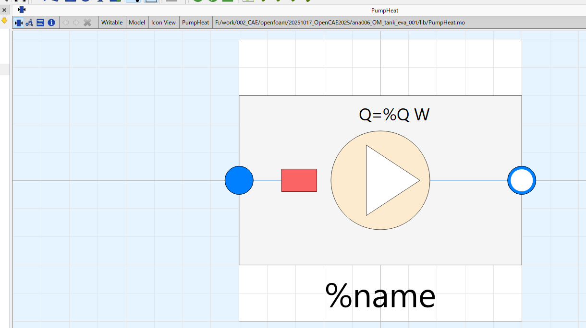
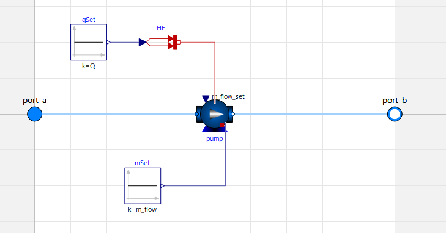

# パッケージ（再利用部品）の作り方

OpenModelica で「繰り返し現れる部品のまとまり」を1つの再利用部品にする手順。
`PumpHeat`（投入熱＋ポンプ）を例に、**parameter をどこに入れるか**・**interface（コネクタ）をどうするか**を説明する。

---

## 完成イメージ

外から見ると「箱＋端子＋設定値」、中を開くと「元の部品の集まり」。

| 外観（アイコン）＝使う人が見る | 中身＝実装 |
|---|---|
|  |  |

ポイントは3つ： **① interface(端子)** 、 **② parameter(設定値)** 、 **③ アイコン**。

---

## 手順

### STEP 0. 何をまとめるか決める
モデル図で**繰り返し現れるグループ**を探す（例：加熱＋ポンプ、地面放熱、外気放熱）。
そのグループの「外とつながっている線」が、部品の**端子（interface）**になる。

### STEP 1. 新しい model を作る
```modelica
model PumpHeat "投入熱＋循環ポンプ をまとめた部品"
  ...
end PumpHeat;
```
- 独立ファイル `lib/PumpHeat.mo`（`within ;` を先頭に）でも、使うモデルの中に**同梱**でもよい。
- 同梱（このモデル内に `model PumpHeat ... end PumpHeat;` を書く）にすると**1ファイルで完結**し、読み込み順の失敗がない（推奨）。

### STEP 2. interface（コネクタ＝端子）を決める
**外とやり取りするものだけ**をコネクタにする。中身は隠す（カプセル化）。

| つなぐもの | 使うコネクタ |
|---|---|
| 流体（配管） | `Modelica.Fluid.Interfaces.FluidPort_a`（入口）／`FluidPort_b`（出口） |
| 熱 | `Modelica.Thermal.HeatTransfer.Interfaces.HeatPort_a` ／ `HeatPort_b` |
| 信号（数値） | `Modelica.Blocks.Interfaces.RealInput` ／ `RealOutput` |

```modelica
  Modelica.Fluid.Interfaces.FluidPort_a port_a(redeclare package Medium = Medium) "吸込" annotation(
    Placement(transformation(extent = {{-110,-10},{-90,10}}),
              iconTransformation(extent = {{-110,-10},{-90,10}})));   // ← アイコンの左端(-100)に端子
  Modelica.Fluid.Interfaces.FluidPort_b port_b(redeclare package Medium = Medium) "吐出" annotation(
    Placement(transformation(extent = {{ 90,-10},{110,10}}),
              iconTransformation(extent = {{ 90,-10},{110,10}})));   // ← アイコンの右端(+100)に端子
```
- **`iconTransformation` を ±100 の縁に置く**と、OMEdit で箱の左右に端子（○）が出る（上の画像の青丸/白丸）。
- 流体・熱コネクタは向き（a/b）で色や流れの向きの意味が決まる。入口=a, 出口=b が分かりやすい。

### STEP 3. parameter（外から変える値）を入れる
**使う人に変えてほしい値だけ** を `parameter` として model の**先頭**で宣言する。

```modelica
  parameter Modelica.Units.SI.HeatFlowRate  Q      = 610    "投入熱 [W]";
  parameter Modelica.Units.SI.MassFlowRate  m_flow = 110/60 "ポンプ流量 [kg/s]";
  parameter Medium.Temperature              T_start = 293.15 "初期温度 [K]";
```
- **どこに入れる？** → model 直下（コンポーネント宣言より前）。単位付きSI型を使うと安全。
- **どう使う？** → 内部部品の設定にそのparameterを渡す：
```modelica
  Modelica.Fluid.Machines.ControlledPump pump(m_flow_nominal = m_flow, ...);  // m_flow を利用
  Modelica.Blocks.Sources.Constant       qSet(k = Q);                          // Q を利用
```
- こうすると、**外からは `Q` と `m_flow` を指定するだけ**で中身が設定される（＝カプセル化）。

**媒体(流体)も差し替え可能にする**（任意）：
```modelica
  replaceable package Medium = Modelica.Media.Water.StandardWater
    constrainedby Modelica.Media.Interfaces.PartialMedium "作動流体";
```
→ 意味は [`003_packages.md` の constrainedby](003_packages.md) 参照。

### STEP 4. 中身を配線する（equation の connect）
コネクタ↔内部部品、内部部品どうしを `connect` でつなぐ。
```modelica
equation
  connect(port_a, pump.port_a);      // 入口 → ポンプ吸込
  connect(pump.port_b, port_b);      // ポンプ吐出 → 出口
  connect(qSet.y, HF.Q_flow);        // Q → 投入熱
  connect(HF.port, pump.heatPort);   // 投入熱 → ポンプ(水)
  connect(mSet.y, pump.m_flow_set);  // 流量指令
```

### STEP 5. アイコンを描く（Icon annotation）
中を開かなくても機能が分かる絵にする。`%name`・`%Q` で名前・値を表示できる。
```modelica
  annotation(Icon(graphics = {
    Ellipse(extent = {{-35,35},{35,-35}}, fillColor = {253,235,208}, fillPattern = FillPattern.Solid),
    Polygon(points = {{-10,25},{28,0},{-10,-25}}, fillColor = {255,255,255}, fillPattern = FillPattern.Solid),
    Line(points = {{-100,0},{-70,0}}, color = {0,127,255}),   // 左端子への線
    Line(points = {{35,0},{100,0}},  color = {0,127,255}),    // 右端子への線
    Text(extent = {{-100,-65},{100,-95}}, textString = "%name"),
    Text(extent = {{-40,55},{60,40}},   textString = "Q=%Q W")}));
```

### STEP 6. 使う（インスタンス化して接続）
```modelica
  PumpHeat pumpHeat(redeclare package Medium = fluid1, Q = Q_cyclone, m_flow = 110/60, T_start = T_ini);
equation
  connect(tank1.ports[1], pumpHeat.port_a);      // タンク吸込へ
  connect(pumpHeat.port_b, pipe.port_b);         // 吐出を配管へ
```

---

## まとめ：どこに何を書くか

```
model 部品名
  ┌─ parameter          … ★外から変える値(Q, m_flow, Gc_… )。単位付きSI型で先頭に
  ├─ replaceable package Medium … constrainedby …  … (流体を扱うなら)差し替え可能な媒体
  ├─ コネクタ(port_a/b, heatPort…) … ★interface。iconTransformationを±100の縁に
  ├─ 内部部品(pump, HF, Constant…)  … parameterを参照して設定。外からは見せない
  equation
  └─ connect(…)          … コネクタ↔内部、内部↔内部 の配線
  annotation(Icon(…))    … ③ アイコン(端子の線・%name・%値)
end 部品名;
```

- **parameter＝外から変える値**（先頭に置く）。
- **コネクタ＝外とつなぐ端子だけ**（±100の縁に置く）。中身の部品はコネクタにしない。
- 迷ったら「使う人が指定したいのは？→parameter」「外の線とつながるのは？→コネクタ」で分ける。

実例：`lib/PumpHeat.mo`, `lib/GroundLoss.mo`, `lib/AirLoss.mo`（3部品とも同じ作り）。
