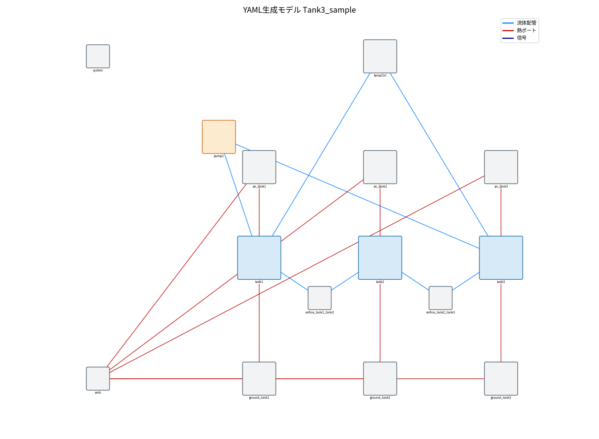

# modelgen — YAML から OpenModelica タンクモデルを自動生成

`config/*.yaml` にタンク構成（数・寸法・接続・ポンプ・温度管理）を書き、`gen_model.py` を実行すると
OpenModelica のモデル `.mo` と実行スクリプト `.mos` を自動生成する。

生成モデルは**自己完結**（再利用部品 `PumpHeat` / `GroundLoss` / `AirLoss` / `TempControl` を
モデル内に同梱）。部品定義は `../lib/*.mo` から読み込んで埋め込む。

## ワークフロー
```
config/xxx.yaml  ──(gen_model.py)──▶  generated/xxx.mo  ──▶  OMEdit で開く / omc で実行
                                       generated/run_xxx.mos
```

## 使い方
```bash
cd modelgen
python gen_model.py config/example_3tank.yaml
# → generated/Tank3_sample.mo, generated/run_Tank3_sample.mos
```
Windows OpenModelica で実行:
```bat
cd generated
"C:\Program Files\OpenModelica1.26.3-64bit\bin\omc.exe" run_Tank3_sample.mos
```

## 生成モデルの例（config/example_3tank.yaml）
3タンク直列＋ポンプ1（tank1→tank3, 610W）＋温度管理（3.5kW, 25L/min）。



- 青＝流体配管, 赤＝熱ポート。`orifice_*`＝タンク間接続, `pump1`＝投入熱+循環, `tempCtrl`＝温度管理,
  `ground_*`/`air_*`＝各タンクの地面/外気放熱, `amb`＝外気/地面境界。

## YAML スキーマ（要点）

| キー | 意味 |
|---|---|
| `model_name` | 生成モデル名(=ファイル名) |
| `ambient_degC` | 外気温[℃](地面・外気境界) |
| `tank_thickness_mm` | タンク板厚[mm](地面伝導に使用) |
| `defaults:` | 各タンクで省略した項目の既定値（下表） |
| `tanks:` | タンク配列。`id`,`Lx_mm`,`Ly_mm` は必須。`connect_to:[...]` で接続先を書く（相互なので片方向でOK） |
| `pumps:` | `id`,`from`,`to`,`heat_W`,`flow_Lmin` |
| `temperature_control:` | `enabled`,`spec_kW`(3.5/5.0),`Ttarget_degC`,`flow_Lmin`,`from`,`to` |
| `sim:` | `stopTime`,`intervals` |

**接続はタンク内 `connect_to` に書く**（例：tank1 に `connect_to:[tank2]` と書けば tank1–tank2 が水路でつながる）。

### 既定値（defaults）と根拠
| 項目 | 既定値 | 根拠・備考 |
|---|---|---|
| `height_mm` | 240 | タンク高さ |
| `level_mm` | 150 | **初期水位＝`level_start`**（Modelicaの `OpenTank.level_start`） |
| `h_air` | 10 | 上面・外面→外気 自然対流[W/m²K]（一般値。eva5合わせこみは8.79、蒸発込みなら45程度） |
| `h_liquid_wall` | 10 | 液→内壁[W/m²K]。**eva5タンク準拠=10**。飽和温度に効くので要調整（下記）。※コップは58だが薄壁・別条件で流用不可 |
| `k_ground` | 1.5 | 底→地面 熱伝導率[W/mK]。**非律速**（外側対流で律速）なので値は結果にほぼ効かない＝任意でOK |

> **h_liquid_wall は飽和温度に効く**（例: 3タンクeva5相当で 10→58 にすると総UA 43→51 W/K、飽和 38.6→36.4℃）。
> 一方 **k_ground は非律速**で 1.5↔80 でも飽和は0.1℃しか変わらない。→ h_air・h_liquid_wall は実測で要調整、k_ground は任意。

各タンクで個別に上書き可（例：あるタンクだけ `level_mm: 128`）。`defaults:` で全体を上書きも可。

## 生成モデルが使う部品（`../lib/`）
| 部品 | 役割 | 主パラメータ |
|---|---|---|
| `PumpHeat` | 投入熱＋循環ポンプ | `Q`[W], `m_flow` |
| `GroundLoss` | 底→地面の放熱 | `Gc_liquid`,`G_wall`,`Gc_ground`（幾何と係数から自動計算） |
| `AirLoss` | 上面→外気の放熱 | `Gc_air` |
| `TempControl` | 温度管理（基準温度追従・冷却能力上限） | `Ttarget`,`cooling_capacity`(=spec_kW×1000),`flow_Lmin`,`enabled` |

## 開発メモ（gen_model.py の仕組み）
1. **ポート割り当て**：各タンクの `nPorts` を「接続＋ポンプ＋温度管理」の数から自動計算し、ポート番号を採番。
2. **接続構築**：`connect_to` から接続ペアを作成（相互重複は除去）。タンク間は `SimpleGenericOrifice` を挿入。
3. **放熱**：各タンクに `GroundLoss`＋`AirLoss` を付与。`Gc_*` は寸法（Lx,Ly,level）と係数（h_air,h_liquid_wall,k_ground）から計算。
4. **部品埋め込み**：`../lib/*.mo` を読み、`within;` 除去＋字下げしてモデル内に同梱（自己完結）。
5. **線注釈**：生成した `connect` に、各コンポーネントの配置座標から `Line` 注釈を自動付与（OMEditで線が見える）。

## TODO / 拡張案
- ポンプ複数・分岐接続（`connect_to` を複数指定）はすでに可能。要動作確認。
- 温度管理を `CoolingCoilCtrl`（冷却コイル型, 基準温度=Tcool）に切替えるオプション。
- 生成後に omc で自動コンパイル・実行チェックを回す `--check` オプション。

## 注記
- omc が無い環境では生成のみ（コンパイル未確認）。OMEdit で開いてエラーが出たら共有ください。
