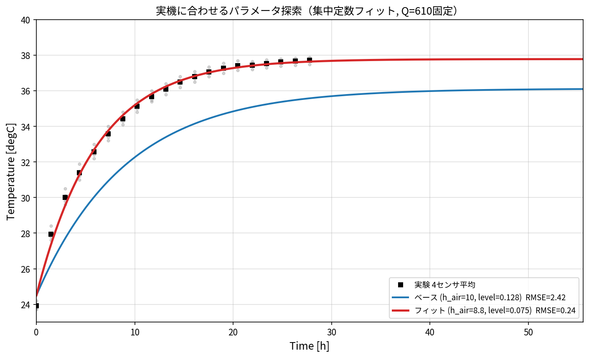

# openmodelica-param-study-temp

OpenModelica の水槽水温モデル（3タンク・サイクロン加熱・循環）を、実験データに
合わせ込むためのパラメータスタディ一式。集中定数モデルによる解析的な照合・フィットと、
Windows の Python + OpenModelica(omc.exe) で回す自動パラメータスタディを収録。

詳細は **[docs/parameter_study_plan.md](docs/parameter_study_plan.md)** を参照。

## 主な結果

- モデル（`OM/ana003_Tank3blocks_cyclononly_NoTemp.mo`）と実験（`data/eva5.py`）を照合。
- ベースは飽和温度が −1.6℃ 低く、立ち上がりも遅い（RMSE 2.42℃）。
- 集中定数フィットで **RMSE 0.24℃** まで一致（`Q=610` 固定、`heatCeffToAir=8.79`,
  `level_start=0.0755`）。飽和温度は放熱 UA を約12%減、立ち上がりは実効水量を
  409→241 kg（水位 128→76 mm 相当）で合う。幾何寸法はレイアウト図と一致を確認済み。



## 構成

```
OM/    OpenModelica モデル(.mo)、実行スクリプト run_sim.mos
data/  実験データ eva*.py、比較 compare_OM_vs_exp.py、
       パラメータスタディ param_study.py / run_study.py
docs/  計画書 parameter_study_plan.md、図生成 make_figures.py / fit_params.py、img/
```

## 使い方（Windows）

```bat
:: 基準ケースを OM で回して実験と比較
cd OM
"C:\Program Files\OpenModelica1.26.3-64bit\bin\omc.exe" run_sim.mos
cd ..\data
python compare_OM_vs_exp.py

:: パラメータスタディ（LHS -> omc 実行 -> パレート）
python param_study.py gen --n 30
python run_study.py
python param_study.py pareto --csv results.csv
```

必要な Python パッケージ: `numpy pandas matplotlib scipy`（pairplot 用に任意で `seaborn`）。
