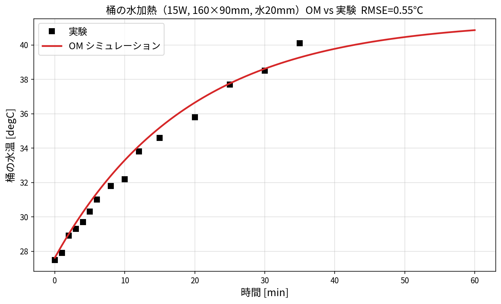

# OpenModelica 1DCAE — 桶の水加熱・タンク水温 モデル集

OpenModelica による 1DCAE モデルと実験データの比較・パラメータスタディ。
テーマ別に **番号付きフォルダ**へ整理し、各フォルダの `docs/` に実行手順・結果をまとめている。

| フォルダ | テーマ | 内容 |
|---|---|---|
| **[001_cup](001_cup/)** | 桶の水加熱（15W） | 底面加熱の1DCAE。実験と RMSE 0.55℃ で一致。蒸発を含む上面熱伝達率の検討 |
| **[002_tank_base](002_tank_base/)** | タンク水温 ベース | 3槽サイクロン加熱モデルの合わせこみ（実験 eva5, RMSE 0.24℃）・数式化・感度 |
| **[003_tank_para](003_tank_para/)** | タンク パラメータスタディ | 因子影響・pairplot・**温度管理あり/なし**の比較（実機OM＋pairplot） |

各フォルダは自己完結（モデル `.mo`・スクリプト・データ・`docs/`）。実行手順は各 `docs/README.md` 参照。

---

## 代表結果：桶の水加熱（001_cup）

桶（内寸 底面 160×90mm, 高さ30mm）に水を20mm入れ、底面を15Wで加熱する 1DCAE モデル。
OpenModelica の計算と実験がよく一致する（**RMSE 0.55℃**）。

- 放熱経路は **上面（蒸発込み h_top=55）** と **側壁・底面（自然対流 h=10, SUS304桶経由）**。
- 水面の熱伝達率が大きいのは**蒸発（潜熱）**が支配的なため（Chilton–Colburn アナロジーで
  実効 h≈45 と見積られ、使用値55とオーダー一致）。h_top=10（対流のみ）では 58℃まで過熱して合わない。
- 詳細は [001_cup/docs/README.md](001_cup/docs/README.md)。

---

## 実行環境
- OpenModelica 1.26.3（`omc.exe`）。WSL からも実行可（モデルパスは Windows 形式に変換）。
- Python: `numpy pandas matplotlib scipy`（作図・フィット）。

> 各フォルダの `OM/` 直下や `_build/` に出る**ビルド副産物・結果CSV は再実行で作り直せる**ため
> `.gitignore` で除外している（追跡するのは `.mo`/`.py`/`.md`/図）。
