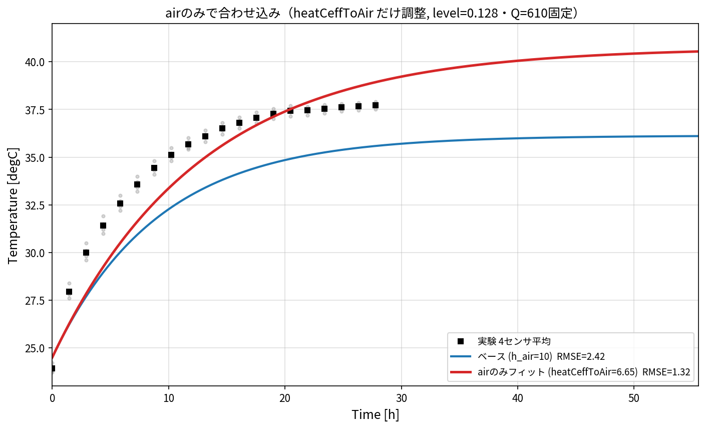
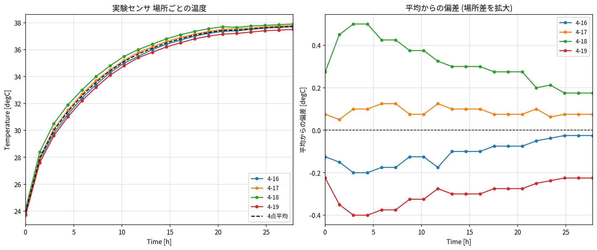
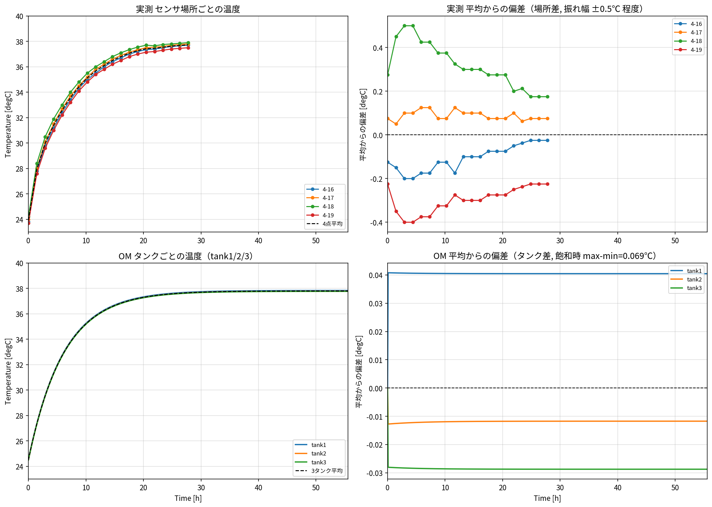

# 001: 合わせこみ結果と温度分布

OpenModelica の水槽水温モデルを実験（`data/eva5.py`, 2026-07-09）に合わせ込んだ結果、
実測の**温度分布（場所ごとの差）**、および**タンク1/2/3の温度差**をまとめる。
合わせ込みは集中定数モデル（`docs/fit_params.py`）で行い、投入熱 Q=610 W は固定。

---

## 1. 合わせこみ結果

| ケース | 調整 | UA [W/K] | 飽和温度 Tmax [℃] | 時定数 τ [h] | RMSE [℃] |
|---|---|---|---|---|---|
| ベース | なし | 52.5 | 36.1 | 9.1 | **2.42** |
| air のみ | `heatCeffToAir`=6.65 | 37.6 | 40.7 | 12.7 | 1.32 |
| **air＋水位** | `heatCeffToAir`=8.79, `level_start`=0.0755 | 45.9 | 37.8 | 6.1 | **0.24** |

### air だけでは合わない（fig005）

`heatCeffToAir` だけを下げると飽和温度は上げられるが、**立ち上がりの遅さは直せない**。
最小二乗はその折衷として h_air を下げすぎ、今度は飽和が 40.7℃ へ**行き過ぎ**る（RMSE 1.32）。
→ 飽和温度（高さ）と立ち上がり（速さ）は別の物理量なので、air 1つでは同時に合わない。

### air＋水位でほぼ一致（RMSE 0.24）
左＝平均どうし（実験4点平均 vs OM 3タンク平均）、右＝非平均（実測4センサ分布 vs OM tank1/2/3）。
実測は場所でばらつくが、OM の 3 タンクは循環でほぼ重なる（後述 §3）。

- **飽和温度 Tmax** は放熱 \(UA\) で決まる（\(T_{max}=T_\infty+Q/UA\)）→ `heatCeffToAir` を 10→8.79 で +1.6℃。
- **立ち上がり τ** は水の熱容量 \(C\) で決まる（\(\tau=C/UA\)）→ `level_start` を 0.128→0.0755 で 9.1h→6.1h。
- 幾何寸法は図面と一致確認済みなので、放熱側の補正（約12%）は面積ミスではなく
  h_air／水面被覆の小補正。支配的なのは**実効水位**（実機の実際の水位確認が最重要）。

**推奨パラメータ**: `Q_cyclone=610`, `heatCeffToAir=8.79`, `level_start=0.0755`
（`-override heatCeffToAir=8.79,level_start=0.0755`）

---

## 2. 実測の温度分布（場所ごとの差）

実験は 4 点（4-16 / 4-17 / 4-18 / 4-19）で計測しており、**場所ごとに温度差がある**（fig000）。

同時刻での 4 センサのばらつき（最大−最小）:

| 局面 | 温度差 |
|---|---|
| 立ち上がり最大（t≈2.9h） | **0.90 ℃** |
| 平均（全区間） | 0.61 ℃ |
| 飽和時 | 0.40 ℃ |

飽和時の高温側→低温側（平均からの偏差）:

| センサ | 飽和温度 [℃] | 平均からの偏差 |
|---|---|---|
| 4-18 | 37.90 | **+0.17**（最も高温） |
| 4-17 | 37.80 | +0.07 |
| 4-16 | 37.70 | −0.02 |
| 4-19 | 37.50 | **−0.23**（最も低温） |

→ 実機には **±0.5℃ 程度の空間温度分布**がある。1D モデルは代表 1 点なので、
この分布幅（≈0.4〜0.9℃）が**合わせ込みの実質的な許容誤差**。フィットの RMSE 0.24℃ は
この分布幅に十分収まっており、実用上「合っている」と言える。

---

## 3. タンク 1/2/3 の温度差

モデルは 3 タンクを配管（オリフィス）＋サイクロンポンプで**循環**させている。
タンクごとに放熱面積が違うので放熱量は差があるが、循環による混合で温度は揃う。

タンク別の上面放熱（飽和時, \(h_{air}\times A_{top}\times\Delta T\) の概算）:

| タンク | 上面積 [m²] | 上面放熱 [W] |
|---|---|---|
| tank1（下） | 0.43 | 57 |
| **tank2（左上）** | 2.15 | **284**（最大） |
| tank3（右上） | 0.68 | 90 |

放熱は tank2 が突出（面積が大きい）。しかし循環流量が大きいため、タンク間の温度差は小さい:

| 循環流量 | \(\dot m c_p\) [W/K] | 推定タンク間温度差 |
|---|---|---|
| 0.68 kg/s（`m_flow_nominal`） | 2846 | **~0.08 ℃** |
| 1.83 kg/s（ポンプ設定） | 7660 | ~0.03 ℃ |

（タンク間温度差 ≈ 放熱量の差 / \(\dot m c_p\)。混合時間 数分 ≪ 加熱時間 数時間なので**ほぼ均一**）

3タンク＋循環の連成 ODE（`docs/fit_params.py`）で解くと、飽和時
**tank1=37.83, tank2=37.78, tank3=37.77 ℃（差 0.069℃）**。

実測（上段）と OM（下段）を同じ形式で並べると、**実測の場所差 ±0.5℃ に対し
OM のタンク差は ±0.04℃（1桁以上小さい）**:

**結論**: モデル上、tank1/2/3 は**放熱面積は大きく異なるが、循環により温度差は 0.1℃ 未満**でほぼ均一。
実測の場所差（±0.4℃）より小さいので、実測のばらつきは「タンク間の差」というより
**局所的な流れ・センサ位置・成層**によるものと考えられる。

**OM での確認方法**: `OM/run_sim.mos` は `tank1/2/3.medium.T` を出力し、
`data/compare_OM_vs_exp.py` が 3 タンクを別々の線で重ね描きする。
これでタンク間差が上記推定（<0.1℃）どおりかを直接確認できる。

---

## 4. まとめ

- 合わせ込みは **air＋水位** で RMSE 0.24℃（実測の分布幅内）。air 単独では不可（立ち上がりが直せない）。
- 実測は場所ごとに **±0.5℃ 程度の分布**（最大 0.90℃）。これが合わせ込みの許容誤差の目安。
- モデルのタンク間温度差は **0.1℃ 未満**（循環で均一）。実測の分布はタンク間差では説明できず、局所要因。
- 次（002）では、時定数 τ と最大温度 Tmax を目的関数にパラメータスタディ→パレート図で
  設計因子の影響を可視化する。
