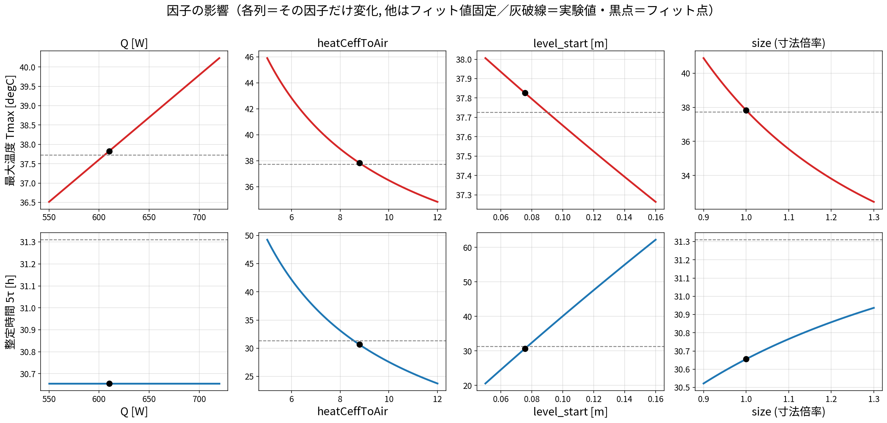
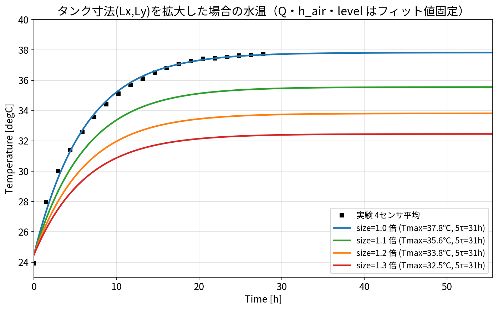
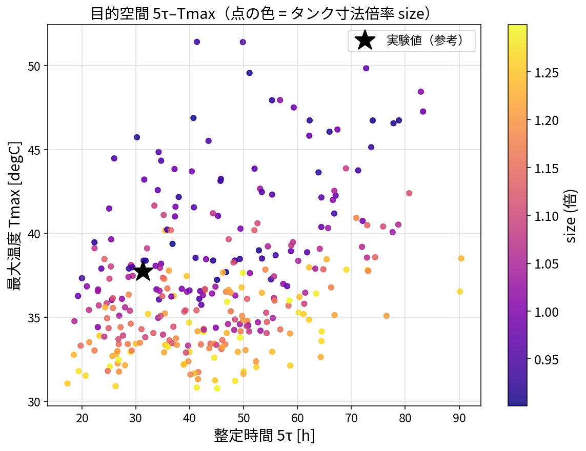
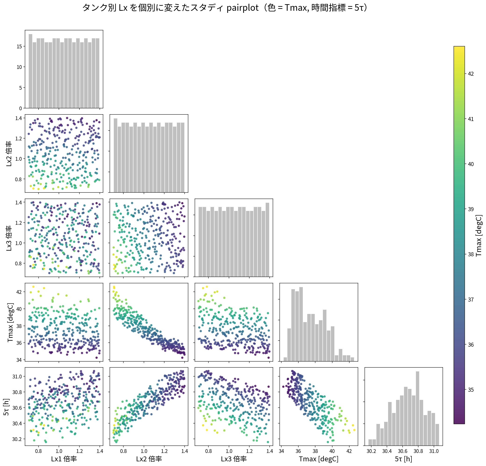

# 002: パラメータスタディ（影響確認）

合わせこみ（001）の後、設計因子を振って **最大温度 Tmax** と **時定数 τ** への影響を確認する。
ここでは集中定数モデルで実演（`docs/study_pareto_demo.py`）。実機 OM では `data/run_study.py`
が omc.exe で同じ流れを回す。**特定の目標値は設けず、因子→応答の傾向を可視化**する。

- **Tmax**（最大温度・飽和温度）＝ \(T_\infty + Q/UA\)
- **τ**（時定数）＝ \(C/UA\)（63.2% 到達時間。決め方は 001 の fit 図参照）

---

## 1. 設計因子

| 設計因子 | 範囲 | フィット点 |
|---|---|---|
| `Q_cyclone` | 550–720 W | 610 |
| `heatCeffToAir` | 5–12 W/m²K | 8.79 |
| `level_start` | 0.05–0.16 m | 0.0755 |
| **`size`（タンク寸法 Lx,Ly の倍率）** | 0.9–1.3 倍 | 1.0 |

`size` は「タンクの容量を増やした場合」を見るための因子（Lx1 など水平寸法を一律に拡大）。

---

## 2. 因子の影響（各因子を単独で変化）

各列＝その因子だけを振り、他はフィット値に固定した応答。上段＝Tmax、下段＝τ。
灰破線＝実験値、黒点＝フィット点。



**読み取り（影響の確認）**

| 因子 | Tmax への影響 | τ への影響 |
|---|---|---|
| `Q` | ↑（比例） | ほぼ無し |
| `heatCeffToAir` | ↓ | ↓ |
| `level_start` | ↓（弱） | **↑（強）** |
| `size`（寸法拡大） | **↓（強）** | ほぼ無し（微増） |

→ **Tmax は `Q`・`heatCeffToAir`・`size`**、**τ は `level_start`** が主に効く。

---

## 3. タンク容量を増やした場合（size 拡大）

タンクの水平寸法（Lx, Ly）を 1.0→1.3 倍にしたときの水温（Q・h_air・level はフィット値固定）。



**重要な知見**：寸法を s 倍すると **放熱面積 UA∝s²** も **水量 C∝s²** も同率で増えるため、
- **τ = C/UA はほぼ不変**（6.1→6.2 h）
- **Tmax = T∞ + Q/UA は低下**（1.2 倍で 37.8→33.8℃）

つまり**タンクの footprint を広げても応答は速くならず、最高温度が下がるだけ**（放熱面が増えるため）。
「応答を変えずに最高温度を下げたい」なら footprint 拡大が有効。逆に「熱容量で応答を鈍らせたい」なら
水平寸法ではなく**水位（level）や深さ**を増やす方が効く（level は τ を強く上げる）。

---

## 4. 目的空間 τ–Tmax（達成マップ）

LHS N=300 で 4 因子を同時に振った結果を τ–Tmax 平面に投影。色＝size。



- 小さいタンク（青紫）は高 Tmax 側、大きいタンク（黄）は低 Tmax 側に分布。
- 実験値（★, 37.7℃/6.3h）近傍は到達可能。特定の目標を決めれば、この分布から
  条件に合う因子帯を選べる（例：Tmax 精度優先／応答速度優先）。

---

## 5. 実機 OM での実行

```
cd ana005_OM_opt\data
python param_study.py gen --n 30     # LHS 設計表 doe.csv
python run_study.py                  # omc.exe 実行 -> results.csv, 連番比較図
python param_study.py pareto --csv results.csv
```

`run_study.py` は各ケースで `tank1/2/3.medium.T` を取得し、Tmax・τ・RMSE を算出。
本実演と同じ関係（heatCeffToAir↔Tmax, level↔τ, size↔Tmax）が再現されるはず。

---

## 5b. タンク別 Lx を個別に変えたスタディ（pairplot）

各タンクの Lx（Lx1_1 / Lx2_1,Lx2_2 / Lx3_1）を個別に 0.7–1.4 倍したときの pairplot。
点の色＝Tmax、時間指標＝**5τ**（整定時間）。



- **Lx2（tank2）を大きくすると Tmax が強く低下**（明確な負の相関）。tank2 上面が放熱面の 65%。
- Lx3 は中程度、**Lx1 はほとんど効かない**（感度解析と一致）。
- 5τ は Lx でほとんど変わらない（面積と水量が同率で増えるため）。

> 時間指標は 001 の fit 図と統一して **5τ（99.3%到達, 整定時間）** を用いている。

---

## 6. まとめ

- **Tmax は Q・heatCeffToAir・size(≒Lx2)、τ は level が支配**（影響グリッド・pairplot で確認）。
- **タンク寸法拡大（容量増）は τ を変えず Tmax を下げる**（放熱面積増）。効くのは tank2 の Lx。
- 目的空間マップで到達可能域を把握。目標を定めれば因子帯を選定できる。

> **これらは集中定数（Python 解析解）の代理結果**。実機 OpenModelica で回す手順と、
> 代理との一致検証（基準36.1℃／フィット37.8℃／タンク差0.06℃）は
> **[003_openmodelica_paramstudy_howto.md](003_openmodelica_paramstudy_howto.md)** 参照。
