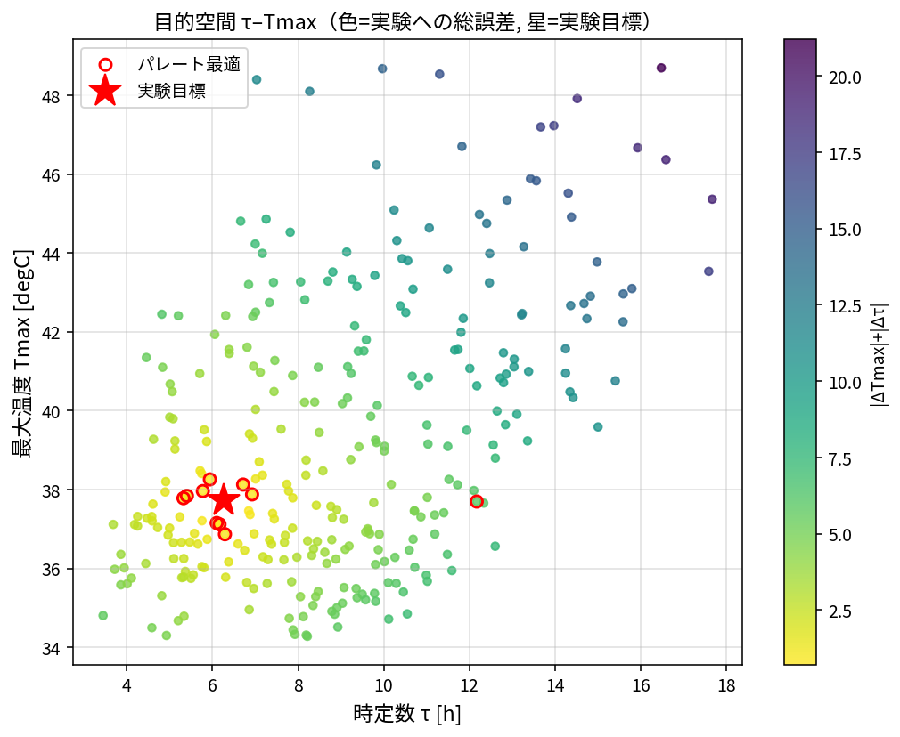

# 002: パラメータスタディとパレート図

合わせこみ（001）の後、設計因子を振って **時定数 τ** と **最大温度 Tmax** を目的関数とし、
パラメータスタディ→パレート図で影響を確認する。ここでは集中定数モデルで実演
（`docs/study_pareto_demo.py`）。実機 OM では `data/run_study.py` が omc.exe で同じ流れを回す。

---

## 1. 設計因子と目的関数

感度解析（計画書 §4）より、効く因子に絞る。範囲はフィット点を中心に取る。

| 設計因子 | 範囲 | フィット点 | 主に効く応答 |
|---|---|---|---|
| `Q_cyclone` | 550–720 W | 610 | Tmax |
| `heatCeffToAir` | 5–12 W/m²K | 8.79 | Tmax・τ |
| `level_start` | 0.05–0.16 m | 0.0755 | τ |

（`kground`・`heatCefftTank2in`・tank1/tank3 面積は低感度なので固定）

**目的関数（2つ）**
- **Tmax** ＝ 飽和温度 \(= T_\infty + Q/UA\)
- **τ** ＝ 時定数 \(= C/UA\)（63.2% 到達時間）

合わせ込みの観点では、実験の \((T_{max}, \tau)=(37.7℃, 6.3\,\mathrm{h})\) に近づける
2 目的最小化 \(\min(|\Delta T_{max}|, |\Delta\tau|)\) とし、パレート前線を求める。

> τ の定義について：本書は 63.2% 到達時間を τ とする。整定を重視する場合は
> **5τ（≈99.3% 到達＝ほぼ Tmax に達する整定時間）** を指標にしてもよい（別途検討）。

---

## 2. pairplot（因子×応答の総当たり）

LHS N=300。赤＝パレート最適点（実験目標に最も近い非劣解）。


**読み取り**
- `heatCeffToAir` × `Tmax`：強い**負の相関**（放熱を増やすと飽和温度が下がる）。
- `level_start` × `τ`：強い**正の相関**（水量を増やすと立ち上がりが遅い）。
- `Q` × `Tmax`：正だが弱め（範囲が狭いため）。`Q` は τ にほぼ無関係。
- 赤のパレート点は `Tmax≈37–38℃`, `τ≈5–6.5h` に集まり、対応する因子帯は
  **heatCeffToAir≈8–11, level≈0.06–0.10, Q≈580–710** に分布。
- → **飽和温度は heatCeffToAir（＋Q）、立ち上がりは level が支配**、という影響が可視化された。

---

## 3. パレート図（目的空間 τ–Tmax）

色＝実験目標への総誤差 \(|\Delta T_{max}|+|\Delta\tau|\)、赤丸＝パレート最適、星＝実験目標。



- 目標 \((\tau, T_{max})=(6.3\mathrm{h}, 37.7℃)\) の近傍に到達可能な設計が存在。
- τ を短くする（速くする）と level を下げる必要があり、Tmax はほぼ独立に
  heatCeffToAir/Q で調整できる → **2 目的はおおむね分離**して詰められる。
- パレート前線から用途に応じて 1 点を選ぶ（速さ優先＝τ小の端、温度精度優先＝ΔTmax小の端）。

---

## 4. 実機 OM での実行

同じ設計表・目的で OM を回すには（Windows）:

```
cd ana005_OM_opt\data
python param_study.py gen --n 30     # LHS 設計表 doe.csv
python run_study.py                  # omc.exe 実行 -> results.csv, 連番比較図
python param_study.py pareto --csv results.csv   # pairplot.png / pareto.png
```

`run_study.py` は各ケースで `tank1/2/3.medium.T` を取得し、T_final(=Tmax)・τ・RMSE を算出する。
本書の集中定数実演と同じ関係（heatCeffToAir↔Tmax, level↔τ）が再現されるはず。

---

## 5. まとめ

- 目的関数 **τ・Tmax** でパラメータスタディを実施、pairplot／パレート図で影響を可視化。
- **Tmax は `heatCeffToAir`（＋`Q`）、τ は `level_start`** が支配（感度解析と一致）。
- 実験目標 (37.7℃, 6.3h) に到達できる設計域を特定。2 目的は分離して調整可能。
- 次段: 実機 OM で `run_study.py` を回し、本実演の関係とパレートを確認する。
