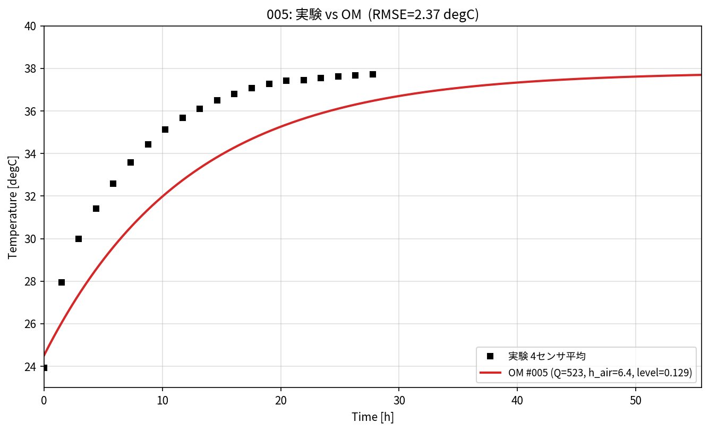

# 003: OpenModelica でパラメータスタディを回す手順

001・002 の集中定数（Python 解析解）は**あくまで代理**。ここでは **実際に OpenModelica
(omc.exe) を回して**同じパラメータスタディを行う手順を示す。

> 検証済み：本モデルは omc で `checkModel` 成功（675 方程式）。基準ケースの飽和温度は
> **36.1℃**（集中定数の予測と一致）、フィット値を `-override` すると **37.8℃**（実験 37.7℃ と一致）。
> タンク間差も **0.06℃**（集中定数 ODE の 0.069℃ と一致）。→ 代理と実機OMは整合。

---

## 0. 環境

- OpenModelica 1.26.3（`omc.exe`）
  - Windows: `C:\Program Files\OpenModelica1.26.3-64bit\bin\omc.exe`
  - WSL から使う場合: `/mnt/c/Program Files/OpenModelica1.26.3-64bit/bin/omc.exe`
- Python: `numpy pandas matplotlib`（解析・作図）
- 対象モデル: `OM/temp_off/ana003_Tank3blocks_cyclononly_NoTemp.mo`
  （投入熱 `Q_cyclone`、`heatCeffToAir`、`heatCefftTank2in`、`kground`、`level_start` が
  すべて top-level `parameter` なので `-override` で振れる）

---

## 1. 1 ケースを回す（基準ケースの確認）

`OM/temp_off/run_sim.mos` を omc に渡すと、タンク水温の時系列 CSV が出る。

```bash
# WSL
cd ana005_OM_opt/OM/temp_off
"/mnt/c/Program Files/OpenModelica1.26.3-64bit/bin/omc.exe" run_sim.mos
# Windows (cmd)
cd ana005_OM_opt\OM\temp_off
"C:\Program Files\OpenModelica1.26.3-64bit\bin\omc.exe" run_sim.mos
```

→ `ana003_Tank3blocks_cyclononly_NoTemp_res.csv`（`time, tank1/2/3.medium.T`）。
実験と重ねて確認：

```bash
cd ../data
python compare_OM_vs_exp.py
```

### パラメータを 1 つ変えて回す（-override）

`simulate(..., simflags="-override 名前=値,名前=値")` で再コンパイルして振れる。例：フィット値

```
simulate(ana003_Tank3blocks_cyclononly_NoTemp, stopTime=200000, numberOfIntervals=2000,
  outputFormat="csv", variableFilter="time|tank1.medium.T|tank2.medium.T|tank3.medium.T",
  simflags="-override heatCeffToAir=8.79,level_start=0.0755");
```

---

## 2. パラメータスタディ（自動・多ケース）

`data/run_study.py` が LHS 設計表の各行を omc で回し、応答（Tmax・τ・RMSE）を集計、
実験と重ねた連番比較図 `docs/img/002/compare_XXX.png` を保存する。

```bash
cd ana005_OM_opt/data

# 2-1. LHS 設計表を作る（Q, heatCeffToAir, heatCefftTank2in, kground, level_start）
python param_study.py gen --n 30          # -> doe.csv

# 2-2. 各ケースを omc で実行（WSL は OMC を指定）
export OMC="/mnt/c/Program Files/OpenModelica1.26.3-64bit/bin/omc.exe"   # WSL
python run_study.py                        # -> results.csv, docs/img/002/compare_XXX.png
#   Windows(cmd) は既定パスなので:  python run_study.py

# 2-3. 結果を可視化（pairplot / 目的空間）
python param_study.py pareto --csv results.csv   # -> pairplot.png, pareto.png
```

実機 OM の実行例（6 ケース, 各 ~23 秒）。下は case005 の実機 OM 出力 vs 実験:



`run_study.py` の要点：
- 各ケースで一時 `.mos` を生成し `simulate(..., simflags="-override ...")` を実行。
- `tank1/2/3.medium.T` の平均を代表水温[℃]とし、
  **Tmax**=末尾値、**τ**=63.2%到達（必要なら 5τ 整定へ）、**RMSE**=実験平均との差 を算出。
- **WSL 注意**：omc.exe は Windows バイナリなので、モデルのパスは `wslpath -m` で
  Windows 形式（`F:/...`）に変換して `loadFile` へ渡している。

---

## 3. タンク寸法（容量）を振るスタディ

寸法 `Lx*,Ly*` はモデルでは `parameter` だが、面積・水量の式に直接使われるため
`-override Lx1_1=...,Ly1_1=...` で個別に振れる。例：tank2 を 1.2 倍

```
simulate(ana003_Tank3blocks_cyclononly_NoTemp, stopTime=200000, outputFormat="csv",
  variableFilter="time|tank1.medium.T|tank2.medium.T|tank3.medium.T",
  simflags="-override Lx2_1=1.4292,Ly2_1=2.004");   // 1.191*1.2, 1.670*1.2
```

（一律拡大は全 `Lx*,Ly*` を同率で override。集中定数の実演 `vary_size.png` と同じ傾向：
寸法拡大→τ ほぼ不変・Tmax 低下 になるはず。）

---

## 4. 実行時間の目安

1 ケース ≈ コンパイル 11s ＋ 計算 13s ≈ **25 秒**（stopTime=200000, interval=2000）。
30 ケースで約 12〜15 分。再コンパイルを避けたい場合は一度 `buildModel` し、
生成された実行体を `-override` 付きで直接回すと高速化できる。

---

## 5. まとめ

- **omc.exe は WSL からも実行可能**（Windows パス変換のみ注意）。
- `run_study.py` で **実機 OpenModelica のパラメータスタディを自動化**できる。
- 代理（集中定数）と実機 OM は基準 36.1℃／フィット 37.8℃／タンク差 0.06℃ で**一致**を確認済み。
