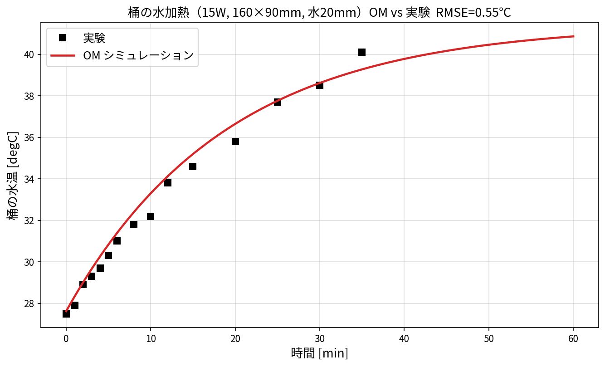

# 004: 桶の水加熱 1DCAE（CupHotWater_15W）と実験比較

桶（内寸 底面 **160×90 mm**, 高さ30 mm）に水を **20 mm** 入れ、底面を **15 W** で加熱する
OpenModelica モデル `cup/CupHotWater_15W_001.mo` と実験データの比較。

---

## 1. 実行手順（cup フォルダ）

`ana005_OM_opt/cup/` 内で実行する。

```bash
# 1) OM でモデルを回して結果CSVを作る
#    WSL:
"/mnt/c/Program Files/OpenModelica1.26.3-64bit/bin/omc.exe" run_cup.mos
#    Windows(cmd):
"C:\Program Files\OpenModelica1.26.3-64bit\bin\omc.exe" run_cup.mos
#    -> CupHotWater_15W_001_res.csv が出力される

# 2) 実験との比較図を作る
python plot_cup_compare.py          # -> CupHotWater_15W_compare.png

# 3) (任意) 上面熱伝達率 h_top の影響を見る
#    先に h_top=55 と 10 の2ケースを OM で回して _build/htop_55.csv, htop_10.csv を作る:
#    simulate(CupHotWater_15W_001, stopTime=6000, outputFormat="csv",
#             variableFilter="time|y_sim_T", simflags="-override h_top=55")   (と =10)
python plot_htop_compare.py         # -> CupHotWater_15W_htop_compare.png
```

必要 Python パッケージ: `numpy matplotlib`。画面表示なしなら `MPLBACKEND=Agg` を付ける。

**cup フォルダの構成**

| ファイル | 役割 |
|---|---|
| `CupHotWater_15W_001.mo` | モデル本体（SUS304桶＋水、上面蒸発＋側/底放熱） |
| `water_heating_temperature_measurement.csv` | 実験データ（time_s, 桶水温[℃]） |
| `run_cup.mos` | OM 実行スクリプト |
| `plot_cup_compare.py` | OM 結果 vs 実験 の比較図 |
| `plot_htop_compare.py` | h_top=55/10 の比較図 |
| `*.png` | 出力図 |

---

## 2. 元モデルのバグと修正

| # | バグ | 修正 |
|---|---|---|
| 1 | `combiTimeTable1` が式で参照されているのに**未宣言** → コンパイル不可 | 実験データ表を CombiTimeTable として追加 |
| 2 | 桶 `level_start = 0`（**水が無い**）→ 熱容量ゼロで温度発散 | `level_fill`（20 mm）に修正 |
| 3 | 寸法 190×100 mm | 実機の **160×90 mm** に修正 |
| 4 | `nPorts=0` と `portsData` 1個指定＋`use_portsData=true` の**不整合** | `use_portsData=false`、portsData 削除 |

---

## 3. OM と実験の比較

修正後、OM と実験は **RMSE 0.55 ℃** でよく一致する（27.6→約41℃で飽和）。



- 水量 288 mL（0.288 kg）、15 W 加熱。
- 放熱経路：上面（蒸発込み）＋ 側壁・底面（桶壁 SUS304 経由で外気へ）。

---

## 4. 熱伝達率の設定（h と h_top）

| 記号 | 値 | 対象 | 妥当性 |
|---|---|---|---|
| `h` | 10 W/m²K | 側面・底面 → 外気（自然対流） | 標準（静止空気 5〜25） |
| `h_top` | 55 W/m²K | 液面 → 外気（**蒸発込み実効値**） | 下記の理論で妥当 |
| `h_l` | 1000 W/m²K | 桶内 水↔壁（固液） | 大（良好接触） |

### 4.1 h_top を 10 にすると合わない

上面を普通の対流（10）にすると放熱不足で **58 ℃まで過熱**し、実験（~41 ℃）と乖離する。


| h_top | 飽和温度 | RMSE |
|---|---|---|
| **55（蒸発込み）** | 41 ℃ | **0.55 ℃** |
| 10（対流のみ） | 58 ℃ | 2.67 ℃ |

### 4.2 h_top の理論的根拠（蒸発）

水面放熱は「対流（顕熱）＋蒸発（潜熱）」。蒸発分は **Chilton–Colburn の熱・物質移動アナロジー**
から見積もれる。

- 対流：\(q_\text{conv} = h_c (T_w - T_\infty),\ h_c \approx 5\text{–}10\)
- 蒸発：\(q_\text{evap} = h_m L_\text{vap} (\rho_{v,s}(T_w) - \rho_{v,\infty})\)
- アナロジー：\(\displaystyle \frac{h_m}{h_c} = \frac{1}{\rho_\text{air} c_{p,\text{air}} Le^{2/3}}\)（\(Le\approx0.87\)）

**概算**（水面35℃・空気27.6℃・湿度50%）:
飽和蒸気密度差 Δρ≈0.026 kg/m³、\(h_c=5\) → \(h_m\approx0.0047\) m/s、
\(q_\text{evap}=h_m L \Delta\rho\approx 300\) W/m²、ΔT=7.4 K で割ると
**実効 \(h_\text{evap}\approx 40\)**。合計 \(h_\text{top}\approx 5+40 = 45\) W/m²K。
→ 使用値 **55 と同オーダー**（湿度・気流・水温で 30〜60 に変動）。

### 4.3 近似の限界

厳密には蒸発は **ΔT ではなく蒸気圧差**に比例する非線形現象（飽和蒸気圧は水温で指数増加）。
`h_top=一定` は線形化した実効値なので、水温が高いほど本来は蒸発が強まる。
より厳密には `h_top` 固定をやめ、**蒸気圧差ベースの蒸発モデル**（水温・湿度依存の \(q_\text{evap}\)）に
置き換えるのが望ましい。

---

## 5. まとめ

- 元モデルの 4 バグ（未宣言テーブル・水位0・寸法・ポート不整合）を修正し、実験と RMSE 0.55℃ で一致。
- 側面・底面の `h=10` は自然対流の標準値。**上面 `h_top=55` は蒸発を含む実効値**で、
  Chilton–Colburn アナロジーの概算（~45）とオーダーが合う理論的裏付けあり。
- 精密化するなら蒸発を蒸気圧差で陽にモデル化する。
